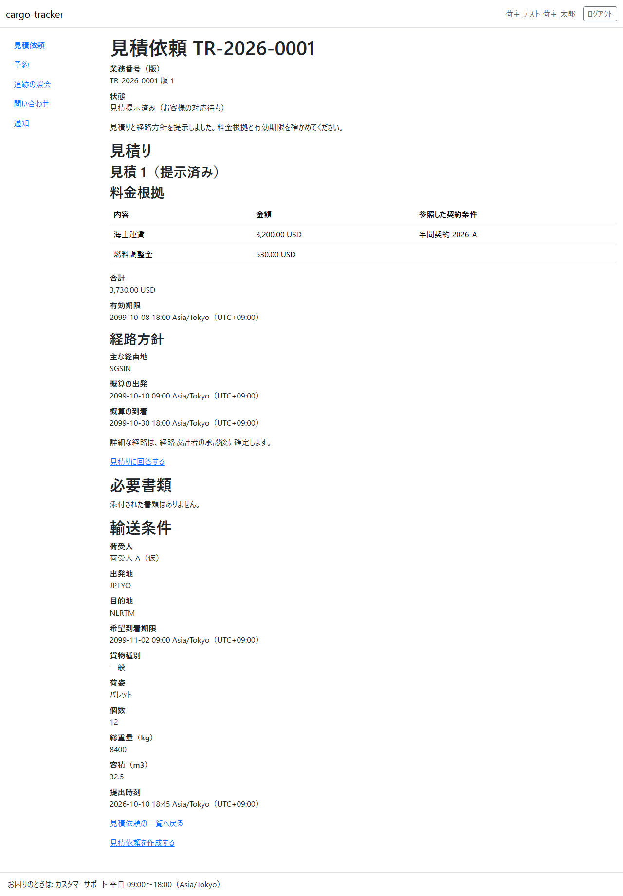
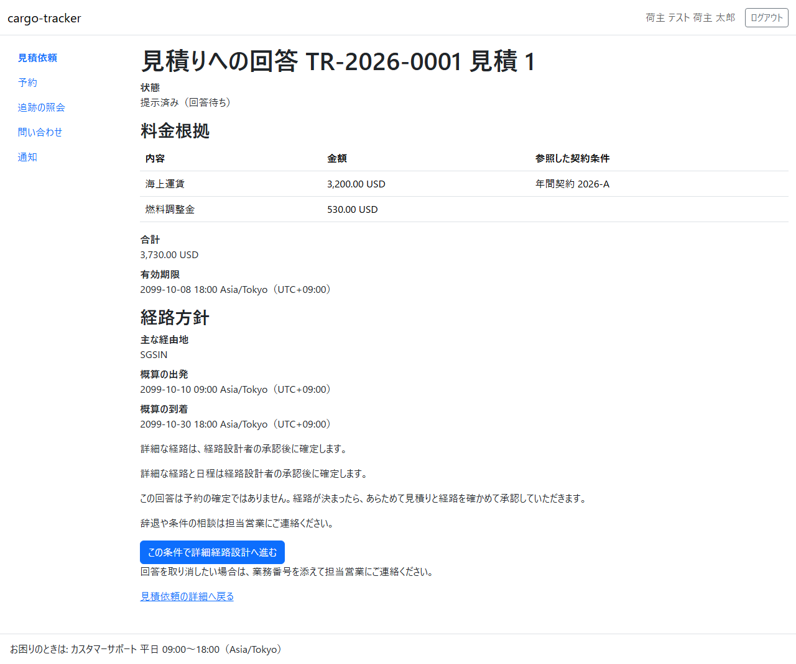
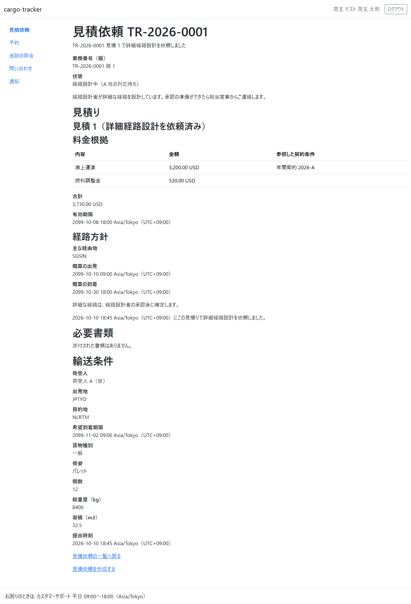
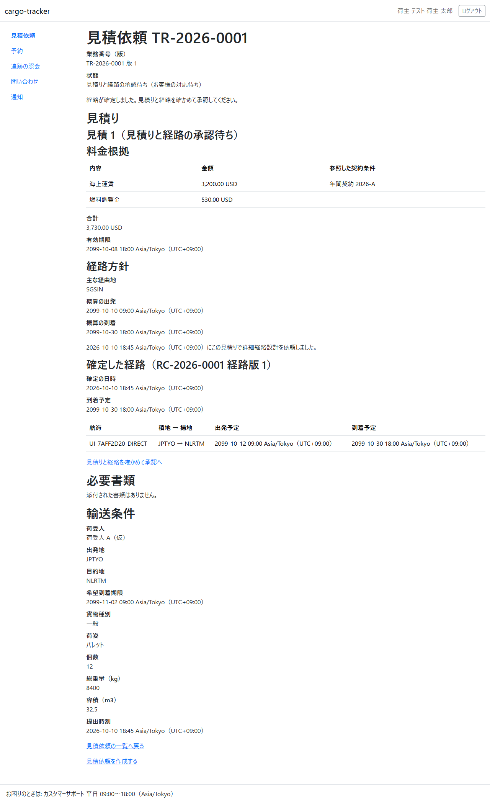
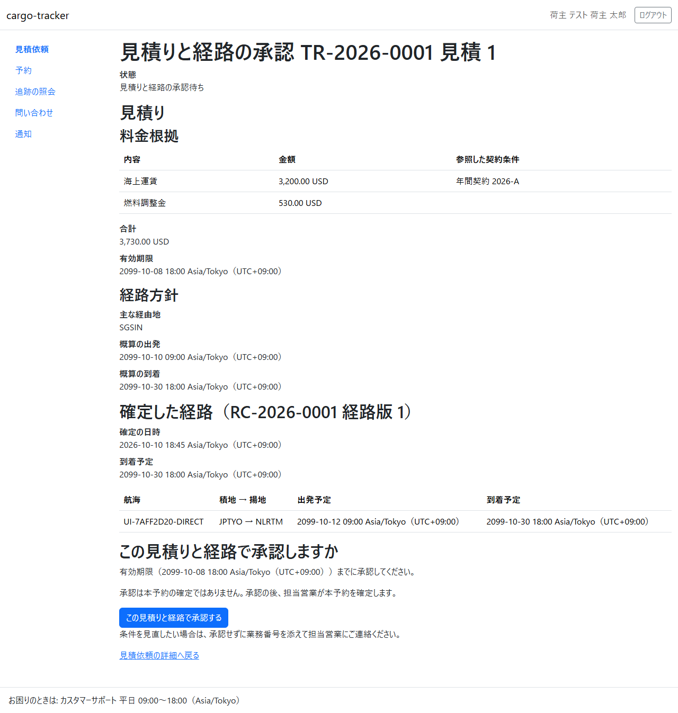
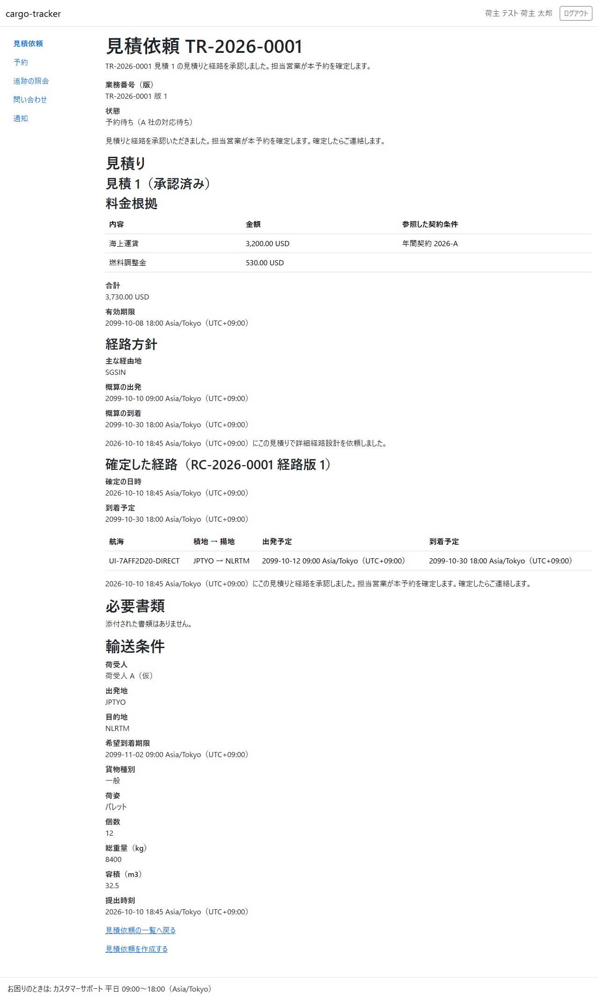

# 4 章 見積りへの回答と承認

営業担当者が提示した見積りに、荷主担当者が回答し、経路が決まった後に見積りと経路を承認する画面です。本章は [WF-1](01-業務フロー.md#wf-1-見積依頼から追跡の照会まで) の工程 3（見積りに回答する）と工程 5（見積りと経路を承認する）に対応します。

画面の開き方: ナビゲーションの「見積依頼」→ 見積依頼の一覧の業務番号 → 見積依頼の詳細の「見積り」の節。

| 画面 | 役割 | 節 |
| :--- | :--- | :--- |
| 見積りへの回答 | 料金根拠と経路方針を確かめ、詳細経路設計へ進む | [4.1](#41-見積りへの回答) |
| 見積りと経路の承認 | 確定した経路を確かめ、見積りと経路を承認する | [4.2](#42-見積りと経路の承認) |

回答の後の経路の設計は経路設計者が、承認の後の本予約の確定は担当営業が行います。

## 4.1 見積りへの回答

### この画面でできること

- 提示された見積り（料金根拠・合計・有効期限・経路方針）を確かめ、この条件で詳細経路設計へ進むと回答します

### 画面の開き方

- 見積依頼の詳細の「見積りに回答する」（URL: `/customer/transport-requests/{業務番号}/quotations/{見積り番号}/response`）

見積りが提示されると、見積依頼の詳細は次のように「見積り」の節が加わり、状態が「見積提示済み（お客様の対応待ち）」になります。

### 画面の説明

| # | 項目 | 説明 |
| :--- | :--- | :--- |
| ① | 状態 | 「提示済み（回答待ち）」 |
| ② | 料金根拠 | 明細ごとの内容・金額・参照した契約条件 |
| ③ | 合計・有効期限 | 有効期限までに回答してください |
| ④ | 経路方針 | 主な経由地、概算の出発と到着。詳細な経路は経路設計者の承認の後に確定します |
| ⑤ | 「この条件で詳細経路設計へ進む」 | 回答します |
| ⑥ | 「見積依頼の詳細へ戻る」 | 回答せずに戻ります |

### 操作手順

1. 料金根拠・合計・有効期限・経路方針を確かめます
2. 「この条件で詳細経路設計へ進む」をクリックします
3. 見積依頼の詳細に戻り、状態が「経路設計中（A 社の対応待ち）」になります

### 注意・補足

- この回答は予約の確定ではありません。経路が決まったら、あらためて見積りと経路を確かめて承認していただきます（[4.2](#42-見積りと経路の承認)）
- 辞退や条件の相談は担当営業にご連絡ください
- 回答を取り消したい場合は、業務番号を添えて担当営業にご連絡ください
- 有効期限を過ぎた見積りには回答できません。担当営業が新しい見積りを用意します

## 4.2 見積りと経路の承認

### この画面でできること

- 経路設計者が確定した経路（航海・積地と揚地・出発予定・到着予定）と見積りを確かめて承認します

### 画面の開き方

- 見積依頼の詳細の「見積りと経路を確かめて承認へ」（URL: `/customer/transport-requests/{業務番号}/quotations/{見積り番号}/approval`）

経路が確定すると、見積依頼の詳細の状態が「見積りと経路の承認待ち（お客様の対応待ち）」になり、確定した経路が示されます。

### 画面の説明

| # | 項目 | 説明 |
| :--- | :--- | :--- |
| ① | 状態 | 「見積りと経路の承認待ち」 |
| ② | 見積り | 料金根拠・合計・有効期限・経路方針（回答のときと同じ内容） |
| ③ | 確定した経路 | 経路の番号と版、確定の日時、到着予定、区間ごとの航海・積地 → 揚地・出発予定・到着予定 |
| ④ | 「この見積りと経路で承認する」 | 承認します。有効期限までに承認してください |
| ⑤ | 「見積依頼の詳細へ戻る」 | 承認せずに戻ります |

### 操作手順

1. 見積りと確定した経路を確かめます
2. 「この見積りと経路で承認する」をクリックします
3. 見積依頼の詳細に戻り、状態が「予約待ち（A 社の対応待ち）」になります

### 注意・補足

- 承認は本予約の確定ではありません。承認の後、担当営業が本予約を確定します。確定すると、予約一覧（[5.1](05-予約一覧と追跡の照会.md#51-予約一覧)）に出ます
- 条件を見直したい場合は、承認せずに業務番号を添えて担当営業にご連絡ください
- 経路は経路設計者が確定してから届きます。見積依頼の詳細に確定した経路が出ていないときは、少し待ってから画面を開き直してください
- 有効期限を過ぎた見積りは承認できません。担当営業が新しい見積りを用意します
