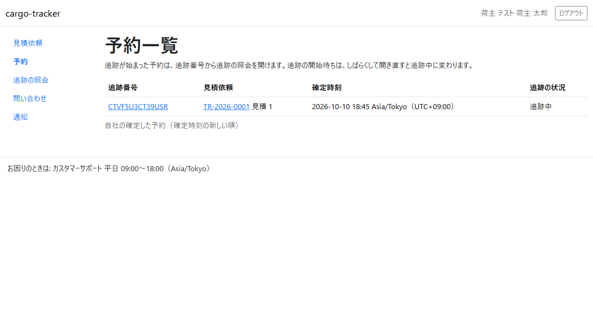
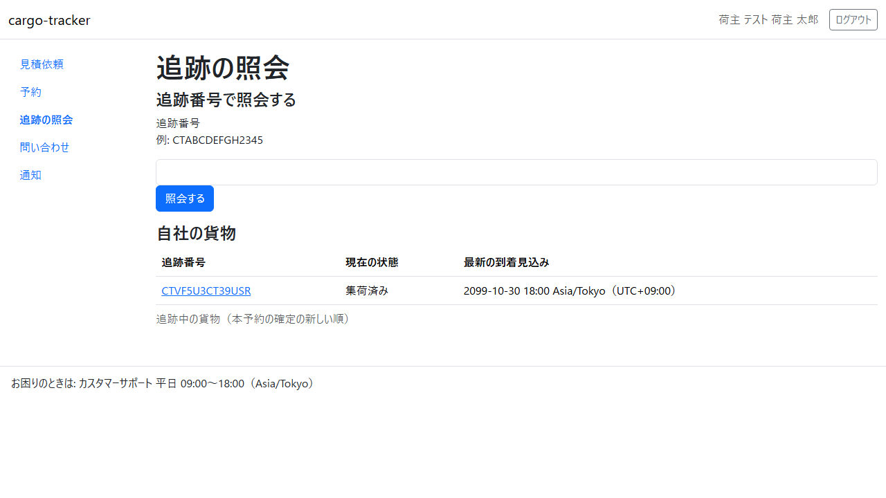
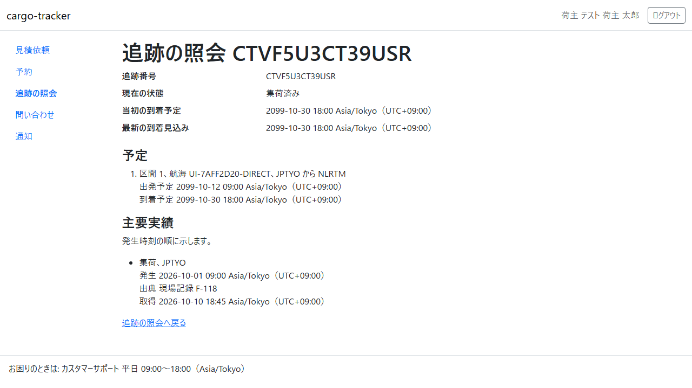
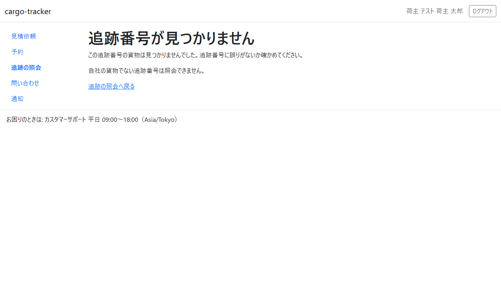

# 5 章 予約一覧と追跡の照会

担当営業が本予約を確定した後に、荷主担当者が自社の予約と貨物の輸送の状況を確かめる画面です。本章は [WF-1](01-業務フロー.md#wf-1-見積依頼から追跡の照会まで) の工程 8（予約と追跡の状況を確かめる）に対応します。

画面の開き方: ナビゲーションの「予約」（URL: `/customer/bookings`）、ナビゲーションの「追跡の照会」（URL: `/customer/tracking-records`）。

| 画面 | 役割 | 節 |
| :--- | :--- | :--- |
| 予約一覧 | 自社の本予約と追跡の状況を確かめる | [5.1](#51-予約一覧) |
| 追跡の照会 | 追跡番号で照会する、自社の追跡中の貨物を一覧する | [5.2](#52-追跡の照会) |
| 照会の結果 | 現在の状態・到着の予定と見込み・予定区間・主要な実績を確かめる | [5.3](#53-照会の結果) |

予約の変更・取消しの申請と予約の詳細は、Release 0.1 ではまだありません。担当営業にご連絡ください。

## 5.1 予約一覧

### この画面でできること

- 自社の確定した本予約を、確定した時刻の新しい順に確かめます。追跡が始まった予約は、追跡番号から照会の結果を開けます

### 画面の開き方

- ナビゲーションの「予約」（URL: `/customer/bookings`）

### 画面の説明

| # | 項目 | 説明 |
| :--- | :--- | :--- |
| ① | 案内 | 追跡番号から照会を開けること、追跡の開始待ちはしばらくすると追跡中に変わること |
| ② | 追跡番号 | 貨物の追跡番号（CT…）。追跡中ならクリックで照会の結果が開きます |
| ③ | 見積依頼 | 業務番号と見積り番号。業務番号をクリックすると見積依頼の詳細が開きます |
| ④ | 確定時刻 | 本予約を最初に確定した日時 |
| ⑤ | 追跡の状況 | 「追跡中」「追跡の開始待ち」「追跡の開始待ち（担当営業が確認します）」 |

### 操作手順

1. 確かめたい予約の追跡番号をクリックします。照会の結果（[5.3](#53-照会の結果)）が開きます
2. 見積りの内容を確かめたいときは、見積依頼の業務番号をクリックします

### 注意・補足

- 一覧に出るのは自社の予約だけです。新しい 50 件まで示します。それより前の予約は、追跡番号を入れて追跡の照会で確かめてください
- 確定した直後は「追跡の開始待ち」で、追跡番号はまだクリックできません。しばらくして画面を開き直すと「追跡中」に変わります
- 「追跡の開始待ち（担当営業が確認します）」のときは、担当営業が状況を確かめています
- 予約がなければ「確定した予約はまだありません。担当営業が本予約を確定すると、ここに出ます。」と示されます

## 5.2 追跡の照会

### この画面でできること

- 追跡番号を入れて貨物を照会します。自社の追跡中の貨物の一覧から選ぶこともできます

### 画面の開き方

- ナビゲーションの「追跡の照会」（URL: `/customer/tracking-records`）

### 画面の説明

| # | 項目 | 説明 |
| :--- | :--- | :--- |
| ① | 追跡番号 | 照会する追跡番号を入れます（例: CTABCDEFGH2345） |
| ② | 「照会する」 | 入れた追跡番号で照会の結果を開きます |
| ③ | 自社の貨物 | 自社の追跡中の貨物の一覧（追跡番号・現在の状態・最新の到着見込み）。本予約の確定の新しい順 |

### 操作手順

1. 「追跡番号」に追跡番号を入れて「照会する」をクリックします。または、自社の貨物の一覧の追跡番号をクリックします
2. 照会の結果（[5.3](#53-照会の結果)）が開きます

### 注意・補足

- 追跡番号は大文字・小文字を区別しません。電話やメールで区切って伝えられた番号（ハイフンや空白を含む）もそのまま入れられます
- 追跡番号の形が違うと「CT で始まる 14 文字で入力してください。英字の I・L・O と数字の 0・1 は使いません（例: CTABCDEFGH2345）」と示されます
- 一覧は新しい 50 件まで示します。それより前の貨物は、追跡番号を入れて照会してください

## 5.3 照会の結果

### この画面でできること

- 貨物の現在の状態、当初の到着予定と最新の到着見込み、予定の区間、主要な実績（集荷など）と出典を確かめます

### 画面の開き方

- 追跡の照会の「照会する」、自社の貨物の一覧の追跡番号、予約一覧の追跡番号（URL: `/customer/tracking-records/{追跡番号}`）

### 画面の説明

| # | 項目 | 説明 |
| :--- | :--- | :--- |
| ① | 追跡番号・現在の状態 | 例: 「集荷済み」 |
| ② | 当初の到着予定・最新の到着見込み | 予約したときの到着予定と、いまの見込み |
| ③ | 予定 | 区間ごとの航海・積地から揚地・出発予定・到着予定 |
| ④ | 主要実績 | 集荷などの実績を発生した時刻の順に示します。発生した日時・出典（現場記録など）・出典を取得した日時 |
| ⑤ | 「追跡の照会へ戻る」 | 追跡の照会に戻ります |

### 操作手順

1. 現在の状態と到着の見込みを確かめます
2. 主要実績で、いつ・どこで何が起きたかと、その情報の出典を確かめます

### 注意・補足

- 主要実績がまだなければ「主要実績はまだありません。」と示されます
- 見つからない追跡番号、または自社の貨物でない追跡番号を開くと、次の画面が示されます。追跡番号に誤りがないか確かめてください

