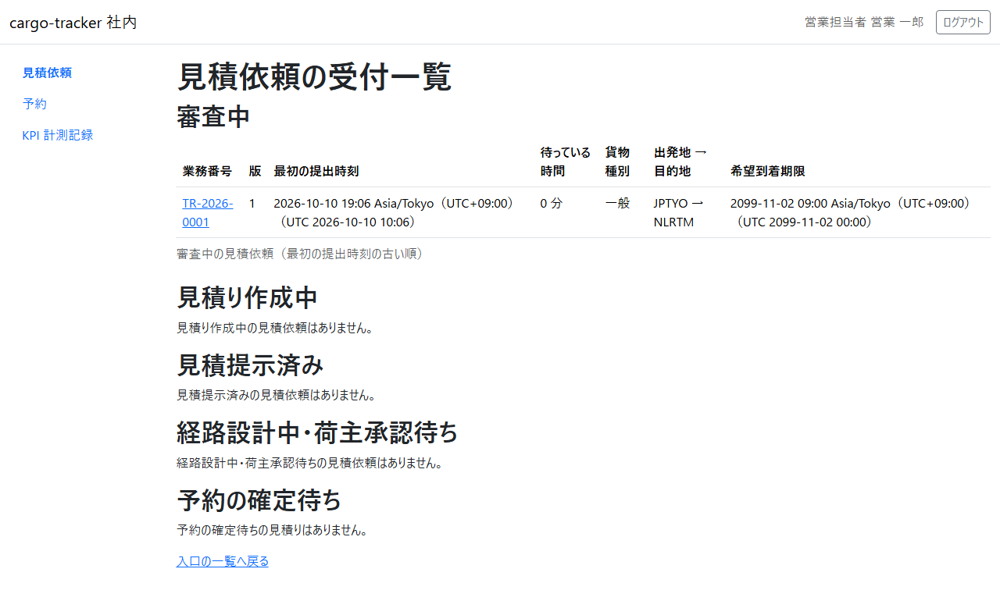
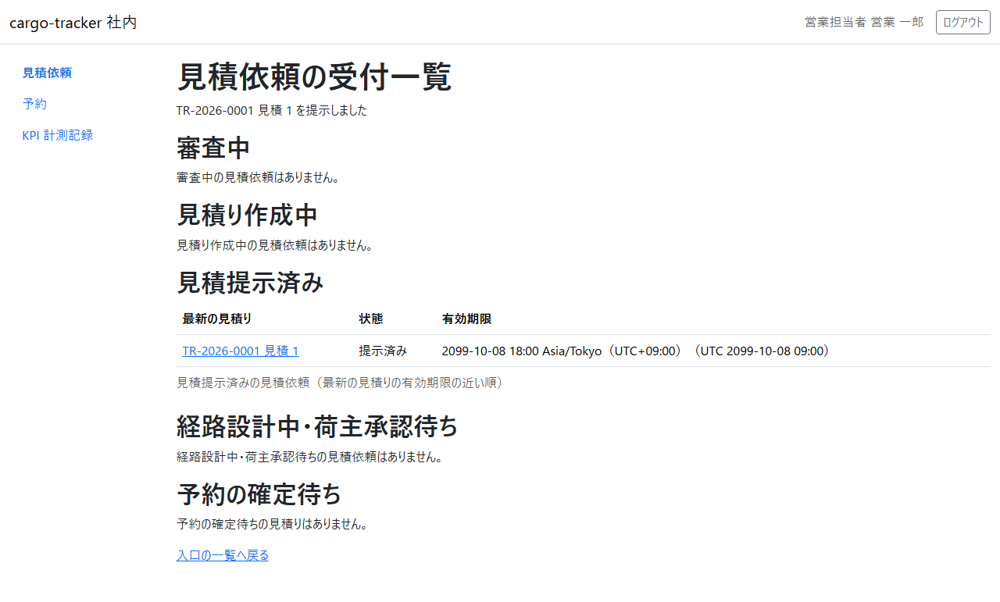
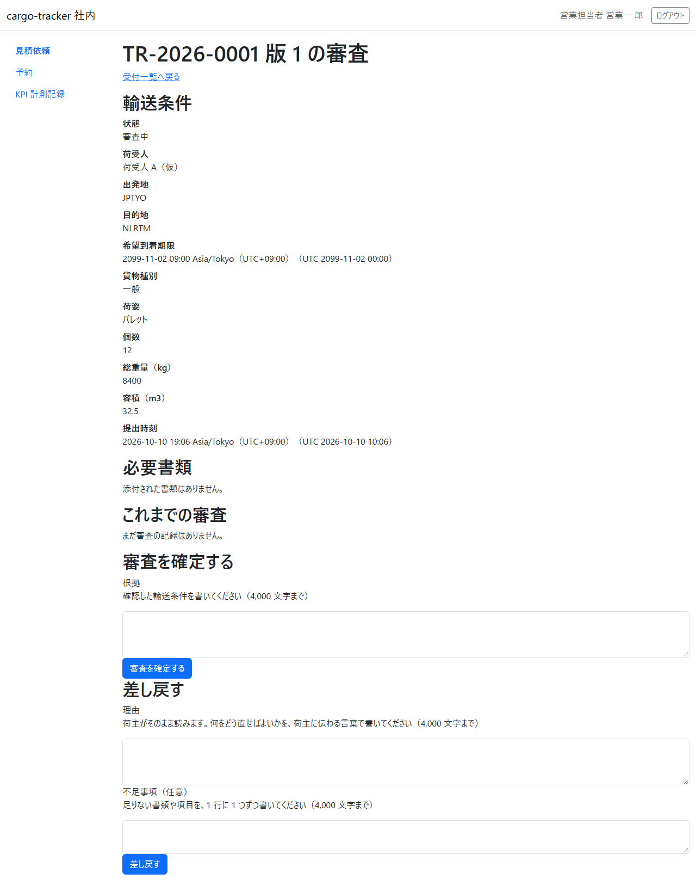
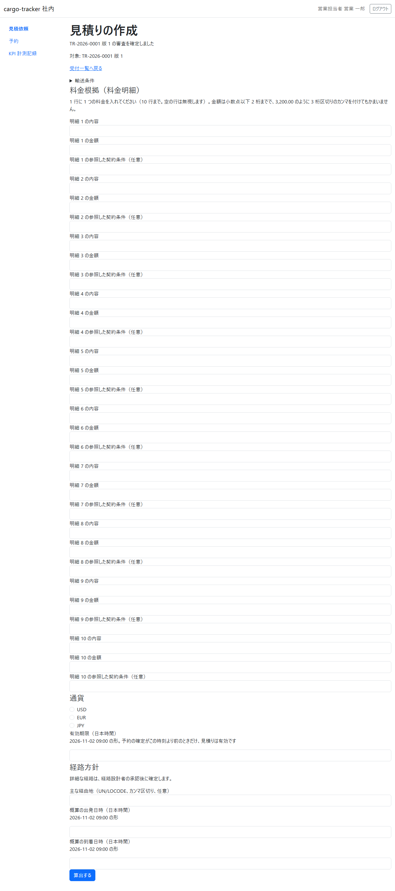
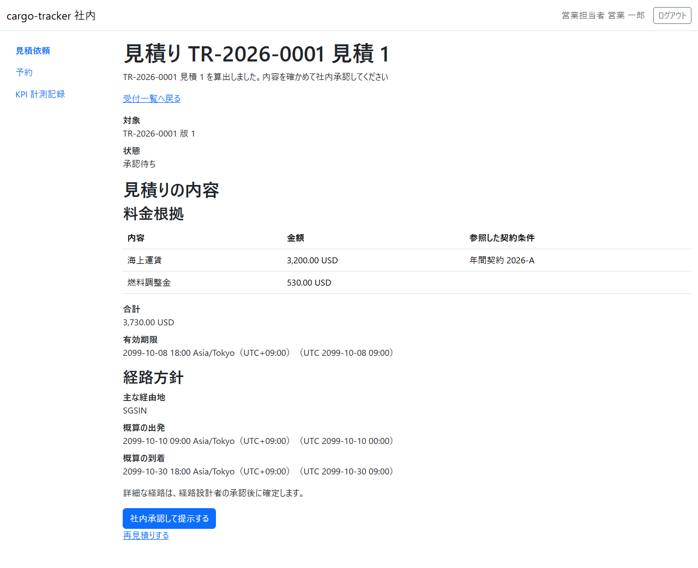

# 6 章 受付一覧と審査と見積り

営業担当者が、荷主から届いた見積依頼を審査し、見積り（料金根拠と経路方針）を作成して荷主へ提示する画面です。本章は [WF-1](01-業務フロー.md#wf-1-見積依頼から追跡の照会まで) の工程 2（見積依頼を審査し、見積りを作成して提示する）に対応します。

画面の開き方: ナビゲーションの「見積依頼」（URL: `/staff/transport-requests`）。営業担当者はログインするとこの画面が開きます。

| 画面 | 役割 | 節 |
| :--- | :--- | :--- |
| 見積依頼の受付一覧 | 見積依頼を状態ごとの表で確かめ、次の作業を選ぶ | [6.1](#61-見積依頼の受付一覧) |
| 見積依頼の審査 | 輸送条件を確かめ、審査を確定するか差し戻す | [6.2](#62-見積依頼の審査) |
| 見積りの作成 | 料金明細・通貨・有効期限・経路方針を入れて算出し、社内承認して提示する | [6.3](#63-見積りの作成) |

本予約の確定は [7 章](07-本予約の確定と予約一覧.md) で説明します。

## 6.1 見積依頼の受付一覧

### この画面でできること

- 見積依頼を「審査中」「見積り作成中」「見積提示済み」「経路設計中・荷主承認待ち」「予約の確定待ち」の表に分けて確かめ、次に行う作業の画面を開きます

### 画面の開き方

- ナビゲーションの「見積依頼」（URL: `/staff/transport-requests`）

### 画面の説明

| # | 項目 | 説明 |
| :--- | :--- | :--- |
| ① | 審査中 | 審査を待っている見積依頼。最初の提出時刻の古い順。業務番号・版・最初の提出時刻・待っている時間・貨物種別・出発地 → 目的地・希望到着期限 |
| ② | 見積り作成中 | 審査を確定し、見積りを作成している見積依頼 |
| ③ | 見積提示済み | 見積りを提示し、荷主の回答を待っている見積依頼 |
| ④ | 経路設計中・荷主承認待ち | 経路設計者の経路の確定と、荷主の承認を待っている見積依頼 |
| ⑤ | 予約の確定待ち | 荷主が見積りと経路を承認し、本予約の確定を待っている見積り。有効期限の近い順（[7 章](07-本予約の確定と予約一覧.md)） |

### 操作手順

1. 審査中の表の業務番号をクリックすると、見積依頼の審査（[6.2](#62-見積依頼の審査)）が開きます
2. 見積り作成中の表の行からは見積りの作成（[6.3](#63-見積りの作成)）が、見積提示済みの表の行からは提示した見積りの画面（「見積り TR-… 見積 N」）が開きます

### 注意・補足

- 社内の画面の日時は、日本時間と UTC を併記します
- 表に見積依頼がないときは「審査中の見積依頼はありません。」のように示されます
- 見積りを提示すると、画面の上に提示したことが示され、見積依頼は「見積提示済み」の表に移ります

## 6.2 見積依頼の審査

### この画面でできること

- 見積依頼の輸送条件と必要書類を確かめ、審査を確定する（見積りの作成へ進む）か、荷主に差し戻します

### 画面の開き方

- 受付一覧の審査中の表の業務番号（URL: `/staff/transport-requests/{業務番号}`）

### 画面の説明

| # | 項目 | 説明 |
| :--- | :--- | :--- |
| ① | 輸送条件 | 状態・荷受人・出発地・目的地・希望到着期限・貨物種別・荷姿・個数・総重量・容積・提出時刻 |
| ② | 必要書類 | 荷主が添付した書類。ファイル名をクリックすると取り出せます |
| ③ | これまでの審査 | 過去の版の審査の記録 |
| ④ | 審査を確定する（根拠） | 確認した輸送条件を書きます（4,000 文字まで）。「審査を確定する」で見積りの作成へ進みます |
| ⑤ | 差し戻す（理由・不足事項） | 理由は荷主がそのまま読みます。何をどう直せばよいかを荷主に伝わる言葉で書きます。不足事項は 1 行に 1 つ（任意） |

### 操作手順

審査を確定するとき:

1. 輸送条件と必要書類を確かめます
2. 「根拠」に確認した内容を書き、「審査を確定する」をクリックします
3. 見積りの作成（[6.3](#63-見積りの作成)）が開き、「TR-… 版 1 の審査を確定しました」と示されます

差し戻すとき:

1. 「理由」と、必要なら「不足事項」を書き、「差し戻す」をクリックします
2. 見積依頼は荷主の「差戻し（お客様の対応待ち）」になり、荷主が直して出し直すと、新しい版で審査中の表に戻ります

### 注意・補足

- 根拠と理由は 4,000 文字までです。空のまま確定・差し戻しはできません
- 審査を確定すると、荷主の画面の状態は「見積り作成中（A 社の対応待ち）」になります

## 6.3 見積りの作成

### この画面でできること

- 料金根拠（料金明細）・通貨・有効期限・経路方針を入れて見積りを算出し、内容を確かめて社内承認して荷主へ提示します

### 画面の開き方

- 審査を確定した直後に開きます。または受付一覧の見積り作成中の表の行（URL: `/staff/transport-requests/{業務番号}/quotations/new`）

### 画面の説明

| # | 項目 | 説明 |
| :--- | :--- | :--- |
| ① | 輸送条件 | 開くと見積依頼の輸送条件を確かめられます |
| ② | 料金根拠（料金明細） | 明細ごとの内容・金額・参照した契約条件（任意）。10 行まで。空の行は無視します |
| ③ | 通貨 | 「USD」「EUR」「JPY」 |
| ④ | 有効期限（日本時間） | 予約の確定がこの時刻より前のときだけ、見積りは有効です |
| ⑤ | 経路方針 | 主な経由地（UN/LOCODE、カンマ区切り、任意）、概算の出発日時と到着日時 |
| ⑥ | 「算出する」 | 入れた内容で見積りを算出します |

### 操作手順

1. 料金明細の内容と金額を入れます（例: 海上運賃 3200.00、燃料調整金 530.00）
2. 通貨を選び、有効期限・経路方針を入れて「算出する」をクリックします
3. 算出した見積りが「承認待ち」で示されます。合計・有効期限・経路方針を確かめます

4. 「社内承認して提示する」をクリックします。受付一覧に戻り、見積りを提示したことが示されます

### 注意・補足

- 金額は小数点以下 2 桁まで入れられます。3,200.00 のように 3 桁区切りのカンマを付けてもかまいません
- 料金明細を 1 行も入れずに算出すると「1 行以上入力してください」と示されます
- 算出した後に直したいときは、「再見積りする」で新しい見積りを作ります
- 提示した時刻が、KPI-01 の「最初の提示時刻」として記録されます（[10 章](10-KPI計測記録.md)）
- 詳細な経路は、荷主が回答した後に経路設計者が確定します（[8 章](08-経路設計.md)）
