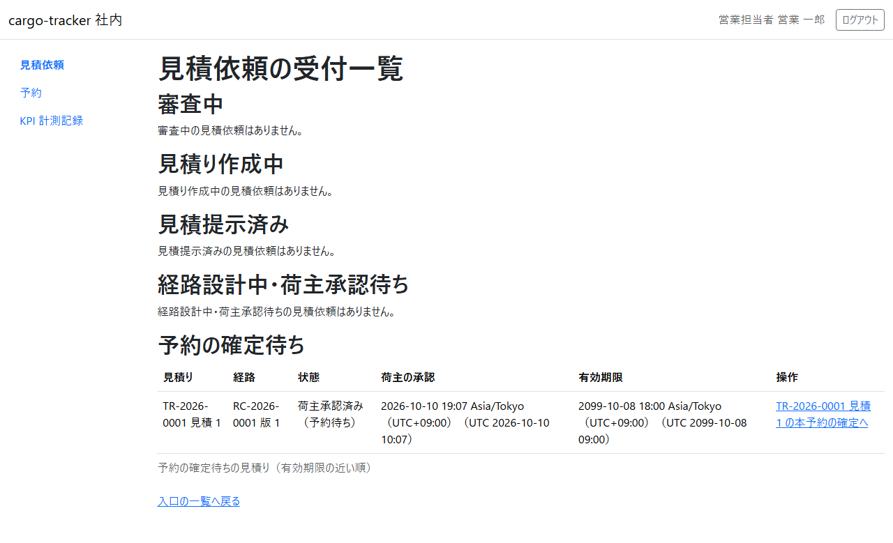
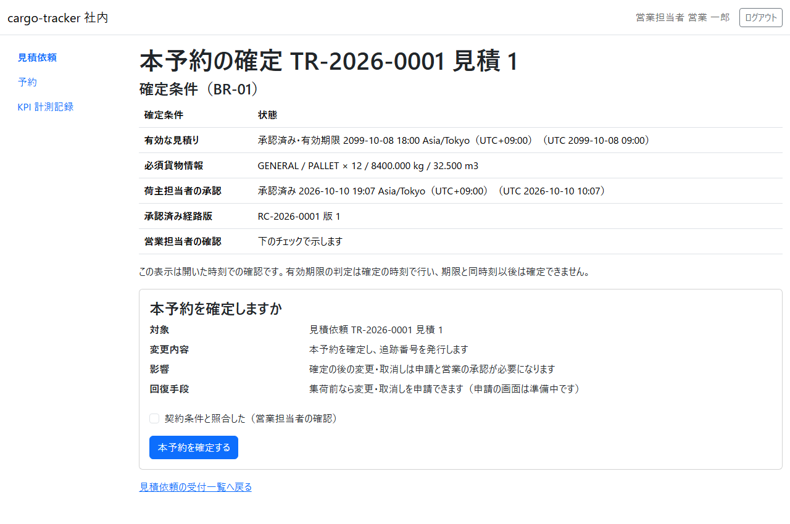
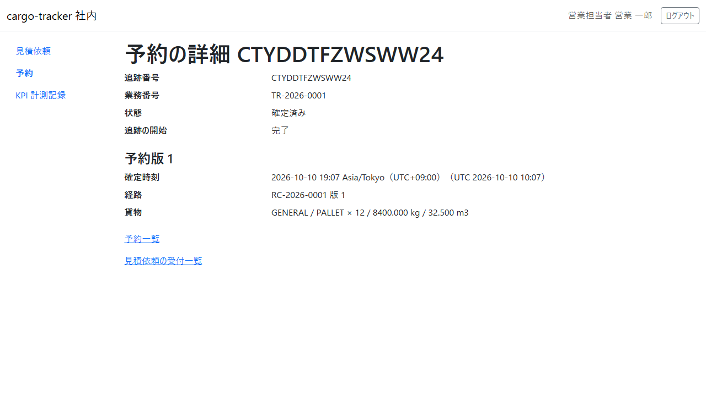
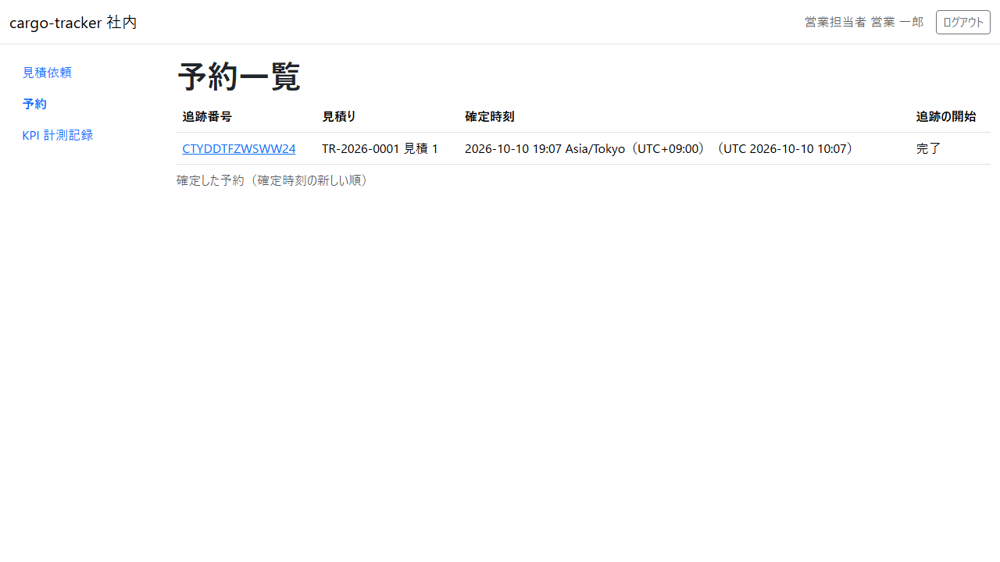

# 7 章 本予約の確定と予約一覧

荷主が見積りと経路を承認した後に、営業担当者が確定の条件を確かめて本予約を確定する画面と、確定した予約を確かめる画面です。本章は [WF-1](01-業務フロー.md#wf-1-見積依頼から追跡の照会まで) の工程 6（本予約を確定する）に対応します。

画面の開き方: ナビゲーションの「見積依頼」→ 受付一覧の「予約の確定待ち」の表、ナビゲーションの「予約」（URL: `/staff/bookings`）。

| 画面 | 役割 | 節 |
| :--- | :--- | :--- |
| 予約の確定待ち（受付一覧） | 荷主が承認した見積りを、有効期限の近い順に確かめる | [7.1](#71-予約の確定待ち) |
| 本予約の確定 | 確定の条件を確かめ、契約条件と照合して本予約を確定する | [7.2](#72-本予約の確定) |
| 予約の詳細 | 追跡番号・状態・追跡の開始・予約版を確かめる | [7.3](#73-予約の詳細) |
| 予約一覧 | 確定した予約を、確定時刻の新しい順に確かめる | [7.4](#74-予約一覧) |

## 7.1 予約の確定待ち

### この画面でできること

- 荷主が見積りと経路を承認した見積りを、有効期限の近い順に確かめ、本予約の確定を開きます

### 画面の開き方

- ナビゲーションの「見積依頼」→ 受付一覧の「予約の確定待ち」の表（URL: `/staff/transport-requests`）

### 画面の説明

| # | 項目 | 説明 |
| :--- | :--- | :--- |
| ① | 見積り | 業務番号と見積り番号 |
| ② | 経路 | 荷主が承認した経路の番号と版 |
| ③ | 状態 | 「荷主承認済み（予約待ち）」 |
| ④ | 荷主の承認 | 荷主が承認した日時 |
| ⑤ | 有効期限 | 見積りの有効期限。この時刻より前に確定します |
| ⑥ | 操作 | 「TR-… 見積 N の本予約の確定へ」 |

### 操作手順

1. 有効期限の近いものから、「… の本予約の確定へ」をクリックします。本予約の確定（[7.2](#72-本予約の確定)）が開きます

### 注意・補足

- 荷主の承認の後に有効期限を過ぎた見積りは、本予約を確定できません。受付一覧に「失効（荷主承認済み）の見積りは本予約を確定できません。荷主の承認の後に失効した見積りの再見積りは、まだ画面で操作できません。扱いは担当者で相談してください。」と示されます。扱いは担当者で相談してください

## 7.2 本予約の確定

### この画面でできること

- 確定の条件（有効な見積り・必須の貨物情報・荷主担当者の承認・承認済みの経路版）を確かめ、契約条件と照合したことを示して本予約を確定します。確定すると追跡番号が発行されます

### 画面の開き方

- 予約の確定待ちの「… の本予約の確定へ」（URL: `/staff/bookings/new?transportRequest={業務番号}&quotation={見積り番号}`）

### 画面の説明

| # | 項目 | 説明 |
| :--- | :--- | :--- |
| ① | 確定条件 | 有効な見積り（承認済み・有効期限）、必須貨物情報、荷主担当者の承認、承認済み経路版、営業担当者の確認 |
| ② | 開いた時刻での確認の注意 | 有効期限の判定は確定の時刻で行い、期限と同時刻以後は確定できません |
| ③ | 本予約を確定しますか | 対象・変更内容・影響・回復手段 |
| ④ | 「契約条件と照合した（営業担当者の確認）」 | 契約条件と照合したらチェックを入れます |
| ⑤ | 「本予約を確定する」 | 本予約を確定します |

### 操作手順

1. 確定条件を確かめます
2. 契約条件と照合し、「契約条件と照合した（営業担当者の確認）」にチェックを入れます
3. 「本予約を確定する」をクリックします
4. 予約の詳細（[7.3](#73-予約の詳細)）が開き、本予約を確定したことと追跡番号が示されます

### 注意・補足

- チェックを入れずに確定すると、「本予約を確定できませんでした」と「営業担当者の確認: 契約条件と照合したことを確かめて、チェックを入れてください。」が示され、確定されません
- 画面を開いた後に有効期限を過ぎた見積りは、送っても確定せず、受付一覧に「… は有効期限を過ぎたため本予約を確定できません。再見積りが必要です。」と示されます。荷主の承認の後の再見積りは、まだ画面で操作できないので、扱いは担当者で相談してください
- 同じフォームを 2 回送っても、予約は増えず、最初の確定と同じ追跡番号の予約の詳細が示されます
- ほかの担当者が先に同じ見積りを確定していたときは、受付一覧にその予約の追跡番号と予約の詳細への導線が示されます
- 確定の後の変更・取消しは申請と営業の承認が必要です（申請の画面は準備中です）

## 7.3 予約の詳細

### この画面でできること

- 確定した予約の追跡番号・業務番号・状態・追跡の開始と、予約版（確定時刻・経路・貨物）を確かめます

### 画面の開き方

- 本予約を確定した直後に開きます。または予約一覧の追跡番号（URL: `/staff/bookings/{追跡番号}`）

### 画面の説明

| # | 項目 | 説明 |
| :--- | :--- | :--- |
| ① | 追跡番号・業務番号・状態 | 状態は「確定済み」 |
| ② | 追跡の開始 | 「処理中」「完了」「有人確認要（担当者が確認します）」 |
| ③ | 予約版 | 確定時刻・経路・貨物 |
| ④ | 「予約一覧」「見積依頼の受付一覧」 | それぞれの画面に戻ります |

### 操作手順

1. 追跡番号を確かめます。荷主にはこの追跡番号で追跡を照会してもらいます
2. 追跡の開始が「処理中」のときは、少し待ってから画面を開き直します。「完了」になれば、追跡管理者が実績を登録できます

### 注意・補足

- 追跡の開始は、確定の後に自動で進みます。画面は自動では変わらないので、開き直して確かめてください。しばらくしても「処理中」のままなら、システム管理者にお問い合わせください

## 7.4 予約一覧

### この画面でできること

- 確定した予約を、確定時刻の新しい順に確かめ、予約の詳細を開き直します

### 画面の開き方

- ナビゲーションの「予約」（URL: `/staff/bookings`）

### 画面の説明

| # | 項目 | 説明 |
| :--- | :--- | :--- |
| ① | 追跡番号 | クリックすると予約の詳細が開きます |
| ② | 見積り | 業務番号と見積り番号 |
| ③ | 確定時刻 | 最初に確定した日時 |
| ④ | 追跡の開始 | 「処理中」「完了」「有人確認要（担当者が確認します）」 |

### 操作手順

1. 確かめたい予約の追跡番号をクリックします

### 注意・補足

- 新しい 50 件まで示します
