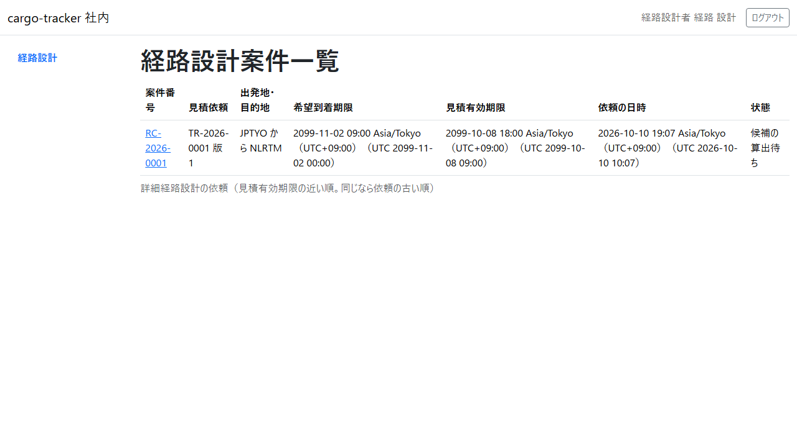
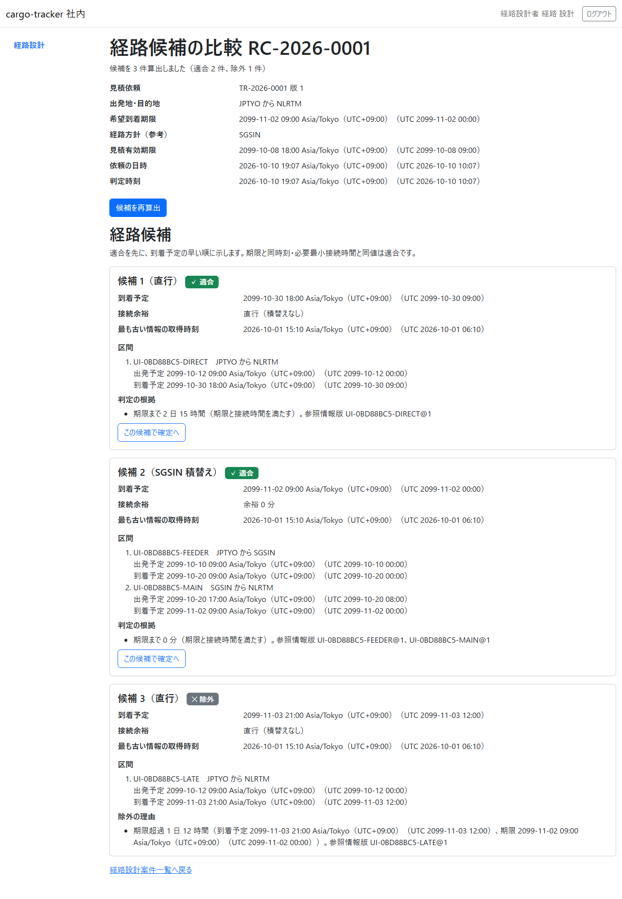
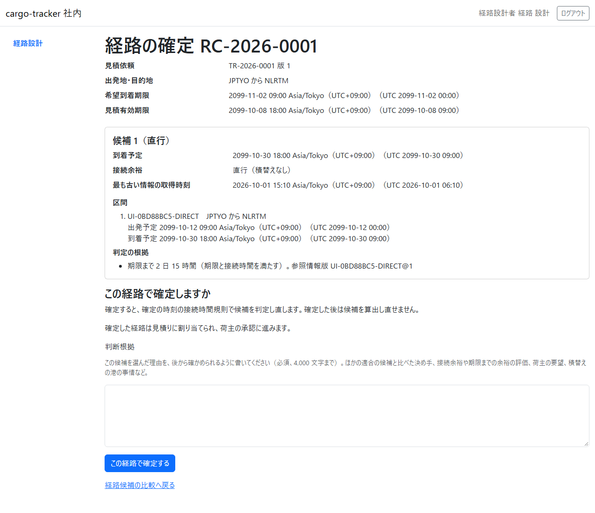
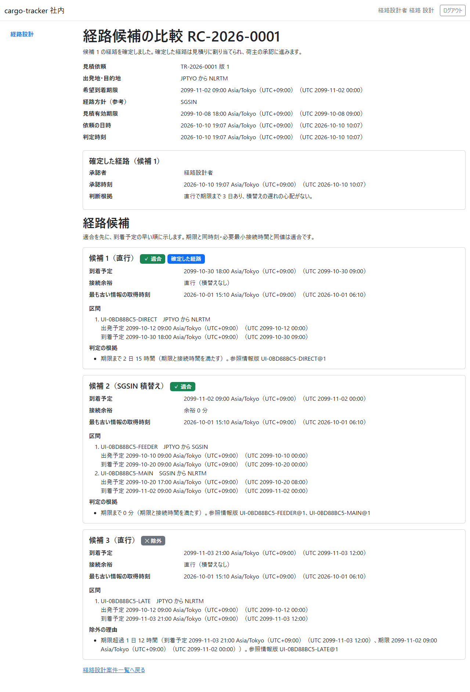

# 8 章 経路設計

荷主が見積りに回答して詳細経路設計を依頼した後に、経路設計者が経路の候補を算出して比べ、判断根拠を残して経路を確定する画面です。本章は [WF-1](01-業務フロー.md#wf-1-見積依頼から追跡の照会まで) の工程 4（経路の候補を比較して確定する）に対応します。

画面の開き方: ナビゲーションの「経路設計」（URL: `/staff/routing-cases`）。経路設計者はログインするとこの画面が開きます。

| 画面 | 役割 | 節 |
| :--- | :--- | :--- |
| 経路設計案件一覧 | 詳細経路設計の依頼を、見積有効期限の近い順に確かめる | [8.1](#81-経路設計案件一覧) |
| 経路候補の比較 | 候補を算出し、適合と除外の候補を理由とともに比べる | [8.2](#82-経路候補の比較) |
| 経路の確定 | 判断根拠を書いて候補を確定する | [8.3](#83-経路の確定) |

## 8.1 経路設計案件一覧

### この画面でできること

- 荷主が依頼した詳細経路設計の案件を、見積有効期限の近い順（同じなら依頼の古い順）に確かめます

### 画面の開き方

- ナビゲーションの「経路設計」（URL: `/staff/routing-cases`）

### 画面の説明

| # | 項目 | 説明 |
| :--- | :--- | :--- |
| ① | 案件番号 | 経路設計の案件の番号（RC-…）。クリックすると経路候補の比較が開きます |
| ② | 見積依頼 | 業務番号と版 |
| ③ | 出発地・目的地・希望到着期限 | 荷主の輸送条件 |
| ④ | 見積有効期限 | この時刻より前に経路を確定し、荷主が承認する必要があります |
| ⑤ | 依頼の日時・状態 | 例: 「候補の算出待ち」 |

### 操作手順

1. 見積有効期限の近い案件から、案件番号をクリックします

### 注意・補足

- 見積りの有効期限が過ぎた案件は、確定の前後に担当営業と扱いを相談してください

## 8.2 経路候補の比較

### この画面でできること

- 航海の情報と接続時間の規則から経路の候補を算出し、期限に間に合うか（適合）、間に合わないか（除外）を、根拠とともに比べます

### 画面の開き方

- 経路設計案件一覧の案件番号（URL: `/staff/routing-cases/{案件番号}`）

### 画面の説明

| # | 項目 | 説明 |
| :--- | :--- | :--- |
| ① | 案件の情報 | 見積依頼・出発地・目的地・希望到着期限・経路方針（参考）・見積有効期限・依頼の日時・判定時刻 |
| ② | 「候補を算出」（算出の後は「候補を再算出」） | 航海の情報から候補を算出します |
| ③ | 経路候補 | 適合を先に、到着予定の早い順。候補ごとに「適合」「除外」の印 |
| ④ | 到着予定・接続余裕・最も古い情報の取得時刻 | 候補の判断の材料 |
| ⑤ | 区間 | 航海・積地から揚地・出発予定・到着予定 |
| ⑥ | 判定の根拠／除外の理由 | 期限までの余裕や、除外した理由と参照した情報の版 |
| ⑦ | 「この候補で確定へ」 | 適合の候補だけに出ます |

### 操作手順

1. 「候補を算出」をクリックします。「候補を N 件算出しました（適合 N 件、除外 N 件）」と示されます
2. 適合の候補の到着予定・接続余裕・判定の根拠を比べます
3. 選んだ候補の「この候補で確定へ」をクリックします。経路の確定（[8.3](#83-経路の確定)）が開きます

### 注意・補足

- 期限と同時刻に着く候補、必要最小接続時間と同じ接続時間の候補は「適合」です
- 除外の候補は確定できません。除外の理由を確かめてください
- 経路方針（参考）は営業担当者が見積りで示したものです。参考として比べてください

## 8.3 経路の確定

### この画面でできること

- 選んだ候補を、判断根拠を残して確定します。確定した経路は見積りに割り当てられ、荷主の承認に進みます

### 画面の開き方

- 経路候補の比較の「この候補で確定へ」（URL: `/staff/routing-cases/{案件番号}/confirmation?candidate={候補番号}`）

### 画面の説明

| # | 項目 | 説明 |
| :--- | :--- | :--- |
| ① | 案件の情報 | 見積依頼・出発地・目的地・希望到着期限・見積有効期限 |
| ② | 選んだ候補 | 到着予定・接続余裕・区間・判定の根拠 |
| ③ | この経路で確定しますか | 確定の時刻の規則で判定し直すこと、確定した後は候補を算出し直せないこと |
| ④ | 判断根拠 | この候補を選んだ理由（必須、4,000 文字まで）。ほかの適合の候補と比べた決め手、接続余裕や期限までの余裕の評価、荷主の要望など |
| ⑤ | 「この経路で確定する」 | 確定します |

### 操作手順

1. 選んだ候補の内容を確かめます
2. 「判断根拠」に、この候補を選んだ理由を書きます
3. 「この経路で確定する」をクリックします
4. 経路候補の比較に戻り、「候補 N の経路を確定しました。確定した経路は見積りに割り当てられ、荷主の承認に進みます。」と示されます。確定した経路の承認者・承認時刻・判断根拠が示され、候補に「確定した経路」の印が付きます

### 注意・補足

- 判断根拠が空、または長すぎると確定できず、エラーが示されます。入力は残ります
- ほかの経路設計者が先に同じ案件を更新していたときは、「ほかの経路設計者が先にこの案件を更新しました。最新の候補を確かめてください。」と示されます
- 確定の時刻に、出発済みの区間があったり規則に合わなくなっていたりすると確定できません。候補を算出し直してください
