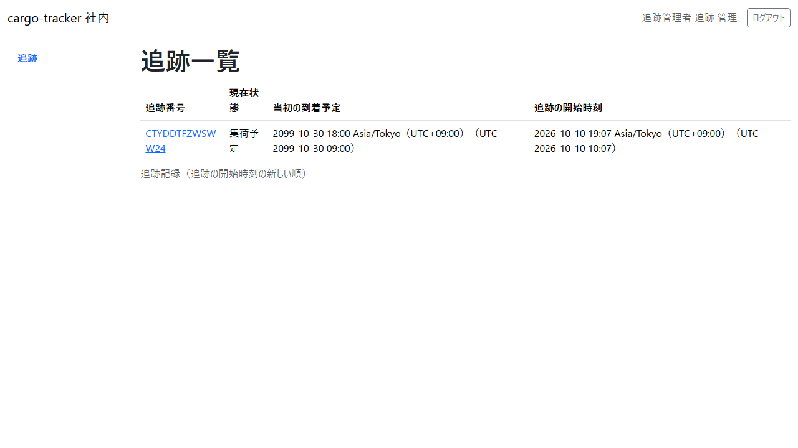
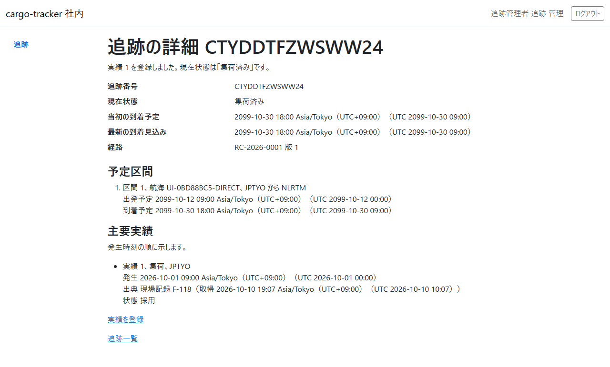
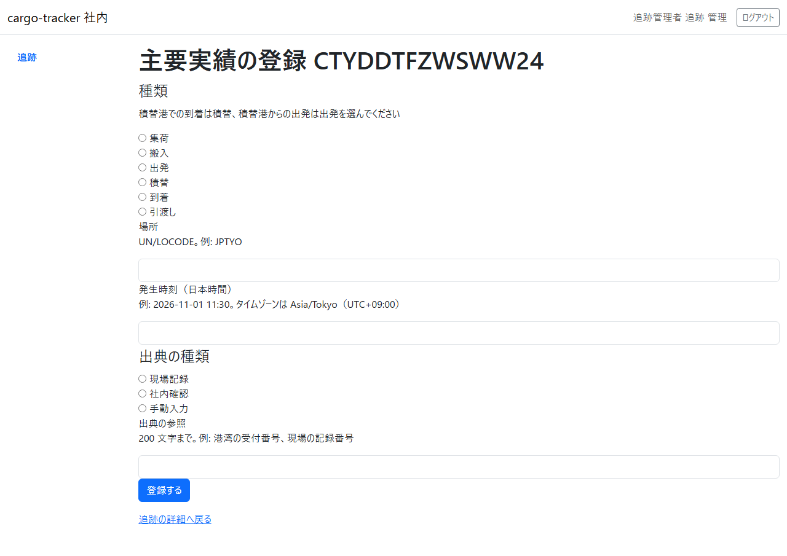

# 9 章 追跡管理

本予約が確定して追跡が始まった貨物について、追跡管理者が予定と主要な実績を確かめ、集荷などの実績を出典とともに登録する画面です。本章は [WF-1](01-業務フロー.md#wf-1-見積依頼から追跡の照会まで) の工程 7（主要な実績を登録する）に対応します。

画面の開き方: ナビゲーションの「追跡」（URL: `/staff/tracking-records`）。追跡管理者はログインするとこの画面が開きます。

| 画面 | 役割 | 節 |
| :--- | :--- | :--- |
| 追跡一覧 | 追跡中の貨物を、追跡の開始時刻の新しい順に確かめる | [9.1](#91-追跡一覧) |
| 追跡の詳細 | 現在状態・到着の予定・予定区間・主要実績を確かめる | [9.2](#92-追跡の詳細) |
| 主要実績の登録 | 実績の種類・場所・発生時刻・出典を入れて登録する | [9.3](#93-主要実績の登録) |

登録した実績は、荷主の追跡の照会（[5.3](05-予約一覧と追跡の照会.md#53-照会の結果)）にも示されます。

## 9.1 追跡一覧

### この画面でできること

- 追跡中の貨物を、追跡の開始時刻の新しい順に確かめ、追跡の詳細を開きます

### 画面の開き方

- ナビゲーションの「追跡」（URL: `/staff/tracking-records`）

### 画面の説明

| # | 項目 | 説明 |
| :--- | :--- | :--- |
| ① | 追跡番号 | クリックすると追跡の詳細が開きます |
| ② | 現在状態 | 例: 「集荷予定」「集荷済み」 |
| ③ | 当初の到着予定 | 予約したときの到着予定 |
| ④ | 追跡の開始時刻 | 本予約の確定の後に追跡が始まった日時 |

### 操作手順

1. 実績を登録する貨物の追跡番号をクリックします

### 注意・補足

- 新しい 50 件まで示します

## 9.2 追跡の詳細

### この画面でできること

- 貨物の現在状態・当初の到着予定・最新の到着見込み・経路・予定区間・主要実績を確かめ、実績の登録を開きます

### 画面の開き方

- 追跡一覧の追跡番号（URL: `/staff/tracking-records/{追跡番号}`）

### 画面の説明

| # | 項目 | 説明 |
| :--- | :--- | :--- |
| ① | 結果のメッセージ | 実績を登録した直後に「実績 N を登録しました。現在状態は「…」です。」と示されます |
| ② | 追跡番号・現在状態・当初の到着予定・最新の到着見込み・経路 | 経路は確定した経路の番号と版 |
| ③ | 予定区間 | 区間ごとの航海・積地から揚地・出発予定・到着予定 |
| ④ | 主要実績 | 発生時刻の順。実績番号・種類・場所、発生・出典（取得時刻）・状態 |
| ⑤ | 「実績を登録」 | 主要実績の登録（[9.3](#93-主要実績の登録)）を開きます |
| ⑥ | 「追跡一覧」 | 追跡一覧に戻ります |

### 操作手順

1. 予定区間と主要実績を確かめます
2. 新しい実績があれば「実績を登録」をクリックします

### 注意・補足

- 主要実績がまだなければ「主要実績はまだありません。」と示されます
- 現在状態は、採用した主要実績から決まります（例: 集荷の実績で「集荷済み」）

## 9.3 主要実績の登録

### この画面でできること

- 集荷・搬入・出発・積替・到着・引渡しの実績を、場所・発生時刻・出典とともに登録します

### 画面の開き方

- 追跡の詳細の「実績を登録」（URL: `/staff/tracking-records/{追跡番号}/milestones/new`）

### 画面の説明

| # | 項目 | 説明 |
| :--- | :--- | :--- |
| ① | 種類 | 「集荷」「搬入」「出発」「積替」「到着」「引渡し」。積替港での到着は積替、積替港からの出発は出発を選びます |
| ② | 場所 | 港の UN/LOCODE（例: JPTYO） |
| ③ | 発生時刻（日本時間） | 「2026-11-01 11:30」の形 |
| ④ | 出典の種類 | 「現場記録」「社内確認」「手動入力」 |
| ⑤ | 出典の参照 | 200 文字まで。例: 港湾の受付番号、現場の記録番号 |
| ⑥ | 「登録する」 | 登録します |

### 操作手順

1. 種類を選び、場所と発生時刻を入れます
2. 出典の種類を選び、出典の参照を入れます
3. 「登録する」をクリックします
4. 追跡の詳細に戻り、「実績 N を登録しました。現在状態は「…」です。」と示されます

### 注意・補足

- 発生時刻は、登録する時刻より前にしてください。未来の時刻は登録できません
- 同じ出典の種類と参照の実績がすでにあるときは、新しい実績を作らず、既存の実績を示します（「出典（…）の実績はすでに登録されています（実績 N）。今回の入力は登録していません。」と「実績 N を一覧で見る」）
- 入力に誤りがあると、画面の上に誤りの一覧が示され、入力した値は残ります
- ほかの追跡管理者が先に同じ追跡記録を更新していたときは、「ほかの追跡管理者が先にこの追跡記録を更新しました。最新の主要実績を確かめ、必要なら、もう一度登録してください。」と示されます
