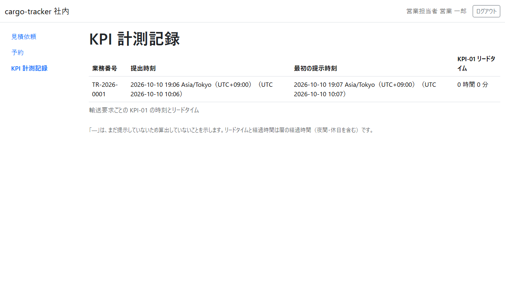

# 10 章 KPI 計測記録

パイロットの効果を測る KPI-01（経路提示リードタイム: 見積依頼の提出から最初の見積りの提示まで）の時刻を、見積依頼ごとに確かめる画面です。本章は [WF-1](01-業務フロー.md#wf-1-見積依頼から追跡の照会まで) の工程 1・2（提出と提示）で記録された時刻を確かめるためのものです。

画面の開き方: ナビゲーションの「KPI 計測記録」（URL: `/staff/kpi-observations`）。

| 画面 | 役割 | 節 |
| :--- | :--- | :--- |
| KPI 計測記録 | 見積依頼ごとの提出時刻・最初の提示時刻・KPI-01 リードタイムを確かめる | [10.1](#101-kpi-計測記録) |

## 10.1 KPI 計測記録

### この画面でできること

- 見積依頼ごとに、提出時刻・最初の提示時刻・KPI-01 リードタイムを確かめます

### 画面の開き方

- ナビゲーションの「KPI 計測記録」（URL: `/staff/kpi-observations`）

### 画面の説明

| # | 項目 | 説明 |
| :--- | :--- | :--- |
| ① | 業務番号 | 見積依頼の番号 |
| ② | 提出時刻 | 荷主が版 1 を最初に提出した日時 |
| ③ | 最初の提示時刻 | 営業担当者が最初に見積りを提示した日時 |
| ④ | KPI-01 リードタイム | 提出時刻から最初の提示時刻までの時間 |

### 操作手順

1. 見積依頼ごとの時刻とリードタイムを確かめます

### 注意・補足

- まだ見積りを提示していない見積依頼は「—」と示され、リードタイムは算出しません
- リードタイムは暦の経過時間（夜間・休日を含む）です
- この画面は、監査担当者が使う KPI の照会の画面（後のリリースで作ります）の前身の仮の画面です。Release 0.1 では営業担当者が開けます
