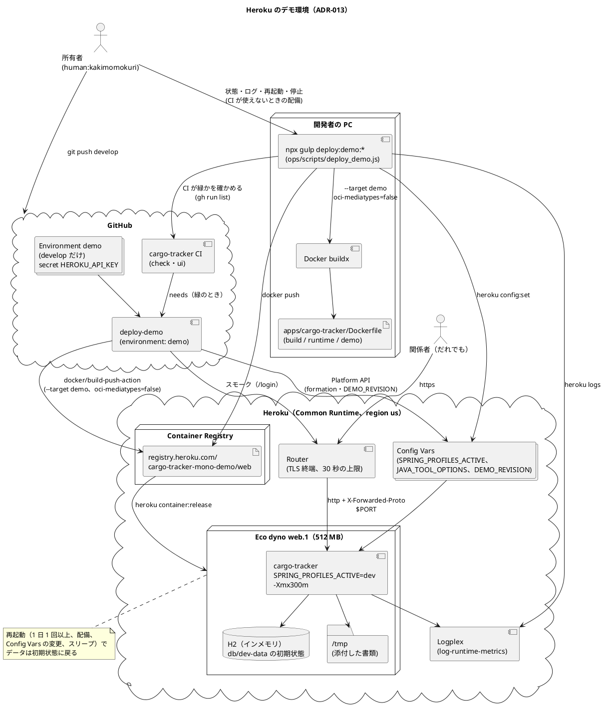
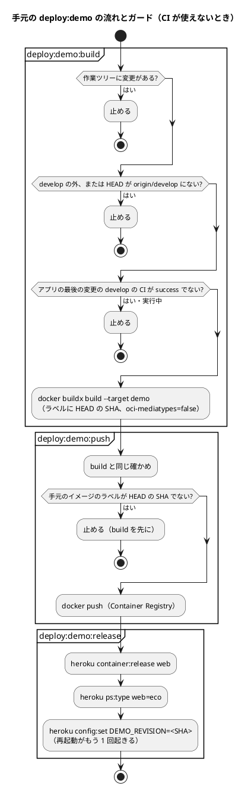

# Heroku デモ環境セットアップ手順書 - cargo-tracker

## 概要

関係者がブラウザで触って確かめるためのデモ環境を、Heroku に作る手順です。位置づけと制約は [ADR-013](../../adr/cargo-tracker/013-heroku-demo-environment.md) を参照してください。配備は、develop の cargo-tracker CI が緑になった後に `deploy-demo` ジョブが自動で行います（Bolt 16）。そのほかの操作（状態・ログ・再起動・停止）と、CI が使えないときの配備は、Gulp のタスク `deploy:demo:*`（`ops/scripts/deploy_demo.js`）で行います。

| 項目 | 内容 |
| :--- | :--- |
| アプリ名 | `cargo-tracker-mono-demo` |
| URL | <https://cargo-tracker-mono-demo-883bf0b92807.herokuapp.com/> |
| プロファイル | `dev`（H2 のインメモリ、開発用の利用者） |
| dyno | Eco（512 MB）、web 1 つ、region `us`、stack `container` |
| 配備 | CI の `deploy-demo` ジョブ（`.github/workflows/cargo-tracker-ci.yml`）が自動で行う。手元の `deploy:demo` は CI が使えないとき。どちらも Container Registry に `apps/cargo-tracker/Dockerfile` の `demo` のステージを送る |
| CI の認証 | GitHub の Environment `demo`（develop だけ）の secret `HEROKU_API_KEY`（Heroku の authorization、期限 1 年） |
| Config Vars | `SPRING_PROFILES_ACTIVE=dev`、`JAVA_TOOL_OPTIONS=-Xmx300m -XX:+UseSerialGC -Xss512k -XX:ReservedCodeCacheSize=64m -XX:MaxMetaspaceSize=192m` |
| 費用 | Eco の定額、月 5 USD（アカウントの全 Eco dyno に共通） |
| 所有者 | human:kakimomokuri（Heroku のアカウント・費用・停止の手段。不在のときに止める必要があれば、Heroku の collaborator を足す） |
| 稼働 | 常時起動。30 分アクセスがなければ Eco のスリープに任せる（ADR-013、D-55） |

> **注意**: だれでも開ける公開のデモです（ADR-013、D-54）。URL はこの手順書と README に書いてあり、開発用の利用者でだれでもログインできます。本物の荷主・利用者・取引のデータを入れないでください。データは dyno の再起動で初期状態に戻ります。不審な利用に気づいたら、`deploy:demo:restart` か `deploy:demo:stop` をしてください。

### 環境の構成



### イメージの構成

`apps/cargo-tracker/Dockerfile` は 3 つのステージを持ちます。

| ステージ | 中身 | 使う場所 |
| :--- | :--- | :--- |
| `build` | `./gradlew bootJar copyDemoLibs` と、bootJar の `app.jar`・`lib/` への展開 | — |
| `runtime` | bootJar だけ。H2 を含まない（AT-06） | W10 の ECR・ECS の出発点 |
| `demo` | `runtime` に `build/demo-lib` の H2 を足す | このデモ環境 |

H2 は `developmentOnly` の依存で、本番の成果物の bootJar には入りません（ADR-007、AT-06）。`copyDemoLibs` が H2 だけを `build/demo-lib` に写し、`demo` のステージがクラスパスに足します。

## 1. 前提条件

| もの | 確かめ方 |
| :--- | :--- |
| Heroku のアカウントと Eco の契約 | Heroku の Billing で Eco dynos plan が有効 |
| Heroku CLI | `heroku --version` |
| Docker（buildx を含む） | `docker buildx version` |
| GitHub CLI（CI の結果を見る） | `gh auth status` |
| Node.js と依存 | リポジトリのルートで `npm install` 済み |

ログインは対話のため、人が行います。

```bash
heroku login
heroku container:login
```

## 2. 初回のセットアップ

リポジトリのルートで実行します。2 回目以降に実行しても、作成を飛ばして Config Vars を合わせるだけです。

```bash
npx gulp deploy:demo:setup
```

アプリの作成（`--stack container --region us`）、Config Vars の設定、`log-runtime-metrics`（メモリの値をログに出す）の有効化を行います。アプリ名・region・JVM の設定は `.env` の `DEMO_*` で変えられます（`.env.example` を参照）。

### CI からの配備の準備

GitHub の Environment `demo` を作り、配備のブランチを develop に限ります（Bolt 16 で作成済み）。

```bash
gh api -X PUT repos/k2works/practical-domain-driven-design-in-enterpris-application/environments/demo \
  -F 'deployment_branch_policy[protected_branches]=false' -F 'deployment_branch_policy[custom_branch_policies]=true'
gh api -X POST repos/k2works/practical-domain-driven-design-in-enterpris-application/environments/demo/deployment-branch-policies \
  -f name=develop -f type=branch
```

Heroku の API キー（期限 90 日）は所有者が Gulp のタスクで作り、そのまま secret に登録します。キーの値は表示されません。

```bash
npx gulp deploy:demo:ci-key              # キーを作って secret に登録し、更新の Issue を立てる
gh workflow run cargo-tracker-ci.yml --ref develop   # 新しいキーで配備が通ることを確かめる
npx gulp deploy:demo:ci-key:revoke-old   # 配備が通った後に、古いキーを失効させる
```

`deploy:demo:ci-key` は次を行います。

- キーの説明に作った日を入れる（`GitHub Actions cargo-tracker demo deploy YYYY-MM-DD`）
- キーが空なら登録しない（Bolt 16 で、手で貼ったコマンドが折り返しで崩れ、空の secret が登録されて `deploy-demo` が `Password required` で失敗した）
- `gh secret list --env demo` で更新日時を表示する
- 期限の 2 週間前を期日にした Issue「[運用] デモ環境の CI の API キーを更新する（期日 YYYY-MM-DD）」を立て、前の Issue を閉じる

`deploy:demo:ci-key:revoke-old` は、説明が `GitHub Actions cargo-tracker demo deploy` で始まるキーのうち、最も新しいもの以外を失効させます。

| 場面 | すること |
| :--- | :--- |
| 更新の Issue の期日（期限の 2 週間前） | 上の 3 つのコマンドを順に実行し、Issue が閉じたことを確かめる |
| 漏えいの疑い | `npx gulp deploy:demo:ci-key` で新しいキーにし、すぐに `npx gulp deploy:demo:ci-key:revoke-old`。Heroku の Dashboard の Activity と `heroku releases -a cargo-tracker-mono-demo` で、覚えのない release や collaborator の変化がないかを確かめる。ほかのアプリも同じアカウントにあるため、それらの Activity も確かめる |
| デモ環境をやめる | `heroku authorizations` で説明が `GitHub Actions cargo-tracker demo deploy` のキーをすべて `heroku authorizations:revoke <ID>` で失効させ、`gh secret delete HEROKU_API_KEY --env demo` |

キーの境界は「k2works のアカウントで develop に push するもの（人と AI のセッション）」です。develop に push できれば、ワークフローを書き換えてキーを使えます。`.github/workflows/` の変更は人がレビューしてください（ADR-013、D-58）。

## 3. 配備

### CI からの配備（通常）

develop にアプリか設計文書（`docs/design/cargo-tracker/**`）の変更を push すると、cargo-tracker CI の check・ui が緑になった後に、`deploy-demo` ジョブが配備します。手で配備し直すときは、develop で CI を実行します。

```bash
gh workflow run cargo-tracker-ci.yml --ref develop
gh run watch                      # 実行を見る
npx gulp deploy:demo:status       # DEMO_REVISION が配備したコミットか確かめる
```

- `deploy-demo` は `needs: [check, ui]` で、develop の push と手動の実行のときだけ動きます。Pull Request と develop の外では動きません。
- `docker/build-push-action` で `demo` のステージを `linux/amd64`・Docker v2 の manifest（`oci-mediatypes=false`）で作り、ラベルに `github.sha` を付けて push します。
- Heroku Platform API で formation を更新して release し、Config Vars の `DEMO_REVISION` を `github.sha` にします。
- release の前に、CI の対象のパスを最後に変えたコミットが、配備するコミットまでと develop の先頭までで同じかを確かめます。違えば（古い実行を再実行したときなど）警告を出して配備を飛ばします。古いコミットに戻したいときは、develop で `git revert` して push します。
- 配備のジョブはワークフローの取り消しの外にあり、release の途中で取り消されません。配備どうしは 1 つずつ動き、後から来たものが待ちを置き換えます。
- 配備の後、`DEMO_REVISION` が配備したコミットで、最新の release が succeeded で、その版の web の dyno が up で、`/login` が 200 になるのを最大 180 秒待ちます。来なければ直前の release に Platform API で戻し、ジョブを失敗にします。Eco には preboot がなく、新しい dyno が起動に失敗すると古い dyno は止まっているため、戻さないとデモが落ちたままになります。戻せなかったときは「ロールバック」の手順で戻します。
- ログイン・ビルド・push で失敗したときは、release の前なので、前の release のまま動き続けます。
- 同じコミットを配備し直しても（手動の実行など）、イメージと `DEMO_REVISION` が変わらないため Heroku は新しい release を作らず、再起動もしません（Bolt 16 で確かめた）。これはビルドのキャッシュが当たって同じイメージが再現されるときの話で、キャッシュが追い出されていればイメージが変わり、再起動が起きます。
- 所要時間は、配備のジョブが 30 秒〜3 分（キャッシュがあれば短い）。push から配備までは、check・ui を含めて 12〜15 分です。
- develop に push するたびにデモ環境が再起動し、データが初期状態に戻ります。デモの最中は develop に push しないでください。
- CI の配備の実行中は、手元で配備しないでください（どちらのコミットが出たか分からなくなります）。

### 手元からの配備（CI が使えないとき）

develop の CI が緑のコミットから配備します。

```bash
npx gulp deploy:demo
```

`deploy:demo:build` → `deploy:demo:push` → `deploy:demo:release` を順に行います。



- `build` と `push` は、次をすべて確かめてから進みます。
  - 作業ツリーに変更がない
  - develop にいて、HEAD が `origin/develop` に含まれる（push 済み）
  - アプリ（`apps/cargo-tracker`）を最後に変えたコミットの、develop での `cargo-tracker-ci.yml` が success
  - （`push` だけ）手元のイメージが HEAD から作ったもの（イメージのラベル `org.opencontainers.image.revision`）
- イメージは `docker buildx build --provenance=false --sbom=false --output type=image,…,oci-mediatypes=false` で作ります。Heroku の Container Registry は Docker v2 の manifest だけを受けるためです。
- `release` の後に dyno の種類を Eco にし、動いているコミットを Config Vars の `DEMO_REVISION` に残します（Config Vars の変更で再起動がもう 1 回起きます）。
- ビルドの context は作業ツリーの `apps/cargo-tracker` です。gitignore されたファイルは作業ツリーの確かめに出ないまま、`src/` の下にあればイメージに入ります。手元だけのファイルを `src/` に置かないでください（W10 で `git archive` からの context を検討します）。
- 確かめを飛ばすときだけ `DEMO_SKIP_GUARD=1` を付けます。使ったら、理由を Bolt の終了報告かジャーナルに書きます。

所要時間の目安は、依存のキャッシュがあれば 1 分前後です。初回と、`build.gradle` を変えた後は、依存の取得からやり直すため 4〜9 分かかります（Bolt 15 で `build.gradle` を変えた後の build は 8.5 分）。

## 4. 確認

```bash
npx gulp deploy:demo:status   # dyno・release・プロファイル（dev だけ）・URL
npx gulp deploy:demo:open     # ブラウザで開く
```

ブラウザでは、ログインの画面の「開発用の利用者でログイン（開発環境だけ）」から、荷主担当者 2 人・営業担当者 1 人を選んでログインします。

| 確かめること | 期待する結果 |
| :--- | :--- |
| URL を開く | https のまま A-01（`/login`）へ移る |
| 荷主担当者でログイン | 荷主の輸送要求の一覧（`/customer/transport-requests`） |
| 営業担当者でログイン | 営業の受付一覧（`/staff/transport-requests`） |
| 営業担当者で荷主の画面を開く | 「権限がありません」（A-04） |
| `deploy:demo:status` のプロファイル | `dev` だけ（`staging`・`prod` を含まない。ADR-013 のコンプライアンス） |
| `deploy:demo:status` の動いているコミット | `DEMO_REVISION` が配備したコミット |

## 5. ログ

```bash
npx gulp deploy:demo:logs     # tail。Ctrl+C で止める
```

メモリの値は `log-runtime-metrics` で 20 秒ごとにログに出ます（`sample#memory_total`）。`deploy:demo:setup` で有効になります。`memory_total` が 450 MB を超えるか、R14・R15 が出たら、dyno の種類（Basic・Standard-2X）の変更を所有者に諮ります。

### 週次の確かめ

週次の見直しのときに、次を確かめます（ADR-013 の運用の約束）。

- `npx gulp deploy:demo:status`: dyno が up、プロファイルが `dev` だけ、`DEMO_REVISION` が想定のコミット
- `npx gulp deploy:demo:logs`: R14・R15・R10 がないか。見覚えのない大量のアクセスや書類の添付がないか
- 不審な利用があれば `deploy:demo:restart` でデータを消し、続くなら `deploy:demo:stop` で止めて所有者に知らせる

## 6. デモの前に

```bash
npx gulp deploy:demo:restart  # データを db/dev-data の初期状態に戻す
npx gulp deploy:demo:open
```

- 再起動すると、それまでに入れた輸送要求・見積り・添付した書類は消え、開発用の企業と利用者だけになります。起動は 5 秒前後です。
- Eco dyno は 30 分アクセスがないとスリープします。スリープからの最初のアクセスは、起動を待つため遅くなります（再起動の起動は 5 秒前後。スリープからの時間は Bolt 15 では未計測で、計測の 30 分の間に関係者のアクセスがありスリープしなかった）。デモの数分前に一度開いておきます。

## 7. ロールバック

直前の release に戻すときは、release の一覧で番号を確かめてから戻します。

```bash
heroku releases -a cargo-tracker-mono-demo
heroku rollback v<番号> -a cargo-tracker-mono-demo
```

`heroku rollback` は、イメージと Config Vars をその release の状態に戻した新しい release を作ります。戻した後の `DEMO_REVISION` は、その release の値です（`DEMO_REVISION` を足す前の release に戻すと空になります）。Bolt 15 で、v7 から v5 に戻して起動とログインの画面を確かめ、v7 に戻しました（v8・v9）。`rollback` で戻せないとき（イメージが Registry から消えているなど）は、戻したいコミットを develop で作り直して `deploy:demo` で配備します（`git revert` で develop を戻すのが基本です。ガードは develop の CI が緑のコミットだけを通します）。

## 8. 停止と削除

```bash
npx gulp deploy:demo:stop     # dyno を 0 にする（公開と Eco の時間の消費を止める）
npx gulp deploy:demo:start    # dyno を 1 に戻す
```

デモ環境が要らなくなったら、アプリを消します。取り消せないため、タスクにはしていません。人が確かめてから手で実行します。

```bash
heroku apps:destroy -a cargo-tracker-mono-demo --confirm cargo-tracker-mono-demo
```

消した後は、Eco の契約（月 5 USD）がほかのアプリで要らないかを Heroku の Billing で確かめます。

## 9. 制約とよくあるつまずき

| 症状 | 原因と対処 |
| :--- | :--- |
| `docker push` が `error from registry: unsupported` | Docker の containerd のイメージストアが OCI の media type で送っている。`deploy:demo:build` を使う（`oci-mediatypes=false`、`--provenance=false`、`--sbom=false`）。`docker build` で作り直さない |
| ログに `Error R14 (Memory quota exceeded)` | ヒープが 512 MB を基準にしていない。`-XX:MaxRAMPercentage` ではなく `-Xmx300m` を使う（`deploy:demo:setup` で Config Vars を合わせる）。Bolt 15 の計測で、起動の後 355 MB、操作の後 382 MB |
| 起動で `ClassNotFoundException: org.h2.Driver` | `runtime` のステージのイメージを送った。`--target demo` で作る（`deploy:demo:build`） |
| 起動で `cargotracker.dev-login は dev プロファイルでだけ設定できる` | Config Vars の `SPRING_PROFILES_ACTIVE` に `staging`・`prod` が混ざっている。`dev` だけにする |
| `deploy:demo:build` が「CI が緑ではありません」で止まる | アプリの最後の変更の CI が終わっていないか、失敗している。`gh run list --workflow cargo-tracker-ci.yml --branch develop` で確かめ、緑になってから配備する。CI が後の push で取り消された（cancelled）ときは、CI を再実行する |
| 「develop から配備してください」「HEAD が origin/develop にありません」で止まる | develop に切り替え、push して CI を待ってから配備する |
| `deploy:demo:push` が「HEAD から作ったものではありません」で止まる | 手元のイメージが古い。`deploy:demo:build` を先に行う（`deploy:demo` なら順に行う） |
| `deploy-demo` が「Heroku の Container Registry にログインする」で `Password required` か `unauthorized` | secret `HEROKU_API_KEY` が空か、キーの期限が切れた。`npx gulp deploy:demo:ci-key` で登録し直し、`gh workflow run cargo-tracker-ci.yml --ref develop` で配備し直す（失敗した実行の再実行は、より新しい配備の対象があると飛ばされる） |
| `deploy-demo` が「より新しい配備の対象があります」の警告で配備を飛ばした | 古い実行を再実行した。新しい実行の結果を見る。最新を配備し直すときは `gh workflow run cargo-tracker-ci.yml --ref develop` |
| `deploy-demo` が「起動を確かめられません」で失敗し、直前の release に戻した | 新しいイメージが起動しなかった。`deploy:demo:logs` で原因を確かめ、develop で直して push する |
| `push に失敗しました` | `heroku container:login` をしていない（Registry の認証は Heroku CLI のログインとは別） |
| 入れたデータが消えた | 仕様（H2 のインメモリ）。Heroku は dyno を 1 日 1 回以上再起動し、配備とスリープでも初期状態に戻る |
| 大きな書類の添付が失敗する | Heroku の Router は 30 秒で request を打ち切る。デモでは小さなファイルを使う |

## 関連ドキュメント

- [ADR-013 デモ環境](../../adr/cargo-tracker/013-heroku-demo-environment.md)
- [アプリケーション開発環境セットアップ手順書](application_development_setup.md)
- [Bolt 15 計画](../../development/cargo-tracker/bolt_15_plan.md)
- [Bolt 16 計画](../../development/cargo-tracker/bolt_16_plan.md)
- [Heroku Container Registry & Runtime](https://devcenter.heroku.com/articles/container-registry-and-runtime)
