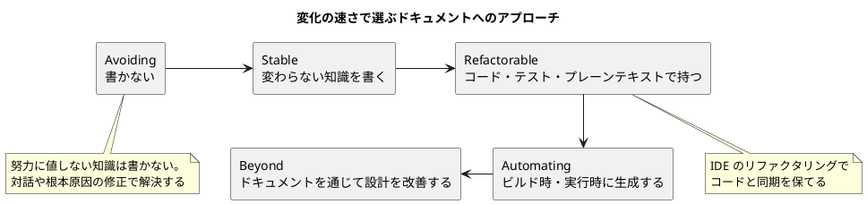
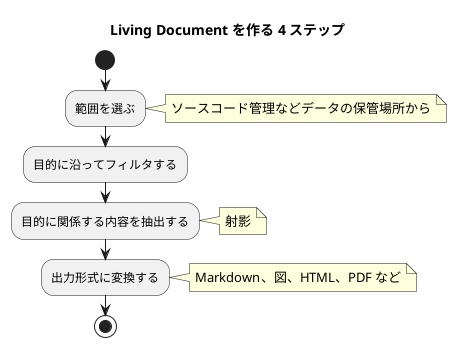

# Living Documentation導入ガイド

Living Documentation とは、**ソフトウェア開発に関わる知識に注意を払うこと**です。重要な知識の多くはすでにコード・テスト・設定・ツールの中にあります。それを別文書に書き写すのではなく、ある場所から必要な場所へ取り出し、足りない意図と根拠だけを補い、システムと同じ速さで更新され続ける形にします。

本ガイドは、Cyrille Martraire『Living Documentation』の第 1 章・第 3〜7 章の要点を整理し、本プロジェクトでの適用方法を示します。第 2 章（BDD）は [BDD導入ガイド](BDD導入ガイド.md) を参照してください。

## ドキュメントを再定義する

### ドキュメントとは知識を伝えるプロセスである

ドキュメントは「価値ある知識を、いま他の人へ、そして将来の人へ伝えるプロセス」です。人から人へ伝える**空間の軸（伝達）**と、いまから未来へ残す**時間の軸（保存）**の 2 つで捉えます。

開発者が同じコードに関わる期間の半減期は約 3.1 年、コードの半減期は約 13 年といわれます。書いた人がいなくなった後もコードは残り続けます。この差を埋めるのがドキュメントの役割です。

ドキュメントの形は文書に限りません。対話、コードそのもの、ツール上の活動、そして「何もしない」ことも選択肢に含まれます。

### デフォルトは書かない

ドキュメント化の対象は**価値のある知識だけ**です。長く役立つ知識、多くの人に関係する知識、重要でクリティカルな知識に絞ります。明確な理由がなければ書きません（The Default Is Don't）。

また、Naur の「理論構築としてのプログラミング」が示すとおり、プログラマの頭の中にある心的モデルは完全には共有できません。この限界を受け入れたうえで、伝えるべき知識を選びます。

### Living Documentation の 4 原則

| 原則 | 要点 |
| :--- | :--- |
| **Reliable（信頼できる）** | 常にソフトウェアと同期している。既存の知識を活用し、正確性を保証する仕組みを持つ |
| **Low effort（低労力）** | 変更時の追加作業を最小にする。シンプルさ、標準の利用、変わらない内容（Evergreen）、リファクタリング耐性、内部ドキュメントを重視する |
| **Collaborative（協調的）** | 文書より会話を優先する。知識をアクセス可能にし、チームで所有する |
| **Insightful（洞察を与える）** | 意図的な意思決定を促し、学びを埋め込み、実装の実態を映す鏡になる |

### 最重要の 4 点

1. 文書より**会話と協働**を重視する。知識の大半はすでにあり、取り出されるのを待っている
2. 知識の大半は既存の成果物にある。**文脈・意図・根拠**で補うだけでよい
3. **変化の頻度**に注意を払う
4. ドキュメントを考えることは、システムの**品質（または品質の欠如）に注意を向ける**手段である

### 変化の速さでアプローチを選ぶ

知識がどれくらいの頻度で変わるかによって、ドキュメントへのアプローチを選びます。



| アプローチ | 対象となる知識 | 手段 |
| :--- | :--- | :--- |
| Avoiding | 努力に値しない知識 | 対話、根本原因の修正 |
| Stable | ほとんど変わらない知識 | 単純な文書（ビジョン、原則） |
| Refactorable | コードと一緒に変わる知識 | 命名、型、テスト、プレーンテキストの図 |
| Automating | 頻繁に変わり、成果物から抽出できる知識 | 生成された用語集・図・レポート |
| Beyond | ドキュメント化が難しいこと自体が問題を示す知識 | 設計の改善 |

### パターンの全体像

『Living Documentation』は約 100 のパターンを次のカテゴリに整理しています。本ガイドでは太字のカテゴリを扱います。

| カテゴリ | 代表的なパターン |
| :--- | :--- |
| Rethinking Documentation | 知識はすでにそこにある、内部ドキュメント優先、正確性の仕組み |
| **Knowledge Exploitation** | 単一情報源からの公開、整合性検証、散在する事実の統合、既成のドキュメント |
| **Knowledge Augmentation** | アノテーション、規約、サイドカーファイル、根拠の記録、コミットメッセージ |
| **Knowledge Curation** | 動的キュレーション、コアのハイライト、模範例、ガイドツアー |
| **Automating Documentation** | Living Document、Living Glossary、Living Diagram、一図一物語 |
| **Runtime Documentation** | Visible Tests、Visible Workings、Introspectable Workings |
| Refactorable Documentation | コード自体をドキュメントに、プレーンテキストの図 |
| Stable Documentation | Evergreen content、永続的な命名、リンクレジストリ |
| How to Avoid Traditional Documentation | 雑談、使い捨て文書、オンデマンド文書、新人の驚きの記録 |
| Beyond Documentation: Living Design | ドキュメントに耳を傾ける、意図的な意思決定、自らを不要にする文書 |
| Living Architecture | 問題を文書化する、Decision log、Test-driven architecture |
| Introducing Living Documentation | 小さな実験から始める、新規作業から適用する |
| Documenting Legacy Applications | Bubble context、Superimposed structure、External annotations |

### DDD との関係

Living Documentation に投資すると DDD にも近づけます。「Living Documentation」という用語自体が BDD に由来し、BDD は TDD と DDD のユビキタス言語の組み合わせです。

| Living Documentation | DDD パターン |
| :--- | :--- |
| Code as documentation | モデル駆動設計、意図を表すインターフェース、宣言的設計 |
| Living glossary | ユビキタス言語（コードが用語集の唯一の参照元になる） |
| Listen to the documentation | Hands-on modelers（高速なフィードバック） |
| Change-friendly documentation | 深い洞察へのリファクタリング |
| Curation | Highlighted / Segregated / Abstract core |
| Ready-made knowledge | 確立された形式知の活用 |
| Evergreen document | Domain vision statement |

DDD の実践は [ドメインモデル設計ガイド](ドメインモデル設計ガイド.md) を参照してください。

## 知識を活用する（Knowledge Exploitation）

知識はすでにソースコード、設定ファイル、テスト、実行時の挙動、ツールのデータ、関係者の頭の中にあります。従来のドキュメントはそれを別文書に複製するため、元が変わるたびに古くなります。知識のある場所から必要な場所へ取り出す仕組みを、**軽量・確実・低コスト**で作ります。

### 権威ある情報源を特定する

同じ知識が複数の場所にあるとき、決定の変更が最も正確に反映される場所を**権威ある情報源**とします。そこから取り出す仕組みを用意し、仕組みそのものは単純に保ちます。

### 単一情報源から公開する（Single-Source Publishing）

知識は 1 か所にだけ置き、必要なときにそこから文書を生成して公開します。

- DDL やスキーマから ER 図やテーブル定義書を生成する
- 1 つの Markdown 原稿から HTML・PDF など複数の形式を生成する
- 公開物にはバージョンと最新版へのリンクを付ける
- 公開物は編集しにくくし、元を直すよう促す

### 整合性を検証する仕組み（Reconciliation Mechanism）

知識がどうしても複数の場所に重複する場合は、不一致を**自動テストで即座に検出**します。

- BDD のシナリオとコードを、ステップ定義で結びつける。食い違えばテストが失敗する
- 前提が真であることを確かめるカナリアテストを置く
- 外部に公開した契約（列挙型の値、API のスキーマ）は、変更を検知するテストで守る

### 散在する事実を統合する（Consolidating Dispersed Facts）

知識が多数の小さな部品に分散しているときは、全体像を自動で集めて再構成します。あるインターフェースの全実装の一覧、依存関係の集約、クラス階層の図などが該当します。

統合した結果を新しい真実の源にしてはいけません。キャッシュとして扱い、いつでも捨てて作り直せるようにします。

### 既成のドキュメントと共通語彙を使う（Ready-Made Documentation）

TDD、DDD、デザインパターン、継続的デリバリーなど、自分たちの知識の多くは書籍やブログですでに文書化されています。車を作るのにエンジンの仕組みを書き直す必要はありません。標準的な文献へリンクし、標準的な名前と用語を採用します。

Adapter、State、Visitor のようなパターン名を使うと、短い言葉で設計意図が伝わります。語彙をそろえることは DDD のユビキタス言語の考え方にもつながります。

## 知識を補う（Knowledge Augmentation）

ソースコードは「どう作るか」は語りますが、「なぜそうしたか」は語りません。足りない**意図・判断・根拠**を、**コードに近い場所に、ツールが解析できる形で**補います。補う手段は、内部ドキュメント（アノテーション・規約）、外部ドキュメント（サイドカーファイル・メタデータ DB）、DSL の 3 系統です。

### アノテーションで補う

アノテーションは名前と属性を持つ型なので、ツールが扱いやすい補足手段です。導入手順は [アノテーション導入ガイド](アノテーション導入ガイド.md) を参照してください。

| 用途 | 例 |
| :--- | :--- |
| ステレオタイプ | `@ValueObject`、`@Entity`、`@DomainService` で DDD の役割を明示する |
| 性質 | `@Immutable`、`@SideEffectFree` で振る舞いの性質を明示する |
| レイヤー | `package-info.java` に `@Layer` を付け、依存違反をツールで検出する |
| 根拠 | `@Decision(rationale = "...")` のように判断した箇所に理由を付ける |

- 独自アノテーションのパッケージ名は、参照する文献に対応させる（例: `com.acme.annotation.ddd`）
- 大半が該当する性質は付けず、**例外だけ**に付ける（全クラスが不変なら `@Mutable` だけを付ける）
- 感情的なアノテーション（`@WTF` など）で型階層を汚さない

### 本質的な知識だけを付ける

| 種類 | 説明 | 扱い |
| :--- | :--- | :--- |
| 本質的（intrinsic） | 要素自体の性質。要素を消せば知識も消える | 付けてよい |
| 外在的（extrinsic） | 他との関係や状況に依存する（所有者、配置場所など） | 付けない |

判断基準は「要素を変更したとき、最小の作業で済むか」です。外在的な知識まで付けると、頻繁に変更が入り保守コストが増えます。

### 規約で補う

命名や構造の規約そのものがドキュメントになります（`*.domain.*` と `*.infra.*` のパッケージ分割など）。規約は README に書くか、他で公開された規約を採用するだけでも構いません。

規約は分類には強いものの、根拠や代替案は書きにくいという限界があります。また、一貫して守られてこそ機能するため、ArchUnit などの静的解析で検証します。

### サイドカーファイルとメタデータ DB

元ファイルに触れられない場合は、同名で拡張子が違うサイドカーファイルや、メタデータ DB に知識を置きます。ただし名前の変更や移動で関係が壊れやすいため、最後の手段とし、可能ならコード内のアノテーションを優先します。

### 根拠を記録する

設計判断は問題に対して選んだ答えです。後から「何を考えていたのか」とならないよう、次を残します。

- その時点の文脈（優先度・制約）
- 問題・要件
- 選んだ解決策と理由
- 却下した代替案と理由

根拠が残っていないと、変更が怖くなるか、不用意に変更して害を及ぼします。**根拠の記録は変更を後押しします**。

- 推測で書かず、実際に作ったものの必要に応じて書く（just-in-time）
- 同種の判断が繰り返されるなら、原則を一度だけ文書化し、各適用箇所から参照する
- チームの拠り所となる書籍・ブログを参考文献として残す
- モジュールごとの設計スタイル（関数型、DDD など）を宣言する

### コミットメッセージで補う

コミットメッセージは変更ごとのドキュメントです。書くことで「これは 1 つの変更か、分割すべきか」を考えさせます（Thinking）。そのほか、意図の説明（Explaining）、変更履歴の元データ（Reporting）、規約に沿った記述（Guidelines）の役割を持ちます。

```text
<type>(<scope>): <subject>

<body>

<footer>
```

- type は `feat`・`fix`・`docs`・`style`・`refactor`・`perf`・`test`・`chore`
- scope はチームで一覧を合意する
- 破壊的変更は footer に `BREAKING CHANGE:` を書く
- Issue は footer に `Closes #123` のように参照する

規約に沿えば、機械的に抽出して CHANGELOG を自動生成できます。

## 知識を選び抜く（Knowledge Curation）

コードベースには膨大な知識があります。その大半を捨てて、読み手の目的に必要な少数だけを選ぶのがキュレーションです。美術展のキュレーターが作品を選び、解説を付け、展示全体で 1 つの物語を伝えるように、開発者も自分のコードのキュレーターになります。

### 動的にキュレーションする

固定のリストで選ぶのではなく、**安定した基準**で動的に選びます。名前や URL で直接参照すると、コピー＆ペーストと同じく陳腐化します。導入手順は [ダイナミックキュレーション導入ガイド](ダイナミックキュレーション導入ガイド.md) を参照してください。

安定した選択基準の例:

- フォルダ構成
- 命名規約（「名前が `Repository` で終わる型」）
- タグ・アノテーション（「このアノテーションが付いた全クラス」）
- リンクレジストリ
- ツールの出力

1 つの知識の集まりから、読み手や目的ごとに複数のドキュメントを作れます。BDD のシナリオに `@acceptancecriteria` や `@keyexample` などのタグを付け、目的別のダイジェストを作るのが好例です。

### コアと模範例をハイライトする

- **コアのハイライト**: `@CoreConcept` のようなアノテーションでコア概念をマークする。名前の変更や移動にも追従し、IDE の検索で常に最新の一覧が得られる
- **模範例（Exemplar）**: 真似してほしいコードに `@Exemplar` を付ける。完璧である必要はなく、弱点があれば理由も添える。目的はコピーではなく、ペアプログラミングやコードレビューでの会話のきっかけにすること

### ガイドツアーとサイトシーイング・マップ

- **サイトシーイング・マップ**: 見どころを 5〜7 個、多くても 10 個以内に絞ってタグ付けする（`@KeyLandmark` など）
- **ガイドツアー**: 順序付きの見どころ。`@GuidedTour(name, description, rank)` で名前・説明・順序を付け、走査して順番どおりのレポートを生成する

タグを付けすぎるとコードを汚すため、控えめに使います。導入手順は [ガイドツアー・サイトシーイング導入ガイド](ガイドツアー・サイトシーイング導入ガイド.md) を参照してください。

## ドキュメントを自動化する（Automating Documentation）

### Living Document

Living Document は、記述対象のシステムと**同じペースで進化する**ドキュメントです。手作業では維持できないため、変更のたびに自動で生成します。



変換が複雑なら中間モデルを連鎖させます。1 つの図やリストは **5〜9 項目程度**に収めます。

### Living Glossary（生きた用語集）

ユビキタス言語の用語集を、コード自身から生成します。クラス名・メソッド名・列挙型の定数名はドメイン言語の一部だからです。

- すべてのコードがドメインに関係するわけではないため、アノテーションなどで**選択的にフィルタ**する
- `toString()` や `equals()`、技術的なフィールドは除外する
- 境界づけられたコンテキストごとに用語集を分ける（`package-info.java` に `@BoundedContext` を宣言する）
- 成功の条件は**コードが宣言的であること**。コードが良いほど用語集も良くなる

用語集はそれ自体が目的ではありません。読みにくければ名前やコードを直すきっかけになる、**コードの質を改善するためのフィードバック機構**です。

### Living Diagram（生きた図）

**1 つの図には 1 つのストーリー（One diagram, one story）**を語らせます。情報が多すぎる図は、情報がない図と同じくらい役に立ちません。リバースエンジニアリングですべてを描くのはアンチパターンです。

作り方は Living Document と同じく、ソースをスキャンし、関連部分をフィルタし、意味のある情報を抽出し、レイアウトしてレンダリングします。出力には Graphviz（DOT 形式）や PlantUML を使います。

| 図の種類 | 特徴 | 使いどころ |
| :--- | :--- | :--- |
| ナプキンスケッチ | 使い捨て | 一時的な会話 |
| 独自ツールの図 | 見た目は良いが差分管理が難しい | 避ける |
| プレーンテキストの図 | 差分管理しやすい | 長く使う図 |
| コード駆動の図 | リファクタリングに強い | 長く使う図 |
| Living Diagram | コードから自動生成 | 頻繁に変わる構造 |

見やすさのガイドライン:

- 軸に意味を持たせる（左に API、右に SPI など）
- 近さは類似性、包含は特殊化というように、レイアウトに意味を持たせる
- 要素のサイズや色に意味を持たせる（重要度、深刻度）
- 線が 1 本でも交差するなら複雑すぎる可能性がある

代表的な Living Diagram:

- **ヘキサゴナルアーキテクチャ図**: ドメインを中心に置き、依存が外から内への一方向であることを示す。違反する依存は赤で強調する
- **ビジネスドメイン概要図**: パッケージに `@BusinessDomain` を付けて関係を宣言し、そこから図を生成する
- **コンテキスト図**: `@ExternalActor` やサイドカーファイルで外部アクターを宣言する。許可リストと組み合わせれば、想定外の依存を検知できる

Living Diagram は**コードをありのままに見せ、設計の質について正直にしてくれます**。設計会議やコードレビューで「不都合な真実」に気づくきっかけになります。ただし、自動化する前にまず手作業で試し、手間に見合うかを判断します。

## 実行時の知識をドキュメントにする（Runtime Documentation）

**質問に答えられるものはすべてドキュメントとみなせます**。動くソフトウェアで質問に答えられるなら、そのソフトウェア自体がドキュメントの一部です。分散アーキテクチャやクラウドが広がるほど、実行時の知識の価値は増します。

### 生きたサービス図

分散トレーシング（Zipkin、OpenTelemetry など）は応答時間の調査に使われますが、同時にアーキテクチャの生きた図にもなります。各サービスが Trace ID・Span ID・Parent ID を伝搬し、集めたスパンを集約するとサービス間の依存グラフが得られます。条件別のタグ（キャッシュのヒット／ミスなど）を付ければ、条件ごとの図も描けます。

### Visible Workings と Visible Tests

- **Visible Workings**: ソフトウェアが内部の仕組みを外から見えるようにする。「この結果はどう計算したか」に実行時に答えられる。給与計算や銀行明細など、説明責任が求められる分野で特に有用
- **Visible Tests**: 良いテストは失敗しない限り沈黙している。テストの出力をドメイン固有の図として可視化し、探索段階ではまず図を眺め、後から一部をアサーションに変えていく

### イベントソーシングのテストをシナリオにする

イベントソーシングのテストは、**Given（過去のイベント）/ When（コマンド）/ Then（新しいイベント）** の形になり、そのままビジネスの振る舞いのシナリオになります。コマンドを命令形、イベントを過去形で命名すれば、BDD フレームワークがなくても読める文章を出力できます。

```text
Given Batch Created With 20 Cookies
When Eat Cookies 10 cookies
Then 10 Cookies Eaten and 10 remaining
```

テスト実行中に集めたコマンドとイベントを、集約を中心に「コマンド → 集約（handled）」「集約 → イベント（emitted）」でつなぐと、ユースケース全体の生きた図になります。

### 実行時のオブジェクトツリーを内省する

DI やファクトリが組み立てるオブジェクトツリーは、設定やリクエストで変わります。実際の構造を知るにはソースではなく実行時を見るのが確実です。

- **リフレクション**: ルートのインスタンスから宣言フィールドを再帰的に走査し、自分たちのパッケージだけに絞って出力する。クラスを汚さないが推奨はされない
- **Introspectable**: 各要素が `members()` でコラボレータを返すインターフェースを実装し、再帰的に走査する。決定木・ワークフロー・設定など、内部の動きを利用者や開発者に見せたい場合に最適

最低限、設定に基づいて動く処理は、その設定を表示できるようにします。

## 本プロジェクトでの適用

本プロジェクトの成果物とプラクティスは、すでに多くが Living Documentation のパターンに対応しています。新しい仕組みを足す前に、次の対応を意識して既存の成果物を使います。

| パターン | 本プロジェクトの成果物・プラクティス | 参照 |
| :--- | :--- | :--- |
| 根拠の記録、Decision log | ADR（背景・決定・影響・代替案） | `creating-adr` スキル |
| コミットメッセージによる文書化 | Conventional Commits、CHANGELOG の自動生成 | `git-commit`・`developing-release` スキル |
| 整合性検証の仕組み | TDD の単体テスト、BDD のシナリオ | [BDD導入ガイド](BDD導入ガイド.md)、[コーディングとテストガイド（AI-DLC 版）](コーディングとテストガイド_AI-DLC版.md) |
| サイドカー・メタデータ | OKF のフロントマター（来歴・検証状態・ライフサイクル） | [OKF 導入ガイド](OKF導入ガイド_V0.2.md) |
| プレーンテキストの図 | PlantUML・Mermaid による図 | 各設計ガイド |
| Living Glossary | ドメインモデルのユビキタス言語、用語集 | [ドメインモデル設計ガイド](ドメインモデル設計ガイド.md)、[AI-DLC 用語集](AI-DLC用語集.md) |
| 単一情報源からの公開 | Markdown を MkDocs で HTML として公開する | `operating-docs` スキル |
| 既成のドキュメント | リファレンス・記事シリーズへのリンク（複製しない） | [記事](../article/index.md) |
| 判断と学びの記録 | 開発ジャーナル（なぜそうしたか、どこで詰まったか） | `creating-journal` スキル |
| 規約による文書化 | ドキュメント構成ガイドによる配置規約 | [ドキュメント構成ガイド](ドキュメント構成ガイド.md) |

### 導入の進め方

1. **新規作業から始める**: 既存コード全体に適用せず、これから書くコードとドキュメントから適用する（Marginal documentation）
2. **書く前に探す**: 知識がすでにコード・テスト・ADR・コミット履歴にないかを確認する。あればリンクするか生成する
3. **根拠だけを補う**: コードから読み取れることは書かない。意図・判断・却下した代替案を ADR やコメントで補う
4. **重複には検証を付ける**: やむを得ず重複させた知識には、不一致を検出するテストかチェックを用意する
5. **図は 1 つのストーリーに絞る**: PlantUML の図は目的ごとに分け、5〜9 要素に収める
6. **書きにくさを設計のシグナルにする**: 説明が難しい、図が交差だらけになるなら、ドキュメントではなく設計を直す

### AI-DLC との関係

AI-DLC では「成果物は契約であり、コンテキストである」とされます。Living Documentation の原則に沿って成果物を永続化すると、AI に渡すコンテキストが常にコードと同期した状態になります。古い文書は AI の誤った判断の原因になるため、**Reliable（信頼できる）**の原則は AI-DLC では一層重要です。詳細は [AI-DLC 導入ガイド](AI-DLC導入ガイド.md) を参照してください。

## まとめ

- ドキュメントは知識を伝えるプロセスであり、価値ある知識だけを対象にする。デフォルトは書かない
- 知識の大半はすでに成果物の中にある。権威ある情報源を特定し、単一情報源から公開し、重複には整合性検証を付ける
- コードに足りない意図と根拠を、本質的で変わりにくいものに限り、コードに近く機械が扱える形で補う
- 膨大な知識から読み手の目的に必要なものだけを、安定した基準で動的に選ぶ
- 頻繁に変わる知識は自動生成する。1 つの図には 1 つのストーリーを語らせる
- 動くソフトウェアとテストの実行結果も、質問に答えられるならドキュメントである
- Living Documentation とは、コードベースの中に知識のシステムを設計することであり、コーディングと同じく設計のスキルが要る

出典: *Living Documentation: Continuous Knowledge Sharing by Design*（Cyrille Martraire 著）第 1 章「Rethinking Documentation」、第 3 章「Knowledge Exploitation」、第 4 章「Knowledge Augmentation」、第 5 章「Living Curation」、第 6 章「Automating Documentation」、第 7 章「Runtime Documentation」の要約
