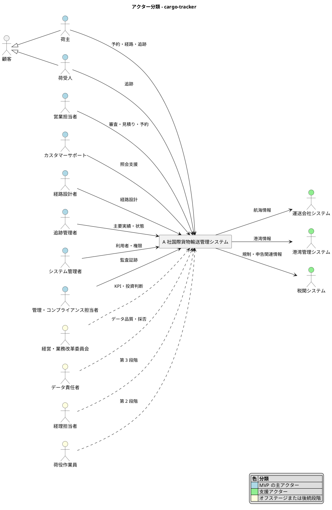
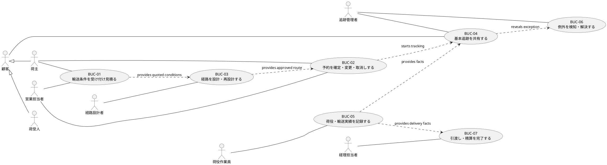

# ビジネスユースケース - A 社国際貨物輸送管理システム

本書は、承認済み要件定義からビジネスユースケースを導出する。現段階では AI-DLC の精度レベル 1 として、システム境界、アクター、目的、優先度、Unit 候補を定義する。業務シナリオはゲート 2、例外はゲート 3 で詳細化する。

## Intent

複雑な国際貨物輸送について、荷主の条件を一度記録し、根拠ある経路を設計し、予約から引渡しまでの予定・実績・例外を関係者が共有できるようにする。

## スコープ

### In / Out

| 領域 | MVP | 後続段階 | Out | 根拠 |
| :--- | :---: | :---: | :---: | :--- |
| 輸送条件の下書き・提出・審査 | ✓ |  |  | UC-01、UC-02 |
| 見積りの作成・提示 | ✓ |  |  | UC-03 |
| 予約の確定・変更・取消し | ✓ |  |  | UC-04、UC-05 |
| 経路候補の比較・確定・再設計 | ✓ |  |  | UC-06〜UC-08 |
| 一般貨物 | ✓ |  |  | OQ-03、2026-09-30 承認 |
| 危険物・冷凍貨物・その他特殊貨物 |  | 専門家承認条件の確定後 |  | BR-03、OQ-03 |
| 予定と主要実績による基本追跡 | ✓ |  |  | UC-09、UC-10 |
| 利用者認証、企業・権限、監査証跡 | ✓ |  |  | UC-16〜UC-18 |
| 外部データの取込み・照合 | 最小データ源 | 強化 |  | UC-15、OQ-05 |
| 荷役イベント記録・同期 |  | 第 2 段階 |  | UC-11 |
| 例外案件管理、状態・例外通知 |  | 第 2 段階 |  | UC-12、UC-13 |
| 引渡し・精算 |  | 第 3 段階 |  | UC-14 |
| 船舶・運航そのものの管理 |  |  | ✓ | 要件定義の対象外 |
| 港湾設備管理、税関申告業務 |  |  | ✓ | 要件定義の対象外 |
| 一般会計、給与、人事 |  |  | ✓ | 要件定義の対象外 |
| 全世界最適化、一般消費者向け配送 |  |  | ✓ | 要件定義の対象外 |

### AI に任せる範囲

| 対象 | AI に任せる | 人の確認が必要な事項 |
| :--- | :--- | :--- |
| ユースケース・ストーリー初稿 | 作成、整合性検査、例外候補の列挙 | 業務上の正しさ、採用する例外、優先順位 |
| 受入条件・テスト候補 | Given / When / Then の初稿 | 数値、規制、権限、品質ゲート |
| 実データ | 匿名化した代表ケースの構造化 | 顧客・契約・貨物・規制の機密情報は AI に渡さない |
| 外部連携 | 契約候補、失敗パターン、テスト候補 | 契約、認証情報、本番接続、代替運用 |

## アクター分類

### アクターの定義

| アクター | 分類 | 目的 | MVP での関与 | 根拠・確度 |
| :--- | :--- | :--- | :--- | :--- |
| 顧客 | 汎化アクター | A 社の輸送サービスから価値を得る | 荷主・荷受人の共通概念 | 承認済み要件定義 |
| 利用者 | 汎化アクター | 本人として認証され、許可された業務を開始する | すべての MVP 主アクターに共通する認証主体 | RQ-11、UC-18、認証方式は OQ-07 |
| 荷主 | 主アクター | 条件を提示し、見積り・経路を理解して予約し、輸送を追跡する | 直接利用 | RQ-01〜RQ-03、確定／一部仮説 |
| 荷受人 | 主アクター | 到着予定と主要実績を把握し、引渡しへ備える | 基本追跡を利用 | RQ-03、確定。開示範囲は要確認 |
| 営業担当者 | 主アクター | 条件を審査し、見積りと予約を正確かつ迅速に管理する | 直接利用 | RQ-04、確定 |
| カスタマーサポート | 主アクター | 顧客照会を正しい情報で支援し、担当部門へ引き継ぐ | 基本追跡・応対を利用 | RQ-05、仮説 |
| 経路設計者 | 主アクター | 候補と根拠を比較し、例外を判断して経路を確定する | 直接利用 | RQ-06、確定 |
| 追跡管理者 | 主アクター | 主要実績を登録・補正し、状態の正確性を保つ | 直接利用 | RQ-08、確定 |
| システム管理者 | 主アクター | 利用者、企業、役割を管理する | 直接利用 | UC-16、具体的な権限は OQ-07 |
| 管理・コンプライアンス担当者 | 主アクター | 操作、承認、変更、訂正を監査する | 監査証跡を利用 | UC-17、保持期間は OQ-07 |
| 運送会社システム | 支援アクター | 航海スケジュールと貨物対応情報を提供する | 限定データ源 | BUC-03、OQ-05 |
| 港湾管理システム | 支援アクター | 港湾コード、取扱能力、制約を提供する | 限定データ源 | BUC-03、OQ-05 |
| 税関システム | 支援アクター | 申告に必要な情報交換を支援する | MVP の直接連携範囲は要確認 | 対象外境界、OQ-05 |
| 経営・業務改革委員会 | オフステージ | KPI、投資、段階継続を判断する | 測定結果を利用 | RQ-10、OQ-06、OQ-08 |
| データ責任者 | オフステージ | 外部原本と採用値の品質・差異を統制する | データ採否を承認 | UC-15、OQ-02、OQ-05 |
| 荷役作業員 | 後続段階の主アクター | 現場実績を速く正確に記録する | MVP では直接利用しない | RQ-07、UC-11 |
| 経理担当者 | 後続段階の主アクター | 配送実績と料金根拠から精算する | MVP では見積根拠の利害関係者 | RQ-09、UC-14 |

## アクター・目的リスト

頻度は現状調査が未完了のため、数値を置かず「要確認」とする。優先度は MVP の縦の流れと安全・監査上の必須性から導出した。

| ID | アクター | 目的 | レベル | 優先度 | 頻度 | Unit 候補 | トレース |
| :--- | :--- | :--- | :---: | :---: | :--- | :--- | :--- |
| AG-01 | 荷主 | 輸送条件を下書き・提出する | 🌊 | 高 | 要確認 | U1 輸送要求・見積り | UC-01、RQ-01 |
| AG-02 | 荷主 | 見積りと承認済み経路を理解して予約を確定する | 🌊 | 高 | 要確認 | U6 予約管理 | UC-03、UC-04、RQ-01、RQ-02 |
| AG-03 | 荷主 | 予約を変更・取消しする | 🌊 | 高 | 要確認 | U6 予約管理 | UC-05、BR-04、OQ-04 |
| AG-04 | 荷主 | 予定と主要実績を照会する | 🌊 | 高 | 要確認 | U3 基本追跡 | UC-09、RQ-03 |
| AG-05 | 荷受人 | 開示された予定と主要実績を照会する | 🌊 | 高 | 要確認 | U3 基本追跡 | UC-09、RQ-03、BR-07 |
| AG-06 | 営業担当者 | 輸送条件を審査・差し戻す | 🌊 | 高 | 要確認 | U1 輸送要求・見積り | UC-02、RQ-04 |
| AG-07 | 営業担当者 | 見積りを作成・提示する | 🌊 | 高 | 要確認 | U1 輸送要求・見積り | UC-03、RQ-04 |
| AG-08 | 営業担当者 | 予約を確定・変更・取消しする | 🌊 | 高 | 要確認 | U6 予約管理 | UC-04、UC-05、RQ-04 |
| AG-09 | カスタマーサポート | 顧客照会へ回答し担当部門へ引き継ぐ | 🌊 | 中 | 要確認 | U3 基本追跡 | RQ-05、仮説 |
| AG-10 | 経路設計者 | 経路候補と除外理由を比較する | 🌊 | 高 | 要確認 | U2 経路設計 | UC-06、RQ-06 |
| AG-11 | 経路設計者 | 一般貨物の例外条件を判断して経路を確定する | 🌊 | 高 | 要確認 | U2 経路設計 | UC-07、BR-02 |
| AG-12 | 経路設計者 | 条件・航海・港湾の変化に応じて再設計する | 🌊 | 高 | 要確認 | U2 経路設計 | UC-08、BR-04 |
| AG-13 | 追跡管理者 | 主要実績を登録・補正する | 🌊 | 高 | 要確認 | U3 基本追跡 | UC-10、BR-05、BR-06 |
| AG-14 | システム管理者 | 利用者・企業・権限を管理する | 🌊 | 高 | 要確認 | U4 アクセス・監査 | UC-16、RQ-11 |
| AG-15 | 管理・コンプライアンス担当者 | 監査証跡を照会する | 🌊 | 高 | 要確認 | U4 アクセス・監査 | UC-17、RQ-11 |
| AG-16 | データ責任者 | 外部データを取込み・照合する | 🌊 | 高 | 要確認 | U5 外部データ | UC-15、BR-08、BR-12 |
| AG-17 | 経営・業務改革委員会 | KPI とガードレールで段階継続を判断する | ☁️ | 中 | 要確認 | 横断 | RQ-10、OQ-06、OQ-08 |
| AG-18 | 利用者 | 本人として認証され、許可された業務を開始する | 🐟 | 高 | 要確認 | U4 アクセス・監査 | UC-18、RQ-11、OQ-07 |
| AG-19 | 荷主担当者 | 予約単位で荷受人を招待し、参照許可を取り消す | 🌊 | 高 | 要確認 | U4 アクセス・監査 | UC-19、BR-07、RQ-03 |
| AG-20 | カスタマーサポート | 顧客照会を受付から回答・終結まで追跡し、未受領時に escalation する | 🌊 | 高 | 要確認 | U3 基本追跡 | UC-20、RQ-05、BR-09 |

## Unit 候補

Unit の境界はゲート 4 で確定する。現時点では、アクター目的の凝集度を確認するための候補である。

| Unit 候補 | 目的 | 含むアクター目的 | 依存候補 | 確度 |
| :--- | :--- | :--- | :--- | :--- |
| U1 輸送要求・見積り | 条件受付から審査、根拠付き見積りと経路方針の提示までを管理する | AG-01、AG-06、AG-07 | U4 | 候補 |
| U2 経路設計 | 見積り済み輸送要求に対し、候補、根拠、版、例外判断を管理する | AG-10〜AG-12 | U1、U4、U5 | 候補 |
| U6 予約管理 | 有効な見積りと承認済み経路から予約を確定し、変更・取消しを版管理する | AG-02、AG-03、AG-08 | U1、U2、U4 | 候補 |
| U3 基本追跡 | 予定と主要実績を出典・鮮度付きで共有し、照会を有人対応へ閉ループで引き継ぐ | AG-04、AG-05、AG-09、AG-13、AG-20 | U2、U4、U5、U6 | 候補 |
| U4 アクセス・監査 | 利用者を認証し、企業・利用者・案件別参照許可を分離して重要操作を監査可能にする | AG-14、AG-15、AG-18、AG-19 | なし。全 Unit から利用 | 候補 |
| U5 外部データ | 外部原本を取込み、重複・順序・差異・復旧照合を管理する | AG-16 | U4 | 候補 |

## 精度レベル 1 の要確認事項

| ID | 要確認事項 | 影響 | 対応ゲート |
| :--- | :--- | :--- | :--- |
| G1-Q1 | **解決済み**: MVP は荷主担当者 1 名の承認とし、入力者・承認者の分離は後続段階とする | UC-01、UC-04、権限、職務分離 | 2026-09-30、human:kakimomokuri |
| G1-Q2 | カスタマーサポートが代理操作を行うか、照会・引継ぎだけを行うか | RQ-05、U1、U3 | ゲート 2 |
| G1-Q3 | 税関システムとの直接連携を MVP に含めるか | U2、U5、外部契約 | ゲート 2／OQ-05 |
| G1-Q4 | データ責任者が実在する単独ロールか、運用・IT の責任として兼務するか | UC-15、データ採否 | ゲート 2 |
| G1-Q5 | 監査証跡照会を管理部門とコンプライアンス部門のどちらが主担当するか | UC-17、U4 | ゲート 2 |
| G1-Q6 | 各アクター目的の現行件数・実行頻度 | 優先順位、パイロット件数、KPI | OQ-01、OQ-06 |

## トレーサビリティ

| 上流 | 本書での対応 |
| :--- | :--- |
| RQ-01〜RQ-11 | アクター定義、AG-01〜AG-20 |
| BUC-01〜BUC-07 | In / Out とアクター目的。詳細化はゲート 2 |
| UC-01〜UC-20 | AG-01〜AG-16、AG-18〜AG-20 |
| BR-01〜BR-18 | AG-03、AG-11〜AG-16、AG-20。BR-13〜BR-18 は主要業務フローへ横断適用し、詳細化はゲート 2・3 |
| OQ-01〜OQ-08 | 精度レベル 1 の要確認事項と後続ゲート |

## AI の仮定

- 「顧客」は荷主と荷受人を汎化する抽象アクターであり、直接操作するロールではない。
- MVP の直接利用者は、荷主、荷受人、営業担当者、カスタマーサポート、経路設計者、追跡管理者、システム管理者、管理・コンプライアンス担当者である。
- U1〜U6 は確定したアーキテクチャ境界ではなく、Unit 候補である。
- MVP では荷主側の入力者と承認者を分離せず、荷主担当者 1 名の承認を求める。データ責任者の組織上の実在性は未確認である。

## ビジネスユースケース構成

### BUC-01 輸送条件を受け付け見積る

| 項目 | 内容 |
| :--- | :--- |
| 業務目標 | 荷主の輸送条件を審査し、根拠の追跡できる見積りと経路方針を提示する |
| 開始 | 荷主または営業担当者が輸送条件を提出する |
| 完了 | 有効期限と根拠を伴う見積りおよび候補方針が荷主へ提示される |
| 責任 | 営業部門 |
| 対象段階 | MVP |
| トレース | RQ-01、RQ-04、UC-01〜UC-03、BR-01、BR-10 |

主成功シナリオ:

1. 荷主が貨物、発着地、希望日などの輸送条件を提示する。
2. 営業担当者が条件と必要書類を審査する。
3. 営業担当者が料金根拠と経路方針を組み立てる。
4. 営業担当者が有効期限付きの見積りを確定する。
5. 荷主が見積りと根拠を確認できる状態になる。

### BUC-02 予約を確定・変更・取消しする

| 項目 | 内容 |
| :--- | :--- |
| 業務目標 | 合意した条件を版管理された予約として確定し、その後の変更・取消しを統制する |
| 開始 | 荷主が有効な見積りと承認済み経路を確認して本予約を申し込む、または既存予約の変更・取消しを申し出る |
| 完了 | 有効な予約版と追跡番号、または変更・取消し結果が記録される |
| 責任 | 営業部門 |
| 対象段階 | MVP |
| トレース | RQ-01、RQ-02、RQ-04、UC-04、UC-05、BR-01、BR-03、BR-04、BR-10 |

主成功シナリオ:

1. 荷主が有効な見積りと承認済み経路を確認し、本予約を申し込む。
2. 営業担当者が見積り、予約条件、経路版、承認状況を確認する。
3. 営業担当者が予約を確定する。
4. 追跡番号と有効な予約版が発行される。
5. 荷主と関係部門が確定内容を参照できる状態になる。

本予約前は輸送要求版を承認なしで更新・取下げできる。本予約後から集荷実績採用前は営業承認付きで変更・取消しでき、条件、理由、承認、旧版との関係を保持する。集荷実績採用後は通常の変更・取消しを禁止し、要求を記録して有人の例外対応へ引き継ぐ。

### BUC-03 経路を設計・再設計する

| 項目 | 内容 |
| :--- | :--- |
| 業務目標 | 輸送制約を満たす経路を、候補・除外理由・承認根拠とともに予約へ割り当てる |
| 開始 | 見積り済みの輸送要求または本予約後の輸送上の変化を受け取る |
| 完了 | 初回設計では本予約に利用できる承認済み経路版が確定し、再設計では新しい経路版が予約へ割り当てられる |
| 責任 | 運用部門 |
| 対象段階 | MVP |
| トレース | RQ-02、RQ-06、RQ-08、UC-06〜UC-08、UC-15、BR-02〜BR-04、BR-11、BR-12 |

主成功シナリオ:

1. 経路設計者が見積り済み輸送要求と利用可能な外部情報を確認する。
2. 制約を満たす経路候補が算出される。
3. 経路設計者が候補、除外理由、情報鮮度を比較する。
4. 専門判断が必要な条件について根拠を記録する。
5. 経路設計者が採用候補を承認する。
6. 承認済み経路を新しい経路版として確定する。
7. 初回設計では経路版を本予約の確定条件として提供し、再設計では本予約へ割り当てる。

### BUC-04 基本追跡を共有する

| 項目 | 内容 |
| :--- | :--- |
| 業務目標 | 荷主・荷受人・社内担当者へ、予定と主要実績に基づく現在状態を共有する |
| 開始 | 予約・経路予定または主要実績を受け取る |
| 完了 | 権限に応じた状態、出典、鮮度を利用者が確認できる |
| 責任 | 運用部門 |
| 対象段階 | MVP |
| トレース | RQ-03、RQ-05、RQ-08、UC-09、UC-10、UC-15、UC-20、BR-05〜BR-09、BR-12 |

主成功シナリオ:

1. 追跡管理者が予約と経路予定を追跡対象として確認する。
2. 主要実績が登録または外部原本から採用される。
3. 予定と実績から現在状態が更新される。
4. 利用者が追跡番号で対象貨物を照会する。
5. 利用者の企業と役割に応じて開示範囲が決定される。
6. 状態、予定、主要実績、出典、鮮度が表示される。

### BUC-05 荷役・輸送実績を記録する

| 項目 | 内容 |
| :--- | :--- |
| 業務目標 | 現場で発生した荷役・輸送事実を検証可能なイベントとして記録する |
| 開始 | 現場が貨物を受領または作業する |
| 完了 | 検証済みイベントが輸送履歴へ反映される |
| 責任 | 現場部門 |
| 対象段階 | 第 2 段階 |
| トレース | RQ-07、UC-11、BR-05、BR-06 |

主成功シナリオ:

1. 荷役作業員が対象貨物と作業を特定する。
2. 発生した作業事実と時刻を記録する。
3. 記録の重複と順序が検証される。
4. 検証済みイベントが輸送履歴へ追加される。
5. 基本追跡へ新しい実績が反映される。

### BUC-06 例外を検知・解決する

| 項目 | 内容 |
| :--- | :--- |
| 業務目標 | 遅延、破損、紛失などを案件として統制し、顧客への約束を回復する |
| 開始 | 状態または現場報告から例外を検知する |
| 完了 | 対応結果と顧客への約束が記録され、案件が終結する |
| 責任 | 運用部門 |
| 対象段階 | 第 2 段階 |
| トレース | UC-12、UC-13、BR-07 |

主成功シナリオ:

1. 追跡管理者が輸送上の例外を検知する。
2. 重要度と対応期限を定めて例外案件を起票する。
3. 担当部門が原因と影響を確認する。
4. 顧客への約束を含む対応方針を決定する。
5. 対応結果を関係者へ共有する。
6. 解決根拠を記録して案件を終結する。

### BUC-07 引渡し・精算を完了する

| 項目 | 内容 |
| :--- | :--- |
| 業務目標 | 貨物の引渡し事実と料金根拠を照合し、監査可能な精算を完了する |
| 開始 | 貨物が目的地へ到着する |
| 完了 | 受領と承認済み精算が記録される |
| 責任 | 管理部門 |
| 対象段階 | 第 3 段階 |
| トレース | RQ-09、UC-14 |

主成功シナリオ:

1. 受領者が貨物の引渡しを確認する。
2. 配送実績と契約・見積りの料金根拠を照合する。
3. 経理担当者が精算内容を作成する。
4. 所定の責任者が精算を承認する。
5. 受領と精算の証跡が保存される。

## 精度レベル 2 の AI の仮定

- BUC-01〜BUC-04 を MVP、BUC-05〜BUC-07 を後続段階として扱う。
- MVP では荷主側の入力者と承認者を別アクターへ分割せず、荷主担当者 1 名の承認と営業担当者の BR-01 確認で本予約を確定する。荷主内の職務分離は後続段階で再検討する。
- カスタマーサポートは照会と担当部門への引継ぎを行い、予約の代理変更・確定は行わない。
- 税関システムとの直接連携は MVP の主成功シナリオへ含めない。
- データ責任者は独立した組織名ではなく、外部原本の採否に責任を持つ役割名として扱う。
