# 要件定義 - A 社国際貨物輸送管理システム

本書は、A 社国際貨物輸送管理システム（プロジェクト識別子: `cargo-tracker`）の要件を RDRA 2.0 の 4 層で整理する。戦略成果物から導出できる内容を要件候補として構造化し、根拠が不足する事項は仮説または要確認事項として明示する。

## 文書の位置づけ

### 対象と目的

- 対象事業は、A 社が法人荷主へ提供するアジア・欧州間を中心とした国際貨物輸送である。
- 対象システムは、予約、経路設計、基本追跡を MVP の縦の流れとして支援し、後続段階で荷役、通知、例外対応、精算、外部連携を拡張する。
- 本書は業務とシステムの境界を合意するための分析成果物であり、物理アーキテクチャ、実装技術、詳細 UI は後続工程で決定する。

### 要件の確度

| 区分 | 意味 |
| :--- | :--- |
| 確定 | 上流成果物間で一貫し、現時点の方針として扱える事項 |
| 仮説 | MVP 検証のための候補。業務責任者または顧客による確認が必要な事項 |
| 要確認 | 根拠となる現状値、外部契約、法規、運用責任が不足している事項 |

### スコープと導入段階

| 段階 | 対象 | 本書での扱い |
| :--- | :--- | :--- |
| MVP | 予約、見積り、制約対応型経路設計、予定と主要実績による基本追跡、荷主への重要な変化のメール通知（UC-13 の一部を前倒し）、パイロット KPI の計測 | 詳細化対象 |
| 第 2 段階 | 荷役イベント、リアルタイム追跡、通知、例外対応 | 境界・状態・移行条件を定義 |
| 第 3 段階 | 料金・精算、外部連携強化 | 概念境界のみ定義 |
| 対象外 | 船舶・運航そのもの、港湾設備管理、税関申告業務、一般会計・給与・人事、全世界最適化、一般消費者向け配送 | 外部責任として扱う |

## 層 1: システム価値

### システムコンテキスト

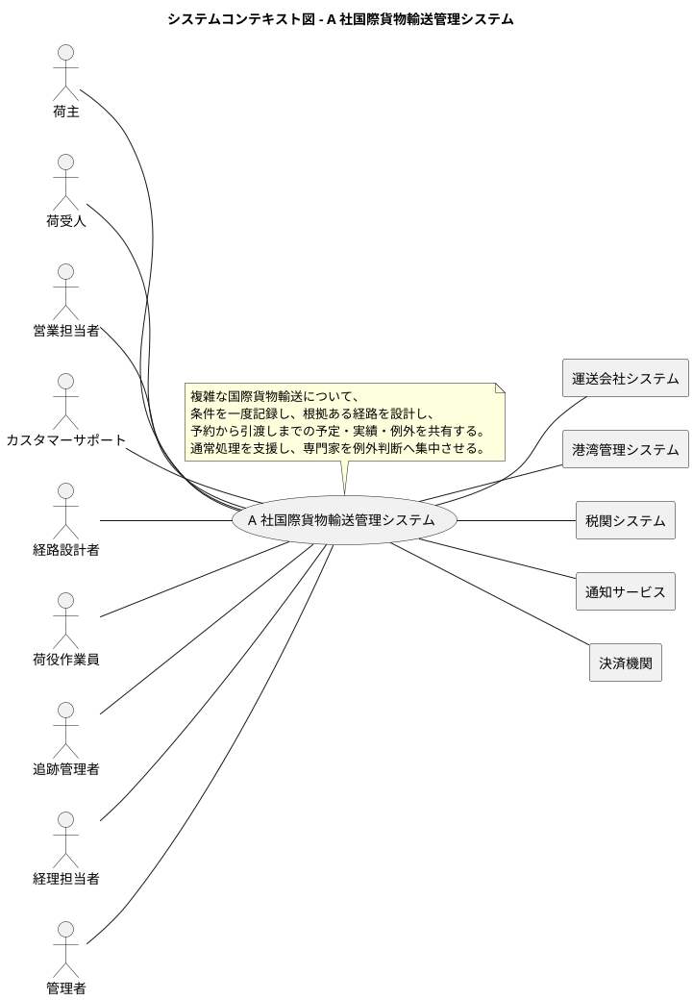

### ステークホルダー要求

| ID | ステークホルダー | 要求 | 派生要件 | 確度 |
| :--- | :--- | :--- | :--- | :--- |
| RQ-01 | 荷主 | 輸送条件を一度入力し、早く正確に予約したい | 下書き、見積り、差戻し、承認、変更、取消しを同一案件で扱えること | 確定 |
| RQ-02 | 荷主 | 安全で期日に合う経路と根拠を理解したい | 候補ごとに安全性、期限、接続余裕、費用、情報鮮度、除外理由を示せること | 仮説 |
| RQ-03 | 荷主・荷受人 | 現在状態、予定、異常時の次の行動を知りたい | 予定と実績、情報源、最終更新、確認中、次回更新、担当窓口を区別して表示すること | 確定 |
| RQ-04 | 営業担当者 | 部門間の確認と転記を減らしたい | 予約条件、見積り、経路、追跡を予約識別子で関連付けること | 確定 |
| RQ-05 | カスタマーサポート | 顧客の照会を引き継ぎ、正しい情報で支援したい | 閲覧権限、応対履歴、担当者への引継ぎ、代理操作を管理できること | 仮説 |
| RQ-06 | 経路設計者 | 制約を満たす候補と根拠を比較し、例外へ集中したい | 定型制約の照合、手動候補、承認、版管理、再設計を支援すること | 確定 |
| RQ-07 | 荷役作業員 | 現場で速く間違いなく実績を記録したい | 通信断、手袋、片手、屋外、騒音、共用端末を考慮し、未同期状態を識別できること | 仮説 |
| RQ-08 | 追跡管理者 | 状態と例外の正確性を保ちたい | 重複・順序・訂正を検証し、例外の責任者、期限、対応履歴を管理すること | 確定 |
| RQ-09 | 経理担当者 | 配送実績に基づく料金根拠を監査したい | 見積り、料金規則、実績、承認、精算を追跡できること | 確定 |
| RQ-10 | 経営・業務改革委員会 | 投資効果と顧客価値を段階ごとに判断したい | KPI、ガードレール、費用、便益、継続・中止条件を測定できること | パイロット継続条件は確定。投資上限・回収条件は要確認 |
| RQ-11 | IT・管理部門 | 安全に運用し、企業間情報を保護したい | 認証、認可、企業分離、監査、監視、復旧、保持を測定可能に定義すること | 要確認 |

### 要求モデル

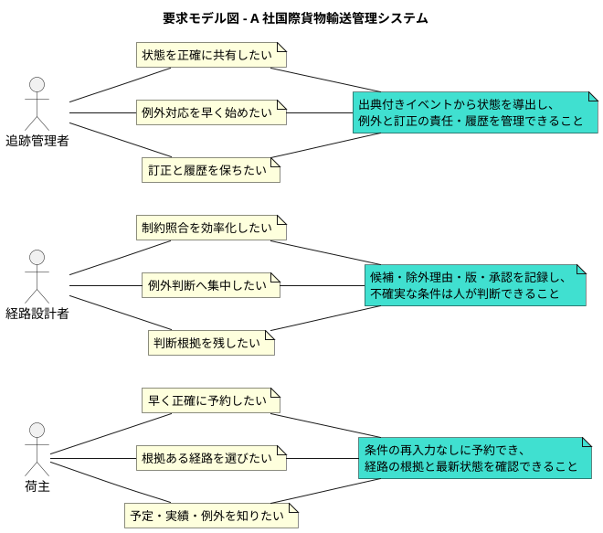

### 優先顧客と MVP パイロット境界

現時点では優先 ICP とパイロット範囲の業務承認がないため、次を検証可能な仮説として扱う。

| 軸 | MVP 仮説 | 承認・検証方法 |
| :--- | :--- | :--- |
| 優先 ICP | 継続契約があり、アジア・欧州間で複雑な条件を持つ法人荷主 | 売上、問い合わせ、再設計、継続率から候補を比較し、経営・営業が承認する |
| 支払者 | 法人荷主の契約主体 | 契約台帳で確認する |
| 契約意思決定者 | 荷主側の物流責任者または購買責任者 | 顧客インタビューで確認する |
| 入力者 | 荷主担当者または A 社営業担当者 | 現行業務観察で比率と権限を確認する |
| 利用者 | 荷主担当者、営業担当者、経路設計者、カスタマーサポート | 役割別タスクと頻度を調査する |
| 受益者 | 荷主、荷受人、A 社営業・運用部門 | 顧客ジャーニーと業務 KPI で確認する |
| 貨物 | MVP は一般貨物に限定し、危険物・冷凍貨物・その他特殊貨物は受け付けず後続段階へ送る | 2026-09-30 に human:kakimomokuri が MVP 境界を承認。後続着手前に規制責任者が対象貨物・必須書類・承認条件を決定する |
| 航路・港湾 | A 社で件数が多く、データ入手性を確認できるアジア・欧州間の限定航路 | 案件数、データ品質、パートナー合意で選定する |
| 案件数 | 統計的有意性より業務多様性を優先し、通常・変更・取消し・例外を含む件数を計画する | 現状件数取得後にプロダクト責任者が決定する |
| 最小データ源 | 予約台帳、承認済み航海・港湾データ、担当者が承認した主要実績 | 出典、更新責任、鮮度、利用条件をデータ源ごとに合意する |

## 層 2: システム外部環境

### ビジネスコンテキスト

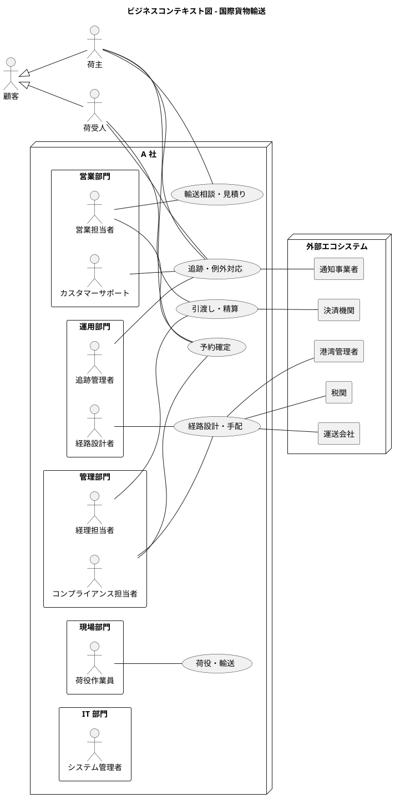

### ビジネスユースケース

| ID | ビジネスユースケース | 開始 | 完了 | 主責任 | 段階 |
| :--- | :--- | :--- | :--- | :--- | :--- |
| BUC-01 | 輸送条件を受け付け見積る | 荷主が輸送条件を提示する | 根拠付き見積りと候補方針を提示する | 営業部門 | MVP |
| BUC-02 | 予約を確定・変更・取消しする | 荷主が有効な見積りと承認済み経路を確認して本予約を申し込む、または条件変更する | 有効な予約版と追跡番号が確定する | 営業部門 | MVP |
| BUC-03 | 経路を設計・再設計する | 見積り済み輸送要求または本予約後の輸送上の変化を受け取る | 初回は本予約に利用可能な経路版が確定し、再設計では新経路版が予約へ割り当てられる | 運用部門 | MVP |
| BUC-04 | 基本追跡を共有する | 予約・経路予定または主要実績を受け取る | 出典と鮮度を伴う状態を利用者へ表示する | 運用部門 | MVP |
| BUC-05 | 荷役・輸送実績を記録する | 貨物を受領または作業する | 検証済みイベントが記録される | 現場部門 | 第 2 段階 |
| BUC-06 | 例外を検知・解決する | 遅延、破損、紛失等を検知する | 顧客への約束を履行し、例外を終結する | 運用部門 | 第 2 段階 |
| BUC-07 | 引渡し・精算を完了する | 貨物が目的地へ到着する | 受領と監査可能な精算が完了する | 管理部門 | 第 3 段階 |

### エンドツーエンド業務フロー

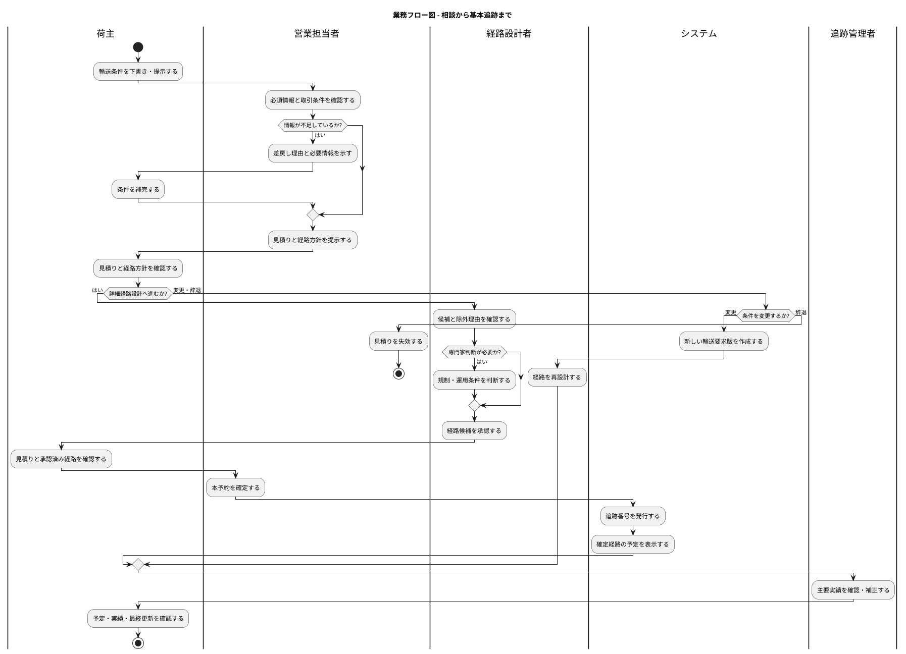

### 例外・外部障害時の業務フロー

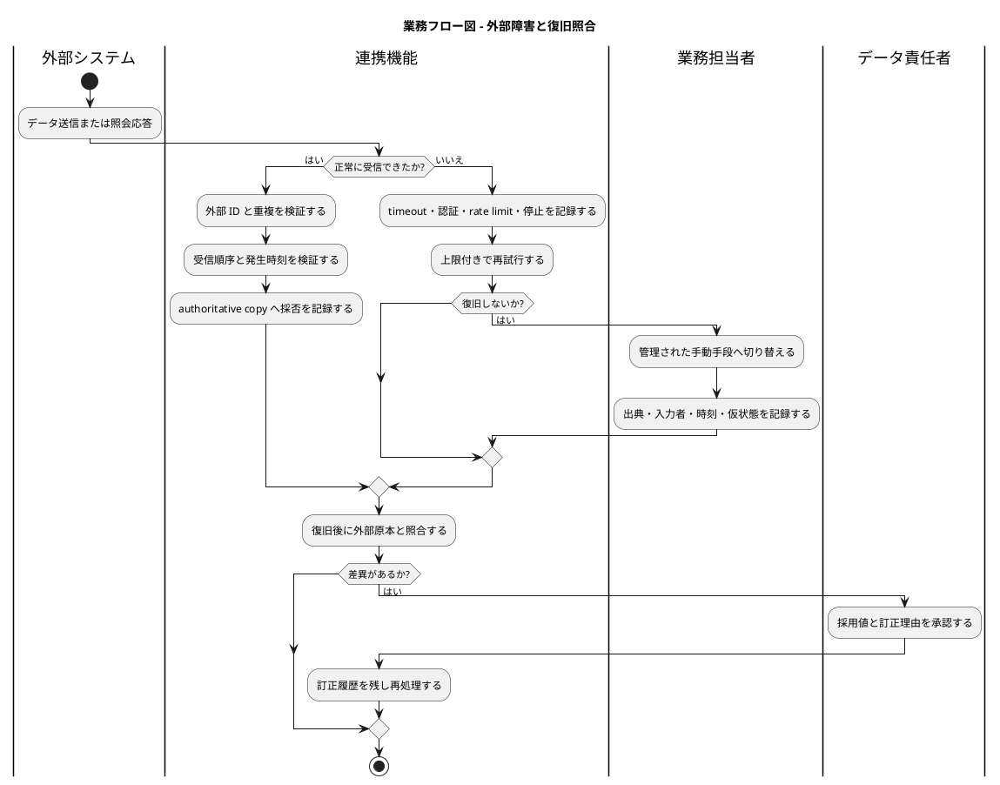

### 利用シーンと役割別利用文脈

| 利用シーン | 主なアクター | 文脈・不安 | システム支援 | 有人支援への切替 |
| :--- | :--- | :--- | :--- | :--- |
| 標準条件の予約下書き | 荷主担当者 | 専門用語や必要項目の不足が不安 | 段階入力、保存、複製、必須書類案内 | 特殊貨物、規制、不足情報を検出した場合 |
| 法人内承認 | 荷主担当者 | 権限外の確定や条件の見落としが不安 | MVP は荷主 1 名の承認、差戻し、期限。入力者・承認者の分離は後続 | 契約条件と入力内容が競合する場合 |
| 経路候補の比較 | 経路設計者 | 古い情報や隠れた制約による誤判断が不安 | 出典、鮮度、除外理由、接続余裕、手動候補 | 規制またはデータ不足で自動判定不能な場合 |
| 基本追跡の照会 | 荷主・荷受人 | 予定を実績と誤認することが不安 | 予定／実績／確認中、最終更新、情報源を表示 | 鮮度超過または例外発生時 |
| 顧客問い合わせ | カスタマーサポート | 説明の不一致や引継ぎ漏れが不安 | 応対履歴、開示範囲、担当部門への引継ぎ | 安全・契約・規制判断が必要な場合 |
| 現場実績入力 | 荷役作業員 | 通信断、誤操作、作業中断が不安 | 少ない操作、オフライン保存、未同期表示、訂正申請 | 端末故障または安全上操作できない場合 |
| 例外対応 | 追跡管理者・営業担当者 | 未確定情報を断定し顧客へ誤案内することが不安 | 事実、未確定、影響、次回更新、担当、必要行動を分離 | 重大例外、顧客判断、規制当局対応が必要な場合 |

### バリエーション・条件

| 分類軸 | 値 | 要件への影響 |
| :--- | :--- | :--- |
| 貨物種別 | 一般、危険物、冷凍、その他特殊貨物 | 必須項目、書類、設備、規制、専門家承認が異なる |
| 予約状態 | 下書き、審査中、見積提示済み、確定、変更中、取消済み、完了 | 可能な操作と権限が異なる |
| 経路判断 | 自動照合可能、専門家判断、承認不可 | 候補提示、承認、除外理由が異なる |
| 追跡情報 | 予定、実績、推定、確認中、訂正済み | 表示、鮮度、顧客説明が異なる |
| イベント入力 | 外部 API、ファイル、社内入力、現場入力、手動補正 | 信頼度、照合、監査、再処理が異なる |
| 通信状態 | オンライン、断続、オフライン、復旧中 | 即時反映、保留、再送、重複排除が異なる |
| 例外重要度 | 軽微、重要、重大 | 責任者、応答時間、通知チャネル、承認が異なる |

## 層 3: システム境界

### システムユースケース一覧

| ID | ユースケース | 主アクター | 主な情報 | 条件・イベント | 段階 |
| :--- | :--- | :--- | :--- | :--- | :--- |
| UC-01 | 輸送条件を下書き・提出する | 荷主、営業担当者 | 予約、貨物仕様、荷主、荷受人 | 必須項目、企業権限 | MVP |
| UC-02 | 輸送条件を審査・差し戻す | 営業担当者 | 輸送要求版、審査履歴 | 契約条件、書類不足 | MVP |
| UC-03 | 見積りを作成・提示する | 営業担当者 | 見積り、料金根拠 | 見積有効期限 | MVP |
| UC-04 | 予約を確定する | 荷主担当者、営業担当者 | 予約、追跡番号 | 荷主 1 名の承認、有効見積り、承認済み経路 | MVP |
| UC-05 | 予約を変更・取消しする | 荷主、営業担当者 | 予約版、変更理由 | 実行段階、取消条件 | MVP |
| UC-06 | 経路候補を算出・比較する | 経路設計者 | 経路版、区間、航海、港湾 | 基本制約、情報鮮度 | MVP |
| UC-07 | 例外条件を判断し経路を確定する | 経路設計者 | 判断根拠、承認、経路版 | 専門家権限、規制根拠 | MVP |
| UC-08 | 経路を再設計する | 経路設計者 | 新旧経路版 | 条件変更、欠航、港湾閉鎖、接続失敗 | MVP |
| UC-09 | 基本追跡を照会する | 荷主、荷受人、社内担当者 | 追跡番号、予定、主要実績、現在状態 | 開示範囲、鮮度 | MVP |
| UC-10 | 主要実績を登録・補正する | 追跡管理者 | 追跡イベント、訂正履歴 | 入力元、二者確認条件 | MVP |
| UC-11 | 荷役イベントを記録・同期する | 荷役作業員 | 荷役イベント | offline、冪等性、順序 | 第 2 段階 |
| UC-12 | 例外案件を起票・対応・終結する | 追跡管理者 | 例外案件、対応履歴 | 重要度、期限、顧客約束 | 第 2 段階 |
| UC-13 | 状態・例外を通知する | 追跡管理者 | 通知、購読設定 | 重要度、静穏時間、代替チャネル | 第 2 段階（荷主へのメール通知 US-22 は MVP へ前倒し） |
| UC-14 | 引渡し・精算を確定する | 経理担当者 | 受領、料金、精算 | 配送実績、承認 | 第 3 段階 |
| UC-15 | 外部データを取込み・照合する | データ責任者 | 外部原本、冪等性キー、取込履歴、差異、復旧照合結果 | timeout、再送、重複、衝突、順序、復旧完了 | 段階的 |
| UC-16 | 利用者・企業・権限を管理する | システム管理者 | 企業、利用者、役割 | 職務分離、企業間分離 | MVP |
| UC-17 | 監査証跡を照会する | 管理・コンプライアンス担当者 | 操作、承認、変更、訂正履歴 | 閲覧権限、保持期間 | MVP |
| UC-18 | 利用者を認証する | 利用者 | 本人識別情報、認証結果、session | 認証方式、失敗制御、利用停止 | MVP |
| UC-19 | 荷受人の参照許可を管理する | 荷主担当者 | 予約、荷受人、開示項目、許可状態 | 予約単位、企業分離、即時取消し | MVP |
| UC-20 | 照会・業務例外を有人対応へ引き継ぐ | カスタマーサポート、業務担当者 | 受付番号、原因、担当、期限、旧版・新版、手動入力出典、顧客連絡、復旧照合、状態 | 受領確認、未受領 escalation、顧客回答、終結 | MVP |

### ユースケース複合図

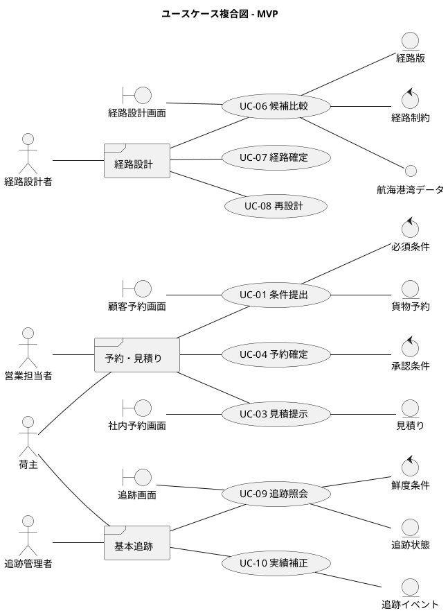

### 画面・帳票モデル

| ID | 境界 | 主利用者 | 目的 | 必須表示・操作 |
| :--- | :--- | :--- | :--- | :--- |
| UI-01 | 顧客予約画面 | 荷主担当者 | 下書き、提出、承認、変更、取消し | 必須情報、書類、版、差戻し、期限、有人支援。入力者・承認者の分離は後続 |
| UI-02 | 社内予約・見積画面 | 営業担当者 | 審査、見積り、顧客応対 | 契約条件、審査履歴、根拠、応対履歴 |
| UI-03 | 経路設計画面 | 経路設計者 | 候補比較、例外判断、確定、再設計 | 安全性、期日、接続余裕、費用、鮮度、除外理由、承認 |
| UI-04 | 顧客追跡画面 | 荷主・荷受人 | 状態と例外の自己照会 | 予定／実績／確認中、最終更新、情報源、次回更新、窓口 |
| UI-05 | 追跡管理画面 | 追跡管理者 | 実績補正、鮮度監視、例外対応 | 原本、採用値、訂正理由、責任者、顧客約束 |
| UI-06 | 現場入力画面 | 荷役作業員 | 荷役実績の記録 | 大きな操作対象、誤入力防止、offline、未同期、訂正申請 |
| RP-01 | 予約・経路確認書 | 荷主、営業担当者 | 合意内容の確認 | 予約版、貨物条件、経路版、見積り、有効期限 |
| RP-02 | 監査証跡 | 管理・コンプライアンス担当者 | 判断・変更の監査 | 操作者、日時、変更前後、理由、承認、出典 |

### イベントモデル

| ID | イベント | 発生元 | 受信・利用先 | 必須属性 | 障害時の扱い |
| :--- | :--- | :--- | :--- | :--- | :--- |
| EV-01 | 予約提出 | 顧客 Web／営業 | 予約管理 | 予約 ID、版、企業、発生時刻 | 同一版の重複を排除する |
| EV-02 | 見積提示 | 見積管理 | 顧客 Web／営業 | 見積 ID、有効期限、根拠 | 配信失敗を再送し画面でも照会可能にする |
| EV-03 | 予約確定 | 予約管理 | 経路・追跡 | 予約 ID、確定版、追跡番号 | 部分成功を検知し再処理する |
| EV-04 | 経路確定 | 経路設計 | 予約・追跡 | 経路版、承認者、根拠、出典時刻 | 古い版による上書きを拒否する |
| EV-05 | 航海・港湾更新 | 外部システム | 経路設計 | 提供元、原本種別、外部 ID、外部版、payload、発生時刻、受信時刻 | 同一キー・同一 payload は重複、同一キー・異 payload は隔離し、停止時は承認済み手動取込へ切り替える |
| EV-06 | 主要実績登録 | 追跡管理者 | 基本追跡 | 追跡番号、種別、場所、発生時刻、出典 | 二重登録を防ぎ、訂正は新イベントで行う |
| EV-07 | 荷役イベント | 現場／港湾 | 追跡 | イベント ID、貨物 ID、種別、場所、発生時刻 | offline キュー、冪等再送、順序逆転の保留を行う |
| EV-08 | 例外検知 | 追跡 | 例外管理 | 種別、重要度、検知根拠 | 自動起票失敗を監視し手動起票を許可する |
| EV-09 | 状態・例外通知 | 通知 | 荷主・荷受人・社内 | 宛先、重要度、メッセージ版 | 配信結果を記録し、重大通知は代替チャネルへ切り替える |
| EV-10 | 外部データ訂正 | 外部システム／データ責任者 | 関連業務 | 原本、旧値、新値、理由、承認 | 影響対象を再計算し顧客向け訂正を判断する |

### システム境界の責任分担

| 対象 | 外部原本 | システム内 authoritative copy | 採否責任 |
| :--- | :--- | :--- | :--- |
| 顧客・契約条件 | 契約台帳・顧客提示情報 | 予約時点で参照した条件と版 | 営業部門 |
| 航海・港湾情報 | 運送会社・港湾管理者 | 取得日時と出典を伴う採用データ | 運用部門 |
| 貨物規制 | 法令・規制資料・専門家判断 | 適用根拠と承認記録 | コンプライアンス責任者 |
| 主要実績 | 外部通知・現場記録・社内確認 | 採用イベントと訂正履歴 | 追跡管理者 |
| 決済結果 | 決済機関 | 精算との照合結果 | 管理部門 |

## 層 4: システム内部構造

### 情報モデル

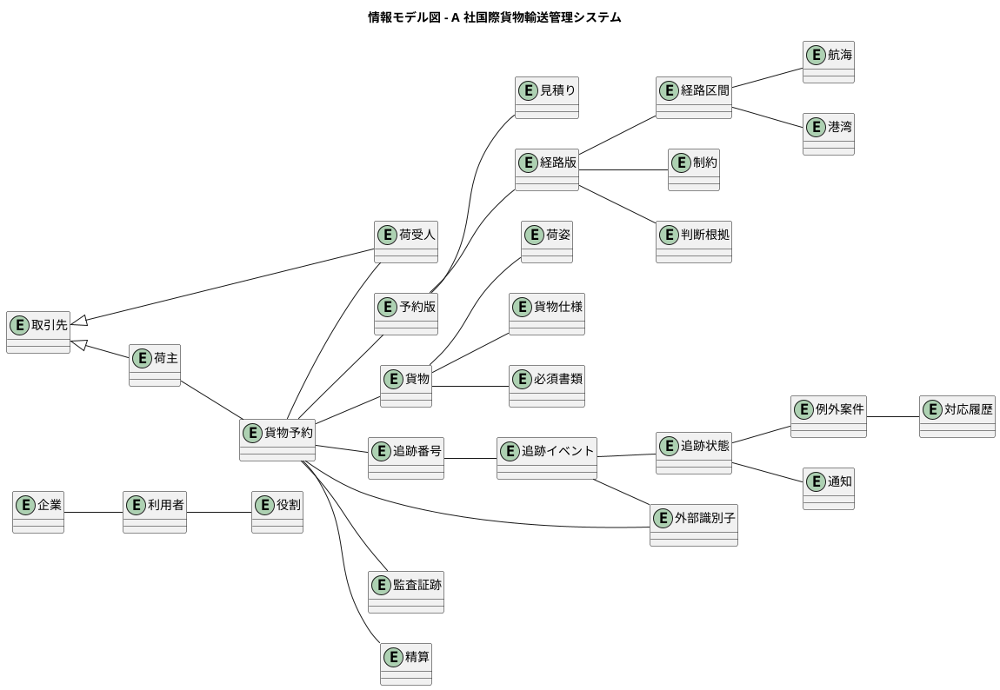

### 識別子と対応関係

| 識別子 | 発行主体 | 目的 | 要確認事項 |
| :--- | :--- | :--- | :--- |
| 予約 ID | A 社システム | 商談から完了までの業務識別 | 予約分割・統合時の扱い |
| 予約版 ID | A 社システム | 条件変更前後の不変な履歴 | 確定後変更の承認単位 |
| 追跡番号 | A 社または合意した発行主体 | 顧客照会 | 複数貨物・複数荷姿との対応 |
| 貨物 ID | A 社システム | 輸送対象の識別 | 分割・混載・積替えのモデル |
| 荷姿 ID | A 社システム | 物理単位の識別 | ラベル・バーコード標準 |
| 経路版 ID | A 社システム | 再設計前後の経路識別 | 有効開始時点と旧版参照 |
| 外部 ID | 各外部組織 | 外部原本との照合 | 発行主体、名前空間、重複条件 |

### 予約の状態モデル

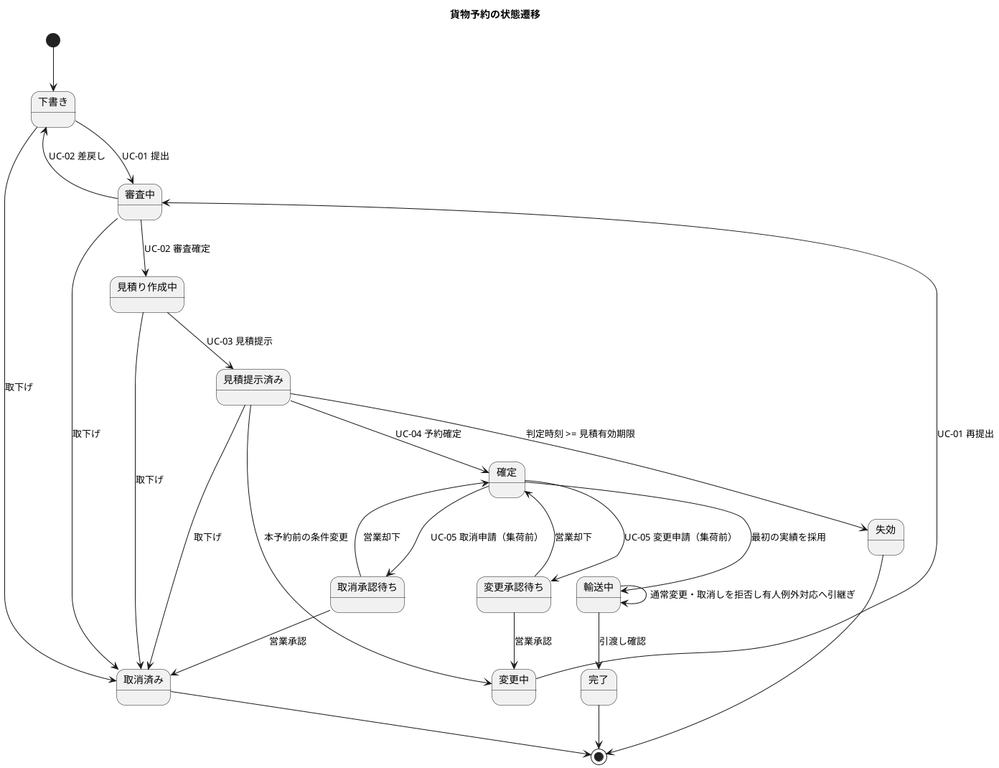

「見積り作成中」は、審査を確定してから見積りを提示するまでの状態である。ドメインモデルの状態遷移に合わせて足した（2026-10-02 に human:kakimomokuri が承認。Bolt 5 の確認ポイント 6）。

### 見積りの状態モデル

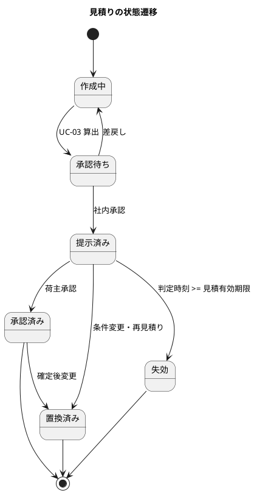

### 経路版の状態モデル

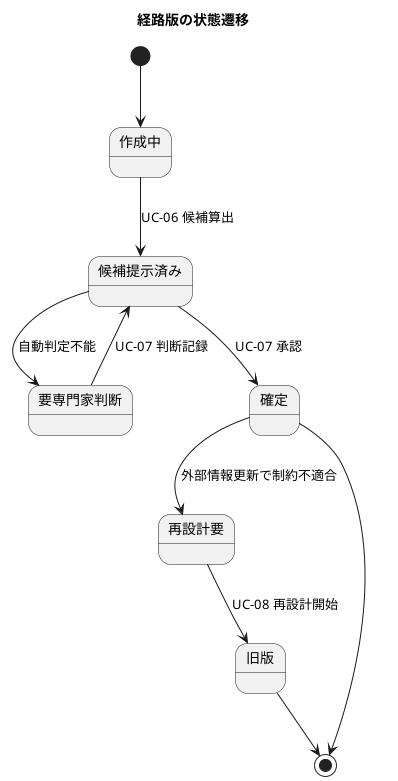

### 追跡状態モデル

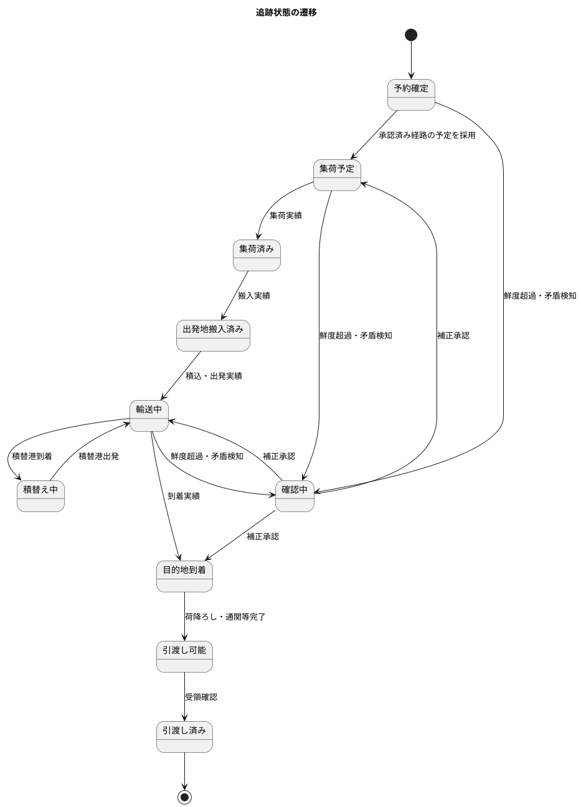

状態名は業務責任者による確認前の候補である。MVP では予定から推定した状態と、担当者が確認した実績状態を混同せず、表示上も区別する。

### 例外案件の状態モデル

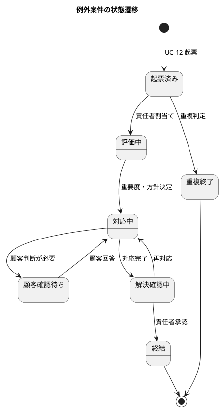

### 主要ビジネスルール

| ID | ルール候補 | 確度・検証 |
| :--- | :--- | :--- |
| BR-01 | 本予約確定には、有効な見積り、必須貨物情報、荷主担当者 1 名の承認、承認済み経路版、営業担当者による条件確認が必要である | 2026-09-30 に human:kakimomokuri が MVP 規則を承認。荷主内の入力者・承認者分離は後続 |
| BR-02 | 期限に間に合わない候補、貨物種別非対応の候補、接続不能な候補は原則除外する | 確定。例外承認の可否は要確認 |
| BR-03 | 危険物・冷凍貨物・その他特殊貨物は MVP の見積り・経路設計・本予約の対象にせず、後続段階の受付・専門家承認条件が確定するまで手動窓口へ案内する | MVP 境界は 2026-09-30 に human:kakimomokuri が承認。後続段階の規則は未決 |
| BR-04 | 本予約前は輸送要求版を更新または取下げできる。本予約後から最初の集荷実績採用前までは営業承認付きで変更・取消しでき、変更は新しい予約版を作って必要に応じて再見積り・荷主再承認・再設計する。集荷実績採用後は通常の変更・取消しを禁止し、有人の例外対応へ引き継ぐ | 実行段階と承認規則は 2026-09-30 に human:kakimomokuri が承認。費用・期限は未決 |
| BR-05 | イベント訂正は原イベントを削除せず、訂正理由を持つ新イベントで行う。採用済みまたは顧客表示済みの実績は登録者と異なる追跡管理者の承認後に採用し、採用前の下書きは二者確認なしで修正できる | 2026-10-01 に human:kakimomokuri がパイロットの二者確認条件を承認。保持期間は後続要件で決定 |
| BR-06 | 順序逆転または矛盾するイベントは現在状態へ直ちに反映せず、確認中として保留する | 仮説。状態責任者が採否ルールを承認する |
| BR-07 | 企業利用者は自社に許可された予約だけを閲覧する。荷主担当者は予約単位で荷受人を招待・取消しでき、荷受人には到着予定、現在状態、主要実績、最終更新時刻だけを開示する。料金、契約条件、書類、他の予約は開示しない。取消し後は既存 session でも対象予約を直ちに参照できない | 2026-09-30 に human:kakimomokuri が MVP 規則を承認 |
| BR-08 | 外部連携停止時の手動入力は、出典、入力者、入力時刻、仮状態を必須とし、復旧後に照合する | 確定 |
| BR-09 | 有人引継ぎは受付番号、担当部門・担当者、優先度、回答期限、次回更新日時、状態、顧客回答履歴を持つ。担当が期限内に受領しない場合は上位の運用責任者へ escalation し、顧客へ回答を返して終結する | 2026-10-01 に human:kakimomokuri が MVP 規則を承認 |
| BR-10 | 見積りは本予約確定の commit 時刻が見積有効期限より前の場合だけ有効とし、同時刻以後は失効とする。時刻は UTC の時点として保存し、画面では利用者のタイムゾーンと UTC offset を明示して表示する | 2026-10-01 に human:kakimomokuri が日時境界を承認 |
| BR-11 | 経路候補は到着予定時刻が希望到着期限以前、かつ各接続時間が必要最小接続時間以上の場合に制約適合とする。経路承認の commit 時点と参照した外部情報版で判定し、承認後の更新で不適合になった場合は予約を自動取消しせず経路を再設計要とする | 2026-10-01 に human:kakimomokuri が日時境界と再評価規則を承認。必要最小接続時間の値は航路別規則で管理する |
| BR-12 | 外部原本の冪等性キーは提供元、原本種別、外部 ID、外部版の組合せとする。同一キー・同一 payload は既存結果を返し、同一キー・異 payload は上書きせず隔離する。復旧は停止期間の全原本を採用済み・重複・隔離へ分類し、件数照合と手動入力との差異確認を完了した時点で完了とする | 2026-10-01 に human:kakimomokuri が冪等性と復旧完了条件を承認 |
| BR-13 | 人が操作する画面・対話部分は WCAG 2.2 AA を目標とし、キーボード操作、可視フォーカス、明示ラベル、エラー要約、色だけに依存しない状態表示、入力エラー時の値保持と修正方法を保証する。入力エラー、非同期更新、確認中への遷移、有人案件の escalation は支援技術へ通知する。本予約確定、取消し、権限変更、実績訂正、荷受人への共有・取消しは対象・現在状態・変更内容・影響・実行者を示して実行前確認し、回復手段または回復不能である旨を示す | 2026-10-01 に human:kakimomokuri が横断 UI 契約を承認。バックグラウンド処理自体は操作条件の対象外とし、結果を表示・操作する UI と WCAG 2.2 AA 全体の適合確認は UI 設計・テスト戦略で行う |
| BR-14 | パイロット利用者は事前登録メールアドレス、password、TOTP MFA で認証する。5 回連続失敗で 15 分ロックし、session は無操作 30 分または発行後 8 時間で失効する。利用停止・権限取消しは確定後の次 request から反映する | 2026-10-01 に human:kakimomokuri がパイロット認証規則を承認。password 強度・回復手順は非機能要件で決定 |
| BR-15 | パイロットの役割は荷主担当者、営業担当者、経路設計者、追跡管理者、データ責任者、カスタマーサポート、システム管理者、監査担当者に固定する。業務担当者は担当企業・担当案件だけを操作し、システム管理者と監査担当者は業務データを変更できない。荷主内の入力者・承認者分離は要求しない | 2026-10-01 に human:kakimomokuri がパイロット役割・職務分離を承認 |
| BR-16 | 失効・置換済み見積りと旧版経路は再利用せず新しい版を作成する。再設計要の経路は新規予約確定へ利用しない。完了済み追跡への遅延イベントは原本を保持するが状態を自動で後退・再開せず、訂正は BR-05 を適用する。取消済み予約への実績登録は拒否し、発生事実は有人例外案件へ記録する | 2026-10-01 に human:kakimomokuri が禁止状態遷移と回復規則を承認 |
| BR-17 | パイロットで変更・取消し、再設計、外部停止が発生した場合、対象の自動処理を停止し、原因、担当、期限、旧版・新版、手動入力出典、顧客連絡、復旧照合を持つ受付番号付き有人案件へ引き継ぐ。顧客都合の取消しだけを PV-01 の母集団から除外し、再設計・外部停止案件は母集団に残して例外件数を報告する | 2026-10-01 に human:kakimomokuri がパイロット例外運用を承認 |
| BR-18 | パイロットの初期情報源は、選定した運送会社または港湾から受領する承認済みファイル 1 件以上をデータ責任者が手動取込する。外部 API 接続は開始条件に含めず、対象情報源が選定・承認されていない場合はパイロットを開始しない | 2026-10-01 に human:kakimomokuri が初期取込方式と開始条件を承認。具体的な提供元・ファイル形式・頻度は開始前に記録する |

## 測定・品質要求

### KPI とガードレールの確定計画

根拠のない目標値を置かず、要件レビューまでに 2026 年 10 月の現状測定から基準値と目標レンジを決定する。

| ID | 指標 | 算式・母集団 | 責任者 | 目標の決め方 |
| :--- | :--- | :--- | :--- | :--- |
| KPI-01 | 経路提示リードタイム | 条件受付から最初の有効な経路・見積提示まで。条件受付は輸送要求の版 1 を最初に提出した時刻とし、差戻し・再提出・新しい版で戻さない（2026-10-02 の D-3）。対象パイロット全件の中央値・90 パーセンタイル | 営業責任者 | 基準値に対して中央値を 10% 以上短縮し、90 パーセンタイルを悪化させない |
| KPI-02 | 自己照会率 | 追跡照会総数に対する顧客 Web で完結した照会数 | プロダクト責任者 | 基準値に対して 10 ポイント以上改善する |
| KPI-03 | 状態反映時間 | 実績発生時刻から顧客表示まで。情報源別の中央値・95 パーセンタイル | 追跡責任者 | MVP 手動更新と第 2 段階自動連携を分けて設定する |
| KPI-04 | 例外対応開始時間 | 例外検知から責任者が対応開始するまで | 運用責任者 | 重要度別に設定する |
| KPI-05 | 期日遵守率 | 期限内引渡し件数／対象完了件数 | 運用責任者 | 貨物・航路別の基準値から設定する |
| GR-01 | 制約違反件数 | 承認済み経路で判明した必須制約違反 | 品質責任者 | MVP リリースを妨げる重大度を定義する |
| GR-02 | 手動補正率 | 訂正・補正イベント数／全採用イベント数 | データ責任者 | 情報源別に許容レンジを決める |
| GR-03 | 誤通知件数 | 訂正通知または苦情に至った通知件数 | 顧客対応責任者 | 重大度別の許容値を決める |
| GR-04 | 現場入力時間 | 代表作業 1 件の入力所要時間と失敗率 | 現場責任者 | 作業観察とユーザビリティテストで決める |

### パイロットのプロダクト検証計画

機能の完成判定と顧客価値・投資継続の判定を分離し、次の `PV-01` を経営・業務改革委員会の判断材料とする。

| ID | 項目 | 判定規則 |
| :--- | :--- | :--- |
| PV-01 | 母集団 | OQ-01 で選定したパイロット航路の一般貨物予約すべて |
| PV-01 | 除外 | 訓練データと顧客都合の取消しだけ。対象 ID、除外理由、判断者を記録する。再設計・外部停止案件は除外しない |
| PV-01 | 基準値 | パイロット開始前 4 週間の同じ母集団・算式による KPI-01、KPI-02 |
| PV-01 | 観測期間 | 開始後 4 週間または追跡状態が引渡し済みに到達した予約 30 件の遅い方 |
| PV-01 | 継続 | KPI-01 の中央値を 10% 以上短縮し 90 パーセンタイルを悪化させず、KPI-02 を 10 ポイント以上改善し、権限外開示、外部原本消失、重複予約が各 0 件 |
| PV-01 | 延長 | 改善条件が未達で重大ガードレール違反がない場合、原因、改善仮説、追加検証期限、責任者を記録して再判定する |
| PV-01 | 中止 | 権限外開示、外部原本消失、重複予約のいずれかが 1 件以上発生した場合、パイロットを停止して原因と再開条件を審査する |
| PV-01 | 例外報告 | 変更・取消し、再設計、外部停止の発生件数、有人案件の期限遵守、顧客連絡、復旧照合結果を母集団とともに報告する |
| PV-01 | 評価対象外 | 荷受人の直接照会 US-10・US-19。パイロットでは荷主または有人窓口が代替し、荷受人価値を検証済みとは扱わない |

KPI-01 と KPI-02 の改善幅に関する投資判断閾値、費用便益、回収期間、投資上限は OQ-06、OQ-08 の残決定とする。

### 横断品質要求の確定項目

数値目標は後続の非機能要件で確定するが、要求 ID と影響範囲は本段階で固定し、後続成果物から参照する。

| ID | 領域 | 最低限定義する内容 | 影響範囲 | 後続成果物 |
| :--- | :--- | :--- | :--- | :--- |
| NFR-AUTH-01 | 認証・認可 | 社内・顧客の認証方式、企業分離、役割、職務分離、退職・契約終了時の失効 | 全 UC、全 Unit | 非機能要件、アーキテクチャ |
| NFR-AUDIT-01 | 監査 | 予約・経路・イベント・権限・訂正の証跡、改ざん防止、保持、検索 | UC-01〜UC-20、U1〜U6 | 非機能要件、データモデル |
| NFR-AVAIL-01 | 可用性 | 業務時間、計画停止、外部停止時の縮退、SLA | UC-01〜UC-10、UC-15、UC-18〜UC-20 | 非機能要件、運用要件 |
| NFR-RECOVERY-01 | 復旧 | RPO、RTO、バックアップ、再処理、復旧後照合 | UC-04、UC-09、UC-10、UC-15、U3、U5、U6 | 非機能要件、運用要件 |
| NFR-PERF-01 | 性能 | 画面応答、候補算出、同時利用、バッチ量、通知遅延 | 全 UC、全 Unit | 非機能要件、テスト戦略 |
| NFR-FRESH-01 | データ鮮度 | 情報源別の更新頻度、鮮度超過表示、責任者、補正期限 | UC-06〜UC-10、UC-15、U2、U3、U5 | 非機能要件、データモデル |
| NFR-ACCESS-01 | アクセシビリティ | BR-13 の WCAG 2.2 AA 目標、キーボード、可視フォーカス、ラベル、エラー要約、色に依存しない表示。言語、日時、時差、単位の詳細 | 主要業務フロー、全 Unit | UI 設計、テスト戦略 |
| NFR-PRIVACY-01 | プライバシー | 個人・取引情報、越境、目的、保持、削除、開示 | UC-09、UC-16〜UC-20、U3、U4 | 非機能要件、運用要件 |

## 検証計画とトレーサビリティ

### Golden dataset

経路算出の test oracle は単一の熟練者に依存させず、次の代表案件を複数の経路設計者とコンプライアンス担当者が承認し、規制根拠とともに版管理する。

- 標準的な一般貨物の直行・積替え候補。
- 接続時間の境界値を含む案件。
- 到着期限を満たさない候補を含む案件。
- 危険物・冷凍貨物・その他特殊貨物が MVP 対象外として安全に停止され、手動窓口へ案内される案件。
- 欠航、港湾閉鎖、接続失敗による再設計案件。
- 外部データ欠落・古さ・矛盾により専門家判断へ送る案件。

各ケースは入力、期待候補、除外候補、判断根拠、規制資料、承認者、適用期間を持つ。件数と具体的データは要件レビューまでに業務責任者が決定する。

### 戦略レビュー指摘への対応

| 指摘 | 本書での対応 | 残作業 |
| :--- | :--- | :--- |
| H-1 KPI | 算式、母集団、責任者、測定期限を定義 | 基準値と目標レンジの承認 |
| H-2 投資効果 | 経営要求 RQ-10 として追跡 | 戦略補完で便益、回収期間、投資上限、継続条件を決定 |
| H-3 MVP 境界 | 優先 ICP・貨物・航路・利用者・データ源の仮説を定義 | 実績データと顧客調査による承認 |
| H-4 基本追跡 | 予定／実績／確認中、情報源、鮮度、補正責任を定義 | データ源別鮮度目標の承認 |
| H-5 状態・変更業務 | 予約、見積り、経路版、追跡、例外の状態と変更・取消し・訂正を定義 | ユースケース受入条件の詳細化 |
| H-6 障害・代替 | 再試行、重複、順序、手動代替、復旧照合を定義 | timeout、回数、RTO 等の数値化 |
| H-7 UX・役割 | 役割別利用文脈、有人切替、例外時表示、現場制約を定義 | UI プロトタイプによる検証 |
| H-8 横断品質 | 必須品質領域と後続成果物を定義 | 測定値と品質ゲートの確定 |
| H-9 golden dataset | 構造と代表ケースを定義 | 実データ収集・複数専門家承認 |
| H-10 優先 ICP | 支払者、意思決定者、利用者、受益者の仮説を分離 | 経営・営業・顧客による選定 |

## 未決事項と承認ゲート

| ID | 未決事項 | 決定者 | 期限・ゲート |
| :--- | :--- | :--- | :--- |
| OQ-01 | 優先 ICP、パイロット顧客、貨物、航路、港湾、案件数 | 経営・業務改革委員会、営業・運用責任者 | 要件レビュー前 |
| OQ-02 | **パイロットの最小取込方式は解決済み**: BR-18 の承認済みファイル手動取込を用いる。具体的な提供元、ファイル形式、取得頻度、鮮度、補正責任、第 2 段階移行条件は未決 | 方式: human:kakimomokuri。残項目: 追跡・データ責任者 | 方式は 2026-10-01 決定。提供元と形式はパイロット開始前 |
| OQ-03 | **MVP 境界は解決済み**: 一般貨物だけを対象とし、危険物・冷凍貨物・その他特殊貨物は後続段階へ送る。後続段階の自動判定範囲と専門家承認条件は未決 | MVP 境界: human:kakimomokuri。後続規則: コンプライアンス・運用責任者 | MVP 境界は 2026-09-30 決定。後続着手前に残規則を決定 |
| OQ-04 | **実行段階と承認規則は解決済み**: 本予約前は輸送要求版を自由に更新・取下げ、本予約後から集荷前は営業承認付きで変更・取消し、集荷後は通常処理を禁止して有人例外対応へ送る。変更・取消しの費用と申請期限は未決 | 段階・承認: human:kakimomokuri。費用・期限: 営業・管理責任者 | 段階・承認は 2026-09-30 決定。費用・期限はパイロット開始前 |
| OQ-05 | **パイロットは外部 API を使用しない**: BR-18 の手動取込を用いる。後続の外部システム契約、更新頻度、timeout、再試行、代替手段は未決 | パイロット方式: human:kakimomokuri。後続: IT・データ・業務責任者 | パイロット方式は 2026-10-01 決定。後続 API はアーキテクチャレビュー前 |
| OQ-06 | **PV-01 の合格幅は解決済み**: KPI-01 は中央値 10% 以上短縮・P90 非悪化、KPI-02 は 10 ポイント以上改善。その他 KPI と品質ゲートは未決 | PV-01: human:kakimomokuri。残項目: プロダクト・品質責任者 | PV-01 は 2026-10-01 決定。残項目はリリース計画前 |
| OQ-07 | **パイロットの予約確定、荷受人開示、横断 UI、認証、役割、訂正承認は解決済み**: BR-01、BR-05、BR-07、BR-13〜BR-15 を適用する。password 強度・回復、RPO/RTO、性能、保持、個別画面のアクセシビリティ適合確認、全社展開時の役割・職務分離は未決 | 解決済み範囲: human:kakimomokuri。残項目: IT・品質・管理責任者 | パイロット規則は 2026-10-01 決定。残項目はアーキテクチャ・UI レビュー前 |
| OQ-08 | **パイロット継続・延長・中止条件は解決済み**: PV-01 の母集団、除外、基準値、観測期間、KPI 改善、重大ガードレールを用いる。投資便益、改善幅、回収期間、投資上限は未決 | 継続条件: human:kakimomokuri。投資条件: 経営・業務改革委員会 | 継続条件は 2026-10-01 決定。投資条件は投資承認前 |

## 参照

- [A 社の企業事例](../../strategy/business_case.md)
- [A 社の経営戦略](../../strategy/business_strategy.md)
- [A 社のビジネスアーキテクチャ](../../strategy/business_architecture.md)
- [インセプションデッキ](../../strategy/inception-deck.md)
- [戦略成果物レビュー](../../review/戦略成果物_review_20260929.md)
