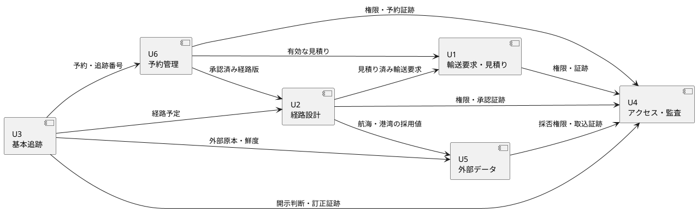

# cargo-tracker Unit 定義

## Intent と分割方針

Intent は、荷主の輸送条件受付から予約、経路設計、基本追跡までを、根拠と監査証跡を失わず一貫して提供することである。

Unit は独立して価値と受入条件を検証できる凝集した業務能力として分割する。アーキテクチャ、サービス、チーム、データベースの境界は本書では決定しない。

## Unit 一覧

| Unit | Intent への責務 | 含むストーリー | 入力 | 観測可能な成果 |
| :--- | :--- | :--- | :--- | :--- |
| U1 輸送要求・見積り | 条件受付から審査、根拠付き見積りと経路方針の提示までを版管理する | US-01〜US-03 | 顧客条件、契約条件 | 見積り済み輸送要求、根拠付き見積り、経路方針 |
| U2 経路設計 | 見積り済み輸送要求の制約を満たす候補を比較し、判断根拠を伴う経路版を管理する | US-06〜US-08 | 見積り済み輸送要求、航海・港湾情報、規制根拠 | 候補、除外理由、承認済み経路版 |
| U6 予約管理 | 有効な見積りと承認済み経路から本予約を確定し、変更・取消しを版管理する | US-04、US-05 | 見積り、承認済み経路版、荷主担当者 1 名の承認 | 有効な予約版、追跡番号、変更・取消し履歴 |
| U3 基本追跡 | 予定と主要実績から、権限に応じた状態・出典・鮮度を共有し、照会を有人対応へ閉ループで引き継ぐ | US-09〜US-13、US-20 | 予約、経路予定、主要実績、顧客照会 | 現在状態、追跡表示、訂正履歴、有人対応案件 |
| U4 アクセス・監査 | 利用者を認証し、企業・利用者・案件別参照許可を分離して重要操作の証跡を提供する | US-16〜US-19 | 企業、利用者、認証結果、役割、予約単位参照許可、業務操作 | 本人確認済み session、アクセス判断、変更履歴、監査証跡 |
| U5 外部データ | 外部原本を冪等に検証・照合し、衝突を隔離して採用値と完了判定可能な復旧結果を提供する | US-14、US-15 | 運送会社・港湾の原本、冪等性キー構成要素、payload、手動情報 | 採用値、重複、隔離、差異、取込履歴、復旧照合結果 |

## 依存 DAG

矢印は「左側の Unit が右側の Unit の成果を利用する」を表す。U4 は全 Unit が利用する横断能力だが、循環を避けるため業務 Unit から U4 への依存として表す。

DAG としての契約順序は、依存先を先に並べると `U4・U5 → U1 → U2 → U6 → U3` となる。ただし U4・U5 を先行完成させる意味ではなく、以下のウォーキングスケルトンで必要最小契約だけを縦に接続する。

## 依存関係

| 利用側 | 依存先 | 必要な契約 | 結合を抑える条件 |
| :--- | :--- | :--- | :--- |
| U1 | U4 | 本人確認済み session、企業・役割のアクセス判断、予約・承認・変更の証跡記録 | 具体的な認証方式を業務条件に混ぜない |
| U2 | U1 | 見積り済み輸送要求の識別、版、制約、経路方針 | 見積り計算の内部過程を U2 に漏らさない |
| U2 | U5 | 出典・版・鮮度付きの航海・港湾採用値 | 外部提供元の形式を経路規則へ直接漏らさない |
| U2 | U4 | 本人確認済み session、設計者・専門家の権限、判断・承認の証跡 | 役割名称の詳細は OQ-07 まで固定しない |
| U6 | U1 | 有効な見積り、必須貨物情報、荷主担当者 1 名の承認 | 見積り内部情報を予約へ複製しない |
| U6 | U2 | 本予約に利用可能な承認済み経路版 | 経路算出方法を U6 に漏らさない |
| U6 | U4 | 本人確認済み session、確定・変更・取消し権限、予約証跡 | 認証・監査の方式を予約規則へ埋め込まない |
| U3 | U6 | 予約識別、追跡番号、開示関係 | 見積り内部情報を追跡へ公開しない |
| U3 | U2 | 有効な経路予定と版 | 候補計算の内部過程を追跡へ公開しない |
| U3 | U5 | 出典・発生時刻・取得時刻付き主要実績 | 未検証原本を現在状態へ直接反映しない |
| U3 | U4 | 本人確認済み session、企業・役割・荷受人開示範囲、照会・訂正証跡 | 開示判定を表示処理へ埋め込まない |
| U5 | U4 | 本人確認済み session、データ採否権限、手動入力・復旧照合の証跡 | 外部障害時も認証・権限と記録を迂回しない |

### Unit 間連携の必須制約

- Unit 間の変更 command は command ID、対象 ID、期待版を持つ。同じ command ID の再実行は同じ結果を返し、異なる内容は衝突として上書きしない。
- 期待版が現在版と一致しない場合は変更せず、競合として最新版の再読込または再承認を要求する。
- 複数 Unit にまたがる処理は完了、処理中、失敗、有人確認要を区別し、後続 Unit が未完了の状態を成功として表示しない。
- 部分成功時は完了済みの処理、未完了の処理、失敗理由、再処理に必要な ID を保持する。再送で完了済み処理を重複実行しない。
- 通信方式、配送保証、補償、timeout、retry の具体方式と数値は ARCH-HO-01〜ARCH-HO-03 としてアーキテクチャ分析へ引き継ぐ。
- 全 Unit は NFR-AUTH-01〜NFR-PRIVACY-01 の該当要求を後続のテスト戦略へトレースする。

## ユースケース × Unit × ストーリー対応表

| BUC | UC | Unit | ストーリー | MVP | 主な要件・品質指標 |
| :--- | :--- | :--- | :--- | :---: | :--- |
| BUC-01 | UC-01 | U1 | US-01 | Yes | RQ-01、BR-01、BR-03、KPI-01 |
| BUC-01 | UC-02 | U1 | US-02 | Yes | RQ-04、BR-01、KPI-01 |
| BUC-01 | UC-03 | U1 | US-03 | Yes | RQ-01、RQ-04、BR-01、BR-10、KPI-01 |
| BUC-02 | UC-04 | U6 | US-04 | Yes | RQ-01、RQ-02、BR-01、BR-03、BR-10 |
| BUC-02 | UC-05 | U6 | US-05 | Yes | RQ-01、RQ-04、BR-04 |
| BUC-03 | UC-06 | U2 | US-06 | Yes | RQ-02、RQ-06、BR-02、BR-11、KPI-01、GR-01 |
| BUC-03 | UC-07 | U2 | US-07 | Yes | RQ-06、BR-02、BR-11、GR-01 |
| BUC-03 | UC-08 | U2 | US-08 | Yes | RQ-02、RQ-06、BR-04、BR-11、KPI-05 |
| BUC-04 | UC-09 | U3 | US-09 | Yes | RQ-03、BR-07、KPI-02、KPI-03 |
| BUC-04 | UC-09 | U3 | US-10 | Yes | RQ-03、BR-07、KPI-02 |
| BUC-04 | UC-09、UC-20 | U3 | US-11 | Yes | RQ-05、BR-07、BR-09、KPI-02 |
| BUC-04 | UC-10 | U3 | US-12 | Yes | RQ-08、BR-05、BR-06、KPI-03、GR-02 |
| BUC-04 | UC-10 | U3 | US-13 | Yes | RQ-08、BR-05、BR-06、BR-15、GR-02 |
| BUC-02〜BUC-04 | UC-20 | U3 | US-20 | Yes | RQ-03、RQ-05、RQ-08、BR-09、BR-17、KPI-02、KPI-04 |
| BUC-03、BUC-04 | UC-15 | U5 | US-14 | Yes | RQ-06、RQ-08、BR-08、BR-12、KPI-03、GR-02 |
| BUC-03、BUC-04 | UC-15 | U5 | US-15 | Yes | RQ-06、RQ-08、BR-08、BR-12、KPI-03、GR-02 |
| 横断 | UC-16 | U4 | US-16 | Yes | RQ-11、BR-07、BR-14、BR-15 |
| 横断 | UC-17 | U4 | US-17 | Yes | RQ-11、BR-05、BR-06 |
| 横断 | UC-18 | U4 | US-18 | Yes | RQ-11、BR-14、BR-15、OQ-07 |
| BUC-04 | UC-19 | U4 | US-19 | Yes | RQ-03、RQ-11、BR-07、OQ-07 |

UC-11〜UC-14 はそれぞれ BUC-05〜BUC-07 の後続段階に属し、MVP の Unit へ先取りしない。第 2・第 3 段階の計画時に、新しいストーリーと Unit 境界を再評価する。

## ストーリーマップ

| 活動 | 条件を見積る | 経路を決める | 本予約する | 輸送を追跡する | 統制する |
| :--- | :--- | :--- | :--- | :--- | :--- |
| ウォーキングスケルトン（Must） | US-01〜US-03 | US-06、US-07 | US-04 | US-09、US-11、US-12、US-20 | US-14、US-16、US-18 |
| 本格展開前（Should） | — | US-08 | US-05 | US-13 | US-15、US-17 |
| MVP オプション（Could） | — | — | — | US-10 | US-19 |
| 第 2 段階 | — | — | — | UC-11、UC-12、UC-13 から導出 | 通知・例外統制を拡張 |
| 第 3 段階 | — | — | — | UC-14 から導出 | 引渡し・精算統制を拡張 |

ウォーキングスケルトンは、代表的な一般貨物 1 件について、条件提出、根拠付き見積り、経路確定、本予約確定、主要実績登録、荷主照会、有人引継ぎまでを最小の形で通す。外部データは最初に 1 つの承認済み情報源だけを接続し、失敗時は根拠付き手動入力へ縮退する。荷受人の直接照会は荷主または有人窓口による共有で代替できるため Could とする。

## Unit ごとの完了判定

すべての Unit は、対象となる人が操作する画面・対話部分について user_story.md の横断受入条件と BR-13 を満たすことを共通の完了条件とする。バックグラウンド処理自体は操作条件の対象外とし、その結果を表示・操作する UI を対象とする。

| Unit | パイロット開始条件 | 本格展開前完了条件 |
| :--- | :--- | :--- |
| U1 | US-01〜US-03 の受入条件を満たし、輸送要求版と見積りの根拠・有効期限を追跡できる | パイロット開始条件と同じ |
| U2 | US-06、US-07 を満たし、再設計発生時は BR-17 の有人案件へ引き継げる | US-08 を含め、Golden dataset で再設計後の候補・除外理由・版を再現できる |
| U6 | US-04 を満たし、変更・取消し発生時は BR-17 の有人案件へ引き継げる | US-05 を含め、有効な見積りと承認済み経路なしに確定せず、変更・取消しの版を追跡できる |
| U3 | US-09、US-11、US-12、US-20 を満たし、権限外開示 0 件、有人案件を受付から終結まで追跡できる | US-13 を含め、訂正履歴と二者確認を検証できる。US-10 は Could として別判定する |
| U4 | US-16、US-18 を満たし、未認証アクセス拒否、企業間分離、固定役割、重要操作の証跡を検証できる | US-17 を満たす。US-19 は Could として別判定する |
| U5 | BR-18 の対象情報源が 1 件以上選定・承認され、US-14 の承認済みファイル手動取込を満たし、停止時は BR-17 の有人案件へ引き継げる | US-15 を含め、全原本の分類・件数照合・手動情報との差異確認による復旧完了を再現できる |

## AI の仮定と要確認

- U1〜U6 は業務能力の Unit であり、デプロイ単位や組織構造を意味しない。
- U4 を先行させるとは認証・権限・監査の全機能を完成させる意味ではなく、ウォーキングスケルトンに必要な本人確認、企業分離、役割、証跡から着手する意味である。
- U5 の最初の承認済み情報源は OQ-05 で選定する。
- Unit の担当チーム、実装技術、データ所有方式はアーキテクチャ分析で決定する。
