# ビジネスアーキテクチャ - A 社

本書は、A 社が複雑な国際貨物輸送における集中差別化戦略を実行するための事業構造を定義する。顧客価値、業務能力、組織、情報および主要シナリオを接続し、後続の要件定義における判断基準とする。

## プリンシプル

### ガイディングプリンシプル

| カテゴリ | プリンシプル | 説明 |
| :--- | :--- | :--- |
| ビジネスアーキテクチャ | 顧客価値を端から端まで最適化する | 部門別の処理量ではなく、荷主が条件を提示してから配送・精算が完了するまでの価値の流れを基準に設計する |
| アプリケーションアーキテクチャ | ドメイン境界と責任を明確にする | 予約、経路設計、荷役、追跡、精算等の業務責任を分離し、明示的な契約で連携する |
| データアーキテクチャ | 事実を一度記録し追跡可能にする | 予約を起点に貨物、経路、荷役イベント、状態、例外および料金を関連付け、履歴と判断根拠を保持する |
| テクノロジーアーキテクチャ | 標準準拠と段階的な相互運用を優先する | UN/LOCODE 等の標準を採用し、外部連携は API・イベントを用いて品質確認しながら拡張する |

### ビジネスプリンシプル

| # | プリンシプル | 説明 | 根拠 |
| :--- | :--- | :--- | :--- |
| 1 | 安全性と期日遵守を最優先する | 自動化や効率化よりも、貨物を安全に指定期日までに届ける判断を優先する | A 社の信頼と法人継続契約の基盤である |
| 2 | 複雑な輸送を分かりやすくする | 制約、候補経路、判断根拠、現在状態を顧客と担当者が理解できる形で示す | 複雑貨物に対する集中差別化を実現する |
| 3 | 通常処理を自動化し例外判断に人を集中する | 定型的な照合・通知は自動化し、規制・遅延・破損等は専門家が判断する | 熟練知を活かしながら属人化を減らす |
| 4 | 同じ事実を部門横断で共有する | 部門ごとの転記や再入力を避け、貨物と輸送の状態を一貫して扱う | 情報分断と顧客問い合わせの増加を解消する |
| 5 | 小さく導入し品質と定着を確認する | 顧客価値単位で導入し、品質・利用定着の基準を満たしてから拡張する | IT 変革経験の不足と現場混乱のリスクを抑える |

## ビジネスモデル

### ビジネスモデルキャンバス

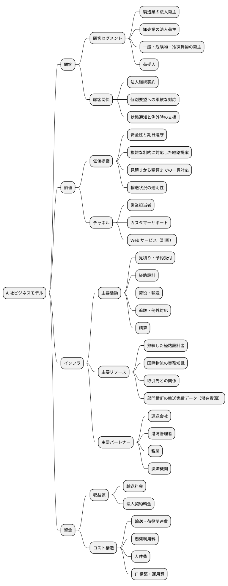

BMC は経営戦略で定義した集中差別化と一致させる。主要顧客を複雑な輸送条件を持つ法人荷主とし、専門家品質の経路提案と輸送透明性を価値提案の中心に置く。Web サービスと輸送実績データは現時点では計画・潜在資源であり、段階導入を通じて事業資産へ転換する。

## バリューストリーム

### バリューストリームマップ

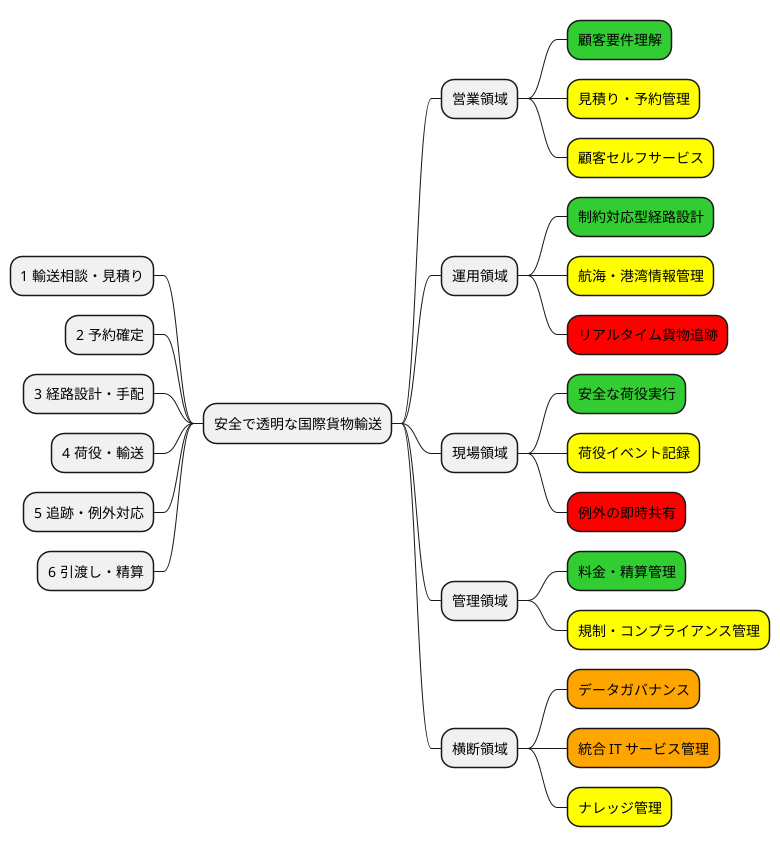

### バリューストリーム詳細

| ステージ | 開始イベント | 主な活動 | 提供価値 | 完了条件 | 関連ケイパビリティ |
| :--- | :--- | :--- | :--- | :--- | :--- |
| 1. 輸送相談・見積り | 荷主が輸送条件を提示する | 顧客・貨物・期限を確認し、概算料金と実現可能性を評価する | 条件と費用を早期に把握できる | 見積りと候補方針が提示される | 顧客要件理解、見積り管理 |
| 2. 予約確定 | 荷主が見積りを承認する | 荷主、荷受人、貨物仕様、期限を登録し予約を確定する | 正確で迅速に依頼できる | 一意な予約と追跡番号が発行される | 予約管理、顧客管理 |
| 3. 経路設計・手配 | 予約が確定する | 航海・港湾・貨物制約を照合し、経路を選択してパートナーへ手配する | 安全で期日を守る経路が決まる | 根拠付きの経路が予約へ割り当てられる | 経路設計、航海情報管理、パートナー管理 |
| 4. 荷役・輸送 | 貨物を受領する | 積込み、輸送、荷降ろし等を実行しイベントを記録する | 貨物が安全に移動する | 作業実績と現在位置が記録される | 荷役管理、輸送実行、イベント記録 |
| 5. 追跡・例外対応 | 作業・移動イベントが発生する | 状態を更新し、異常を検知して関係者へ通知・対応する | 状況を把握し、異常時も安心できる | 状態と対応履歴が共有される | 貨物追跡、通知、例外対応 |
| 6. 引渡し・精算 | 貨物が目的地へ到着する | 荷受人へ引き渡し、実績に基づいて料金を確定する | 配送と取引が正確に完了する | 受領確認と精算が完了する | 引渡し管理、料金・精算管理 |

各ステージは前工程の成果物を再入力せず受け継ぐ。特に予約識別子、貨物仕様、確定経路、荷役イベントを一貫して関連付けることを、ステージ間の情報契約とする。

## ビジネスケイパビリティ

### ビジネスケイパビリティマップ

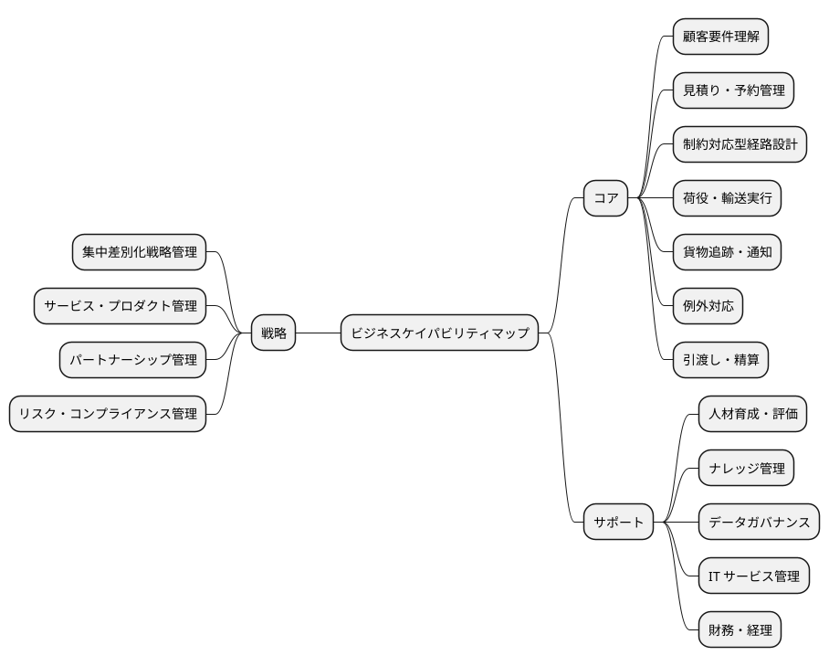

### ヒートマッピング

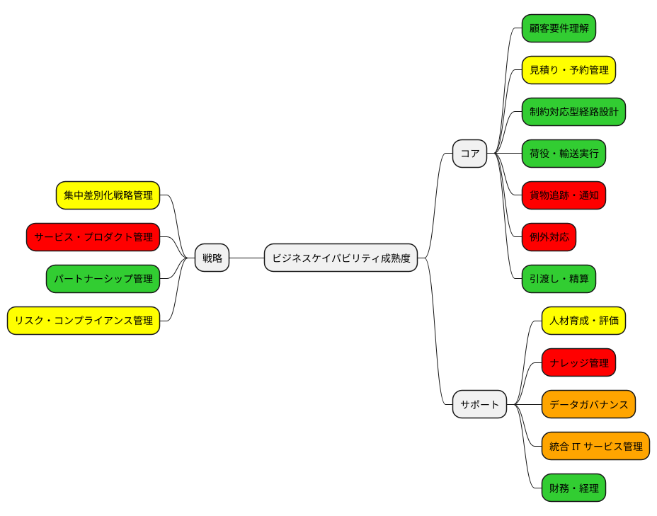

- グリーン：成熟度が高く、現在の強みとして活用する。
- イエロー：能力はあるが、標準化または部門横断化が必要である。
- レッド：成熟度が低く、戦略実行のため優先的に改善する。
- オレンジ：現在不足しており、新規に構築する。

成熟度は与件に基づく定性的な初期評価である。要件定義前に、処理時間、誤り率、属人化度、利用ツール、責任者へのヒアリングで検証する。

### ケイパビリティ階層化

| レベル | ケイパビリティ | 分類 | 成熟度 | 説明 |
| :--- | :--- | :--- | :--- | :--- |
| L1 | 戦略・サービス管理 | 戦略 | 中 | 集中差別化の投資、価値、リスクを統合管理する |
| L2 | 集中差別化戦略管理 | 戦略 | 中 | 複雑貨物セグメントの目標と KPI を管理する |
| L2 | サービス・プロダクト管理 | 戦略 | 低 | 顧客価値に基づきロードマップと優先順位を管理する |
| L2 | パートナーシップ管理 | 戦略 | 高 | 運送会社・港湾等との契約と協働関係を管理する |
| L1 | 顧客・予約管理 | コア | 中 | 輸送相談から予約確定までを管理する |
| L2 | 顧客要件理解 | コア | 高 | 出発地、目的地、期限、貨物条件を明確化する |
| L2 | 見積り管理 | コア | 中 | 条件に基づく料金と実現可能性を提示する |
| L2 | 予約管理 | コア | 中 | 予約の登録、確定、変更、取消しを管理する |
| L1 | 経路設計 | コア | 高 | 複数制約を満たす輸送経路を設計・確定する |
| L2 | 航海・港湾情報管理 | コア | 中 | スケジュール、寄港地、港湾制約を管理する |
| L2 | 経路候補算出 | コア | 低 | 制約を照合して実行可能な候補と根拠を提示する |
| L2 | 例外経路判断 | コア | 高 | 自動判定できない条件を熟練者が判断する |
| L1 | 荷役・輸送管理 | コア | 中 | 貨物の受領から引渡しまでの実行を管理する |
| L2 | 荷役実行 | コア | 高 | 積込み、荷降ろし、受領、引取りを安全に行う |
| L2 | 荷役イベント記録 | コア | 中 | 実施時刻、場所、状態、担当者を即時記録する |
| L1 | 追跡・例外対応 | コア | 低 | 貨物状態を可視化し、異常を処理する |
| L2 | 状態管理 | コア | 低 | イベントから現在位置と状態を一貫して導出する |
| L2 | 状態通知 | コア | 低 | 顧客の設定と重要度に応じて通知する |
| L2 | 例外対応 | コア | 低 | 遅延、破損、紛失の検知、判断、協働、履歴化を行う |
| L1 | 精算管理 | コア | 高 | 輸送実績に基づき料金を確定し精算する |
| L1 | 組織能力管理 | サポート | 低 | 人材、知識、データ、IT を横断管理する |
| L2 | ナレッジ管理 | サポート | 低 | 制約ルールと判断根拠を形式知として管理する |
| L2 | データガバナンス | サポート | 新規 | 所有者、品質、標準コード、履歴を管理する |
| L2 | 統合 IT サービス管理 | サポート | 新規 | 業務横断システムの構築、運用、改善を管理する |

### バリューストリーム・ケイパビリティ対応

| ケイパビリティ | 見積り | 予約 | 経路設計 | 荷役・輸送 | 追跡・例外 | 引渡し・精算 |
| :--- | :---: | :---: | :---: | :---: | :---: | :---: |
| 顧客要件理解 | ◎ | ○ | ○ |  |  |  |
| 見積り・予約管理 | ◎ | ◎ | ○ |  |  | ○ |
| 制約対応型経路設計 | ○ | ○ | ◎ | ○ | ○ |  |
| 荷役・輸送実行 |  |  | ○ | ◎ | ○ | ○ |
| 貨物追跡・通知 |  | ○ | ○ | ○ | ◎ | ○ |
| 例外対応 |  |  | ○ | ○ | ◎ | ○ |
| 引渡し・精算 | ○ | ○ |  | ○ |  | ◎ |
| データ・IT 管理 | ○ | ○ | ○ | ○ | ○ | ○ |

◎は主責任、○は支援を表す。データ・IT 管理は全ステージに共通する横断能力であり、個別部門のローカル最適へ戻さないため経営レベルで統制する。

## 組織マップ

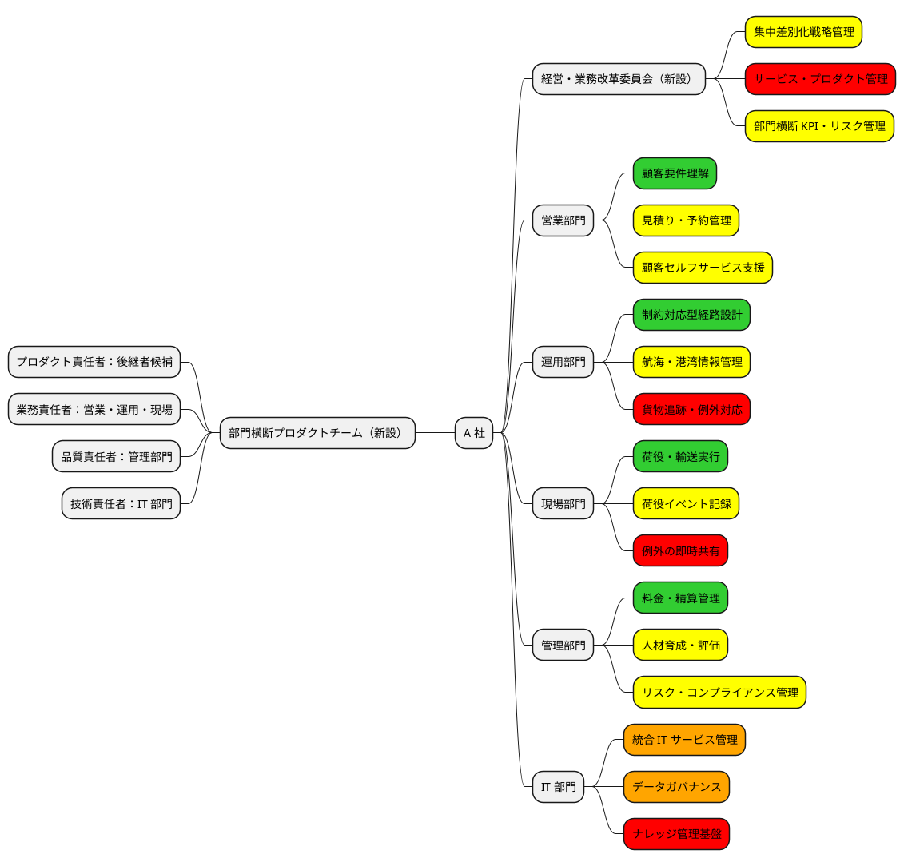

経営・業務改革委員会は投資、KPI、リスクの意思決定を担い、部門横断プロダクトチームは顧客価値単位の改善を担う。営業・運用・現場・管理・IT の既存責任は維持しつつ、経路設計ルール、状態定義、データ品質、受入基準を共同所有する。後継者候補はプロダクト責任者を担い、熟練者の知識と IT 経験を接続する。

## 情報マップ

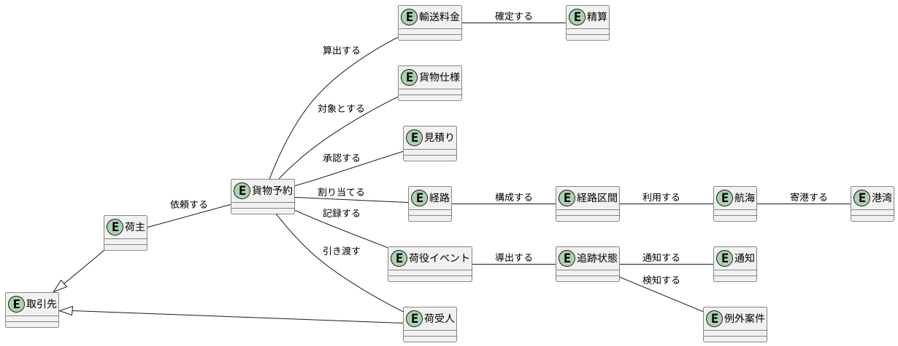

### 情報責任

| 情報 | 正（System of Record）の責任 | 主な生成元 | 品質要件 |
| :--- | :--- | :--- | :--- |
| 荷主・荷受人 | 営業部門 | 荷主、営業担当者 | 一意性、連絡先の最新性 |
| 貨物予約・貨物仕様 | 営業部門 | 荷主、営業担当者 | 必須条件の完全性、変更履歴 |
| 経路・経路区間 | 運用部門 | 経路設計者、経路設計サービス | 制約充足、版管理、判断根拠 |
| 航海・港湾 | 運用部門 | 運送会社、港湾管理者 | 更新時刻、出典、標準コード |
| 荷役イベント | 現場部門 | 荷役作業員、港湾システム | 発生時刻、場所、順序、重複排除 |
| 追跡状態 | 運用部門 | 荷役・航海イベント | 状態遷移の妥当性、鮮度 |
| 例外案件 | 運用部門 | 追跡管理者、検知サービス | 重要度、責任者、対応履歴 |
| 輸送料金・精算 | 管理部門 | 料金規則、配送実績 | 計算根拠、承認、監査可能性 |

情報の物理的な保存先は後続のアーキテクチャ設計で決定する。本段階では、意味、業務責任、品質条件を定義し、単一データベースを前提としない。

## ビジネスシナリオ

### 貨物輸送予約

#### 問題の定義

| 項目 | 内容 |
| :--- | :--- |
| 問題 | 荷主の輸送条件を複数部門が確認するため、見積りと予約確定に時間がかかり、転記誤りも起こり得る |
| 環境 | 複数の航路、港湾、運送会社が存在し、一般・危険物・冷凍貨物で取扱条件が異なる |
| ゴール | 荷主の条件を一度登録し、実現可能な経路方針と見積りを提示して正確に予約を確定する |

#### アクティビティ図

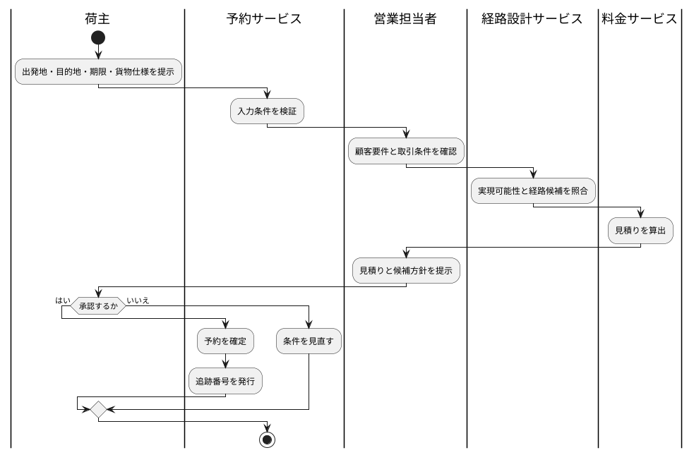

#### ユースケース図

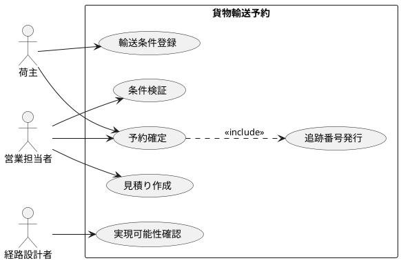

#### アクター一覧

| 種別 | アクター | 役割 |
| :--- | :--- | :--- |
| ヒューマン | 荷主 | 輸送条件を提示し、見積りと予約を承認する |
| ヒューマン | 営業担当者 | 顧客要件、取引条件、見積り、予約を管理する |
| ヒューマン | 経路設計者 | 複雑な条件の実現可能性を判断する |
| コンピュータ | 予約サービス | 条件検証、予約状態、追跡番号を管理する |
| コンピュータ | 料金サービス | 条件に基づき見積料金と根拠を算出する |

### 制約対応型経路設計

#### 問題の定義

| 項目 | 内容 |
| :--- | :--- |
| 問題 | 航海、寄港地、期限、貨物種別、港湾制約の手作業照合に時間がかかり、判断品質が熟練者に依存している |
| 環境 | 外部の航海・港湾情報が変化し、自動判断できない規制・例外条件も存在する |
| ゴール | 制約を満たす候補と判断根拠を提示し、経路設計者が例外へ集中して経路を確定できる |

#### アクティビティ図

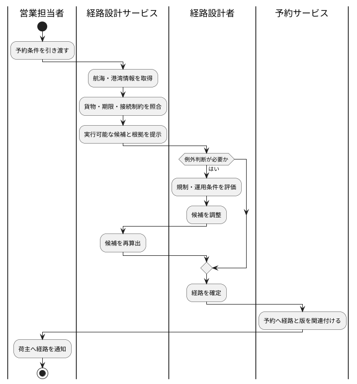

#### ユースケース図

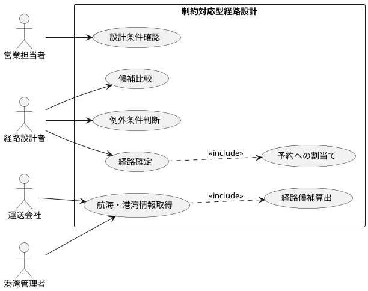

#### アクター一覧

| 種別 | アクター | 役割 |
| :--- | :--- | :--- |
| ヒューマン | 営業担当者 | 正確な予約条件を経路設計へ引き渡し、確定経路を荷主へ伝える |
| ヒューマン | 経路設計者 | 候補と根拠を評価し、例外条件を判断して経路を確定する |
| 組織 | 運送会社 | 航海スケジュールと対応可能な貨物条件を提供する |
| 組織 | 港湾管理者 | 港湾コード、取扱能力、利用制約を提供する |
| コンピュータ | 経路設計サービス | 制約を照合し、実行可能な候補と判断根拠を提示する |

#### 経路設計の制約条件

| 制約条件 | 判定内容 | 違反時の扱い |
| :--- | :--- | :--- |
| 航海スケジュール | 出発日、到着日、寄港地、運航状態が有効である | 代替航海を検索する |
| 寄港地接続 | 乗継ぎが同一港湾で行え、必要な接続時間を確保できる | 接続不能な候補を除外する |
| 期限遵守 | 荷主の到着期限までに引渡し可能である | 原則除外し、条件変更時のみ再評価する |
| 貨物種別対応 | 航海、設備、取扱者が一般・危険物・冷凍等に対応する | 規制違反となる候補を除外する |
| 港湾制約 | 各港湾が対象貨物、設備、営業時間等の条件を満たす | 代替港または代替経路を検討する |

### 荷役・追跡・例外対応

#### 問題の定義

| 項目 | 内容 |
| :--- | :--- |
| 問題 | 荷役記録の反映が遅く、荷主と社内担当者が現在状態を共有できず、異常対応の開始も遅れる |
| 環境 | 複数港湾で作業が並行し、通信状況や外部システム品質に差があり、遅延・破損・紛失も発生する |
| ゴール | 作業イベントを発生時に記録し、状態を一貫して更新して、重要な変化と例外を関係者へ通知する |

#### アクティビティ図

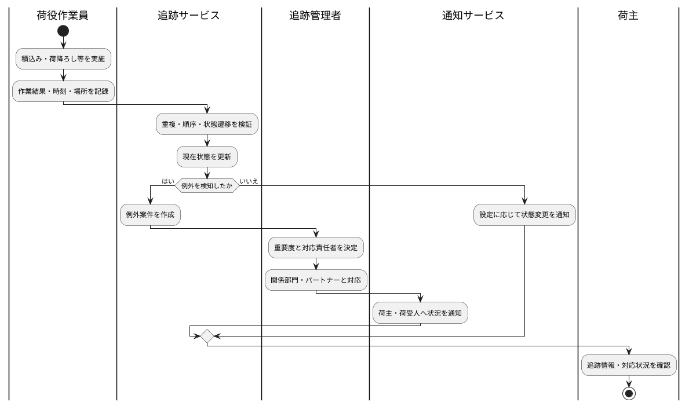

#### ユースケース図

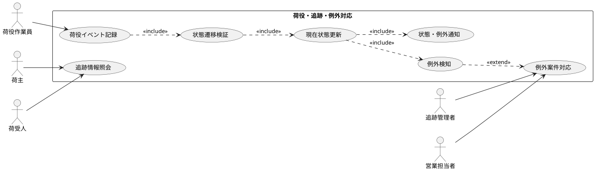

#### アクター一覧

| 種別 | アクター | 役割 |
| :--- | :--- | :--- |
| ヒューマン | 荷役作業員 | 荷役を安全に実行し、結果を発生時に記録する |
| ヒューマン | 追跡管理者 | 状態を監視し、例外の重要度・責任者・対応を管理する |
| ヒューマン | 営業担当者 | 顧客との連絡と期待値調整を担う |
| ヒューマン | 荷主 | 貨物の状態と例外対応状況を確認する |
| ヒューマン | 荷受人 | 到着予定と引渡し可能な状態を確認する |
| コンピュータ | 追跡サービス | イベントを検証し、現在状態と例外を導出する |
| コンピュータ | 通知サービス | 顧客設定と重要度に応じて状態・例外を通知する |

## 要件定義への引継ぎ

| 引継ぎ対象 | 本書で確定した内容 | 要件定義で具体化する事項 |
| :--- | :--- | :--- |
| システム価値 | 迅速な予約、根拠ある経路、安全・期日、透明性、例外時の安心 | 価値ごとの測定指標と目標値 |
| システム境界 | 予約、経路設計、荷役、追跡、例外、通知、精算を対象とする | 各外部システムとの責任分界と連携契約 |
| 優先領域 | 予約・経路設計・基本追跡を第 1 段階とする | MVP のユースケース、業務ルール、受入条件 |
| 中核能力 | 制約対応型経路設計、貨物追跡、例外対応 | 判断ルール、状態遷移、例外分類 |
| 情報責任 | 予約を起点に情報を関連付け、業務責任者を定める | 項目定義、識別子、鮮度、保持期間、アクセス権 |
| 組織 | 部門横断プロダクトチームが改善を担う | 利用者、承認者、運用者、データ責任者の役割 |

後続の要件定義では、第 1 段階の価値を優先し、現状値を計測したうえで「見積りから経路提示までの時間」「期日遵守率」「状態反映時間」「問い合わせ件数」「例外対応開始時間」を測定可能な要求へ変換する。
