# A 社の企業分析

本書は、A 社の与件に基づき、環境分析から企業戦略、事業戦略、機能戦略を導出したものである。市場シェア、競合各社の具体的な能力および顧客別採算は与件に示されていないため、該当する判断には「仮定」と明記する。

## 環境分析

### 組織図

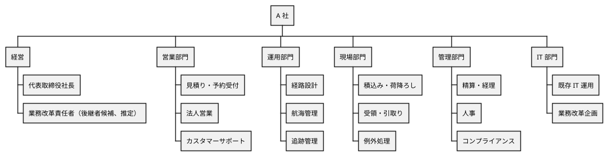

部門構成は与件に明示されている。経営直轄の業務改革責任者という位置付けは、後継者候補が部門横断の変革を推進するための提案であり、現状組織についての仮定である。現状の課題は部門そのものの不足ではなく、各部門の評価・情報・意思決定が分断されている点にある。

### ビジネスモデルキャンバス

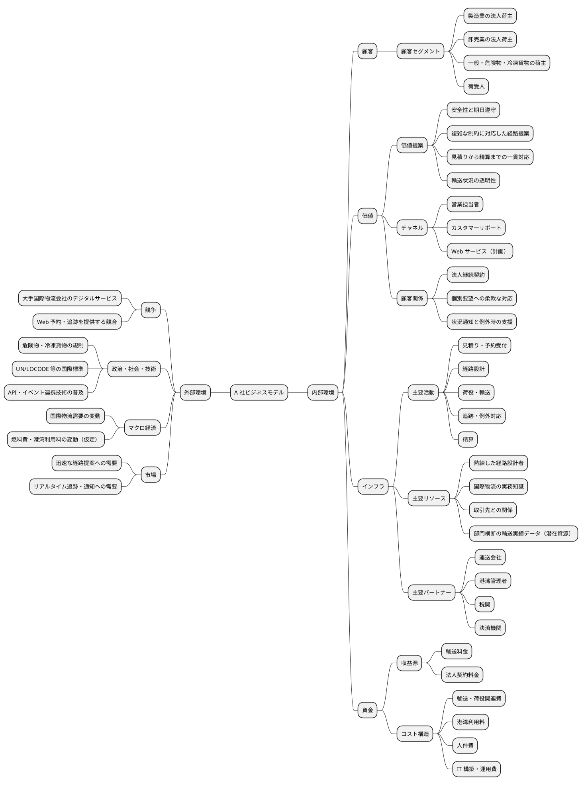

A 社の現在の価値は、複雑な輸送条件に対応する人的専門性と一貫対応にある。今後はその価値を失わず、Web 予約、経路候補の迅速な提示、リアルタイム追跡および通知を新たなチャネルと顧客関係へ組み込む。燃料費等の変動は国際貨物輸送業の一般的な傾向からの仮定であり、本戦略の主要な論拠には用いない。

### SWOT 分析

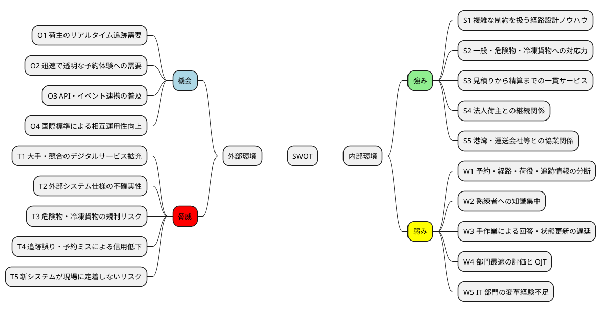

クロス SWOT から、次の戦略方向を導く。

| 組合せ | 戦略方向 | 根拠 |
| :--- | :--- | :--- |
| S × O | 専門ノウハウを組み込んだ経路提案・追跡サービス | S1・S2 を O1・O2 の顧客需要へ変換する |
| S × T | 複雑貨物対応と安全性を軸に大手との差を明確化 | S2・S5 で T1・T3 に対抗する |
| W × O | 情報統合と標準 API による業務横断の可視化 | O3・O4 を使って W1・W3 を解消する |
| W × T | 段階導入、熟練者レビュー、現場参加で品質を統制 | W2・W5 と T4・T5 が重なる変革失敗を避ける |

### VRIO 分析

| 経営資源・能力 | V | R | I | O | 評価 |
| :--- | :---: | :---: | :---: | :---: | :--- |
| 複雑な制約を扱う経路設計ノウハウ | ○ | ○ | ○ | △ | 潜在的な持続的競争優位 |
| 危険物・冷凍貨物を含む取扱経験 | ○ | ○ | △ | ○ | 一時的競争優位 |
| 法人荷主・物流パートナーとの継続関係 | ○ | ○ | ○ | ○ | 持続的競争優位 |
| 見積りから精算までの一貫業務 | ○ | △ | △ | △ | 競争均衡から一時的優位 |
| 輸送実績・制約判断のデータ | ○ | ○ | ○ | × | 未活用の潜在的競争優位 |
| 現行 IT 運用能力 | ○ | × | × | ○ | 競争均衡 |

V は経済的価値、R は希少性、I は模倣困難性、O は組織的な活用能力を表す。経路設計ノウハウと輸送実績データは価値・希少性・模倣困難性を持つが、個人や部門に分散しているため組織能力になっていない。したがって戦略の核心は、新しい情報システムの導入自体ではなく、判断根拠を標準化し、実績データと熟練者のフィードバックで継続的に改善できる組織を作ることにある。

## 事業分析

### 企業戦略

#### ドメイン

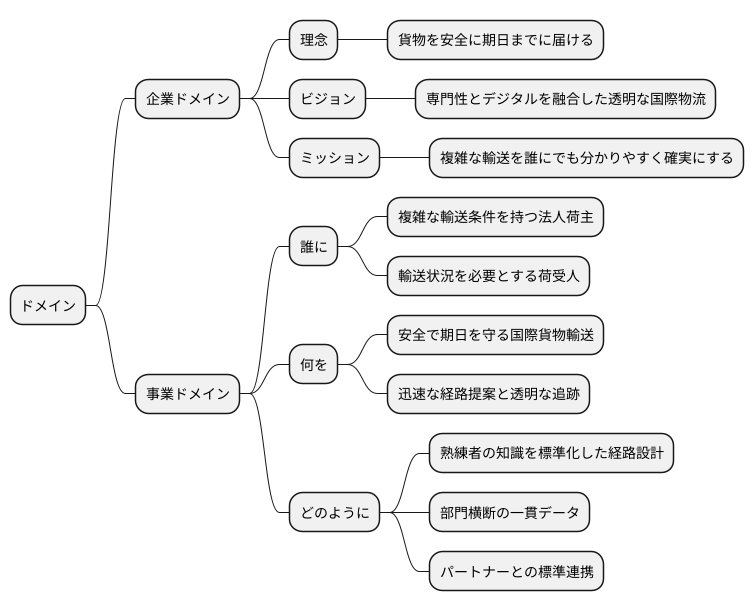

企業ドメインの理念は与件の経営方針から導出した。ビジョンとミッションは相談内容に対する戦略提案である。事業領域を単なる「国際輸送」ではなく、「複雑な輸送条件を、専門性とデジタルで分かりやすく確実に扱うサービス」と定義することで、大手との価格競争を避ける。

#### 成長戦略

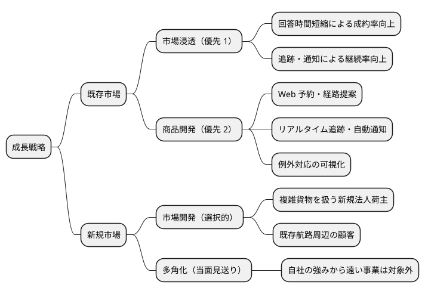

優先するのは市場浸透と商品開発である。既存顧客・既存物流ネットワークを基盤にデジタルな顧客体験を追加すれば、A 社の関係資産を活かしながら変革リスクを抑えられる。新規市場開発は、サービス品質と運用能力を確認した後に複雑貨物セグメントへ限定して行う。多角化は経営資源を分散させるため当面行わない。

#### イシューツリー

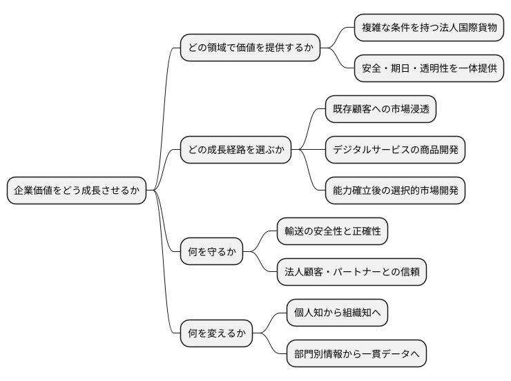

### 事業戦略

#### 基本戦略

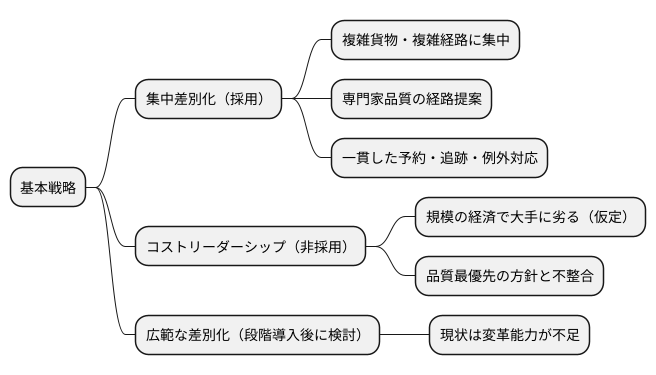

A 社は、危険物・冷凍貨物を含む複雑な輸送条件を持つ法人顧客に集中し、「正確で迅速な経路提案」「輸送状況の透明性」「例外時の確実な支援」で差別化する。市場シェアと競合原価は不明であるため、規模で大手に及ばないとの判断は仮定である。ただし、与件が品質を最優先としていることからも、価格中心のコストリーダーシップは採用しない。

#### 競争戦略

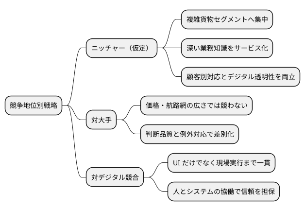

具体的な市場シェアがないため競争地位はニッチャーと仮定する。A 社は、すべての貨物・航路を対象にするのではなく、規制・温度・期限・寄港地接続など複数制約が絡む領域で優位性を築く。自動化は熟練者を置き換える手段ではなく、定型照合を高速化し、例外判断へ専門家を集中させる手段とする。

#### 価値連鎖

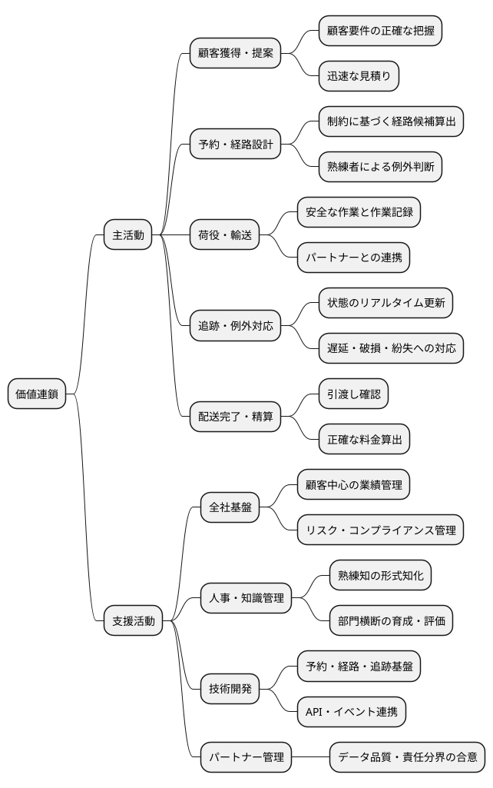

強みは顧客要件の理解、経路設計、例外対応にある。一方、活動間をつなぐ情報連携が弱い。したがって、価値連鎖の各活動を個別に効率化するだけでなく、予約を起点とする同一の貨物・経路・状態情報を活動間で継承することが必要である。

#### イシューツリー

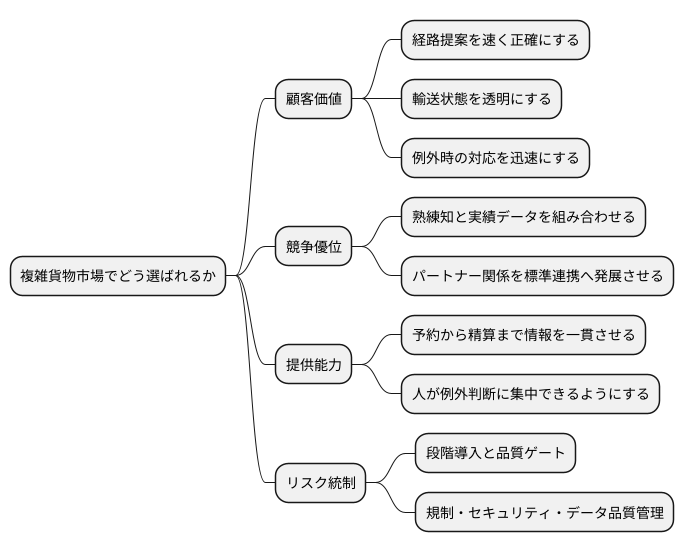

### 機能戦略

#### バリューストリーム

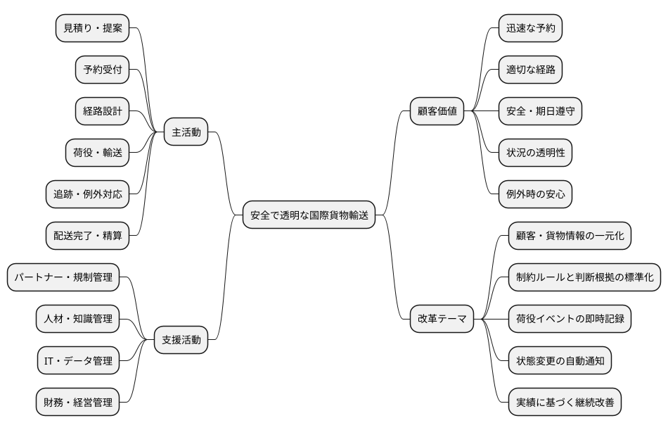

改革は顧客価値の流れに沿って段階化する。第 1 段階では見積り・予約・経路設計・基本追跡をつなぎ、第 2 段階で荷役イベント、リアルタイム追跡、通知を統合する。第 3 段階で精算と外部連携を拡張する。各段階で品質と現場定着を確認してから次へ進む。

#### ケイパビリティマッピング

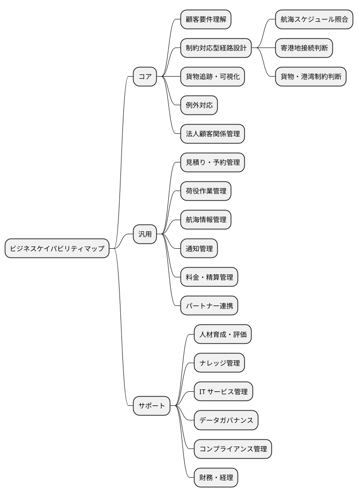

重点投資対象は、制約対応型経路設計、貨物追跡・可視化、例外対応、およびそれらを支えるナレッジ管理とデータガバナンスである。予約や精算は必要な汎用能力として標準化し、競争優位につながる判断品質へ人材と投資を集中する。

#### 組織マップ

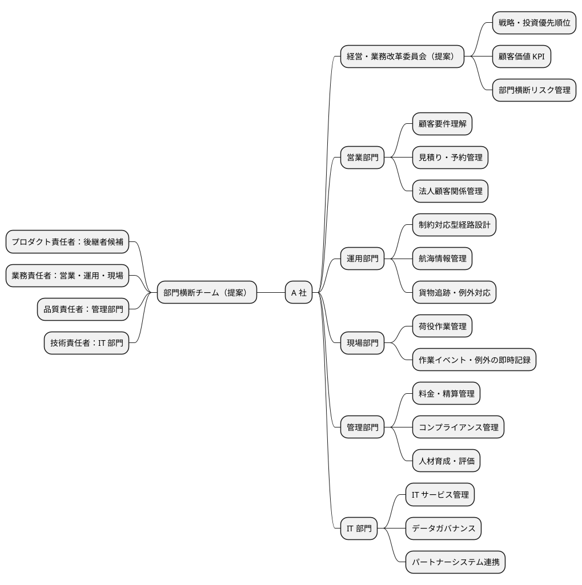

恒久的な組織改編を先行させず、まず経営直轄の部門横断チームを設ける。後継者候補はプロダクト責任者として顧客価値と投資優先順位を管理し、熟練者は業務ルールと受入基準を定義する。これにより、後継者候補の IT 経験と現場の国際物流知識を補完関係にする。

#### 情報マップ

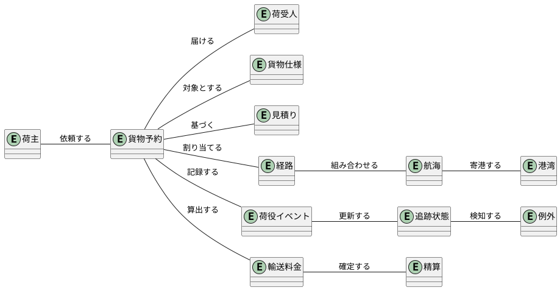

「貨物予約」を業務情報の起点とし、貨物仕様、経路、荷役イベント、追跡状態、料金を同一の識別子で追跡可能にする。航海・港湾は外部から受領する情報を含むため、データの所有者、更新頻度、品質責任をパートナーごとに定義する必要がある。

#### ビジネスシナリオ

| シナリオ | アクター | ゴール | 期待する結果 |
| :--- | :--- | :--- | :--- |
| 見積り・予約 | 荷主、営業担当者 | 条件に合う輸送を迅速に予約する | 貨物仕様と期限を基に見積りと候補経路が提示される |
| 経路設計 | 経路設計者 | 安全で期日を守る経路を確定する | 制約を満たす候補と判断根拠が示され、例外は人が判断する |
| 荷役・追跡 | 荷役作業員、追跡管理者 | 作業結果を即時に共有する | 荷役イベントから追跡状態が更新される |
| 状況確認・通知 | 荷主、荷受人 | 現在位置と異常を把握する | 通常状態は自己照会でき、重要な変化は自動通知される |
| 例外対応 | 追跡管理者、営業担当者 | 遅延・破損・紛失へ迅速に対応する | 関係者が同じ事実を参照し、対応履歴が残る |
| 配送完了・精算 | 荷受人、経理担当者 | 引渡しと料金を正確に確定する | 完了実績に基づく精算が行われる |

中核シナリオは、経路設計と荷役・追跡である。通常処理の自動化だけでなく、制約違反や遅延などの例外を早期に識別し、担当者が根拠を持って判断できることを受入条件に含める。

#### イシューツリー

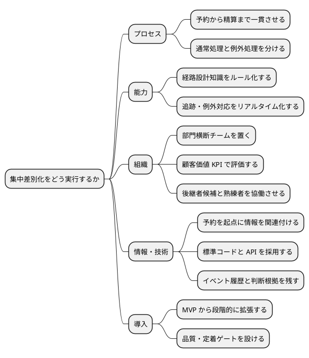

## 業務分析

### 業務領域（サブドメイン）

#### 中核の業務領域（コアサブドメイン）

| サブドメイン | 戦略上の役割 |
| :--- | :--- |
| 経路設計 | 複数制約から候補を算出し、A 社固有の判断品質を実現する |
| 貨物追跡 | 荷役・輸送の事実を一貫した状態として可視化する |
| 例外対応 | 遅延・破損・紛失等に対する判断と協働を支援する |

#### 一般的な業務領域（汎用サブドメイン）

| サブドメイン | 戦略上の役割 |
| :--- | :--- |
| 予約管理 | 荷主、貨物仕様、期限、確定状態を管理する |
| 荷役管理 | 積込み・荷降ろし・受領・引取りを記録する |
| 航海・港湾情報管理 | 経路設計に必要な外部情報を管理する |
| 通知 | 状態変更を荷主・荷受人へ配信する |

#### 補完的な業務領域（サポートサブドメイン）

| サブドメイン | 戦略上の役割 |
| :--- | :--- |
| 顧客管理 | 法人荷主・荷受人の情報を管理する |
| 見積り・料金 | 輸送条件に応じた料金を算出する |
| 精算 | 配送実績に基づく請求・支払いを管理する |
| 認証・権限 | 社内外の利用者とアクセス範囲を管理する |

### ビジネスコンテキスト

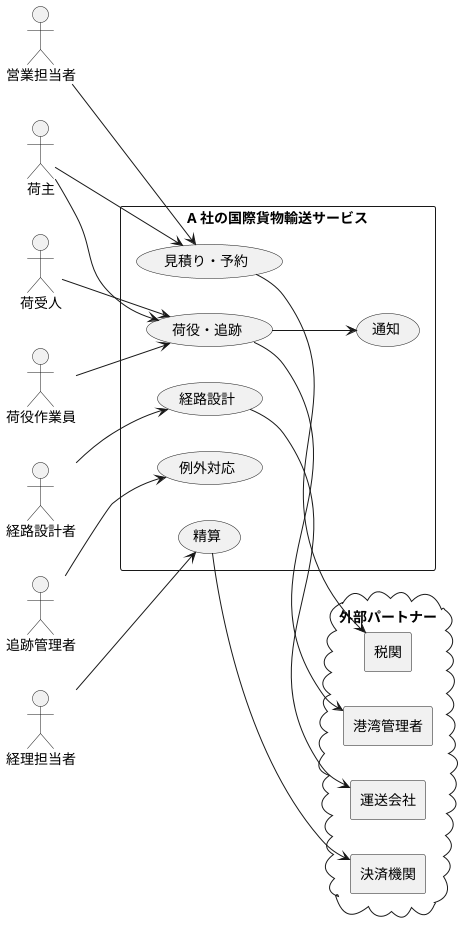

### ビジネスユースケース

#### 国際貨物を予約し配送完了まで管理する

##### ユースケース図

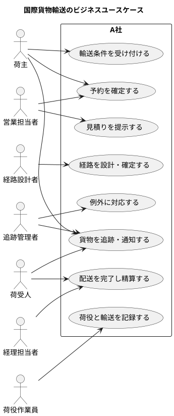

#### シーケンス図

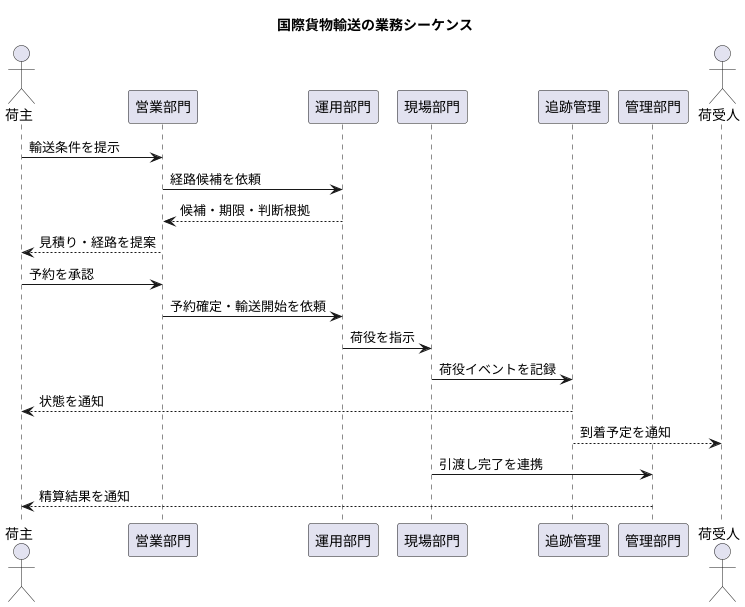

#### 業務フロー図

##### 国際貨物を輸送する

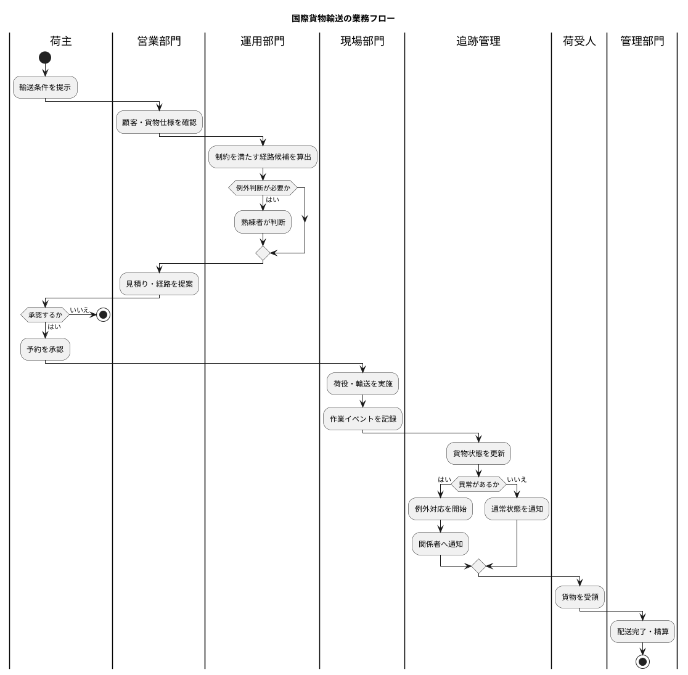

## 戦略実行の優先順位

| 段階 | 目的 | 対象能力 | 移行判定 |
| :--- | :--- | :--- | :--- |
| 第 1 段階 | 顧客回答の迅速化 | 予約、経路設計、基本追跡 | 経路品質、回答時間、利用定着 |
| 第 2 段階 | 輸送透明性の確立 | 荷役、リアルタイム追跡、通知、例外対応 | 状態反映時間、問い合わせ件数、例外対応時間 |
| 第 3 段階 | 一貫サービスの完成 | 精算、税関・港湾・決済等の外部連携 | 精算誤り、連携成功率、運用安定性 |

戦略 KPI は、売上だけでなく、見積りから経路提示までの時間、期日遵守率、追跡状態の反映時間、荷主からの問い合わせ件数、例外対応時間、熟練者以外が処理できる案件比率を用いる。具体的な基準値と目標値は現状計測後に確定する。

## 論理整合性

| 論理段階 | 結論 | 接続根拠 |
| :--- | :--- | :--- |
| 環境分析 | 専門知識と関係資産は強いが、組織的活用が弱い | SWOT の S1・S5、W1・W2 と VRIO の O 評価 |
| 企業戦略 | 既存法人市場を軸にデジタルサービスを開発する | 既存顧客関係を活かし、変革リスクを抑える |
| 事業戦略 | 複雑貨物に対する集中差別化を採る | 専門知識、取扱経験、例外対応力を競争軸にできる |
| 機能戦略 | 知識標準化、一貫データ、部門横断運営を構築する | VRIO の組織能力不足と価値連鎖の情報分断を解消する |
| 実行計画 | 顧客価値単位で段階導入する | 品質最優先と IT 変革経験不足を両立させる |

以上により、環境分析から機能戦略までの縦の論理を一貫させ、与件の相談事項である顧客中心の業務転換、属人的知識の標準化、部門横断の役割分担、現場定着および後継者候補を含む推進体制に回答する。
