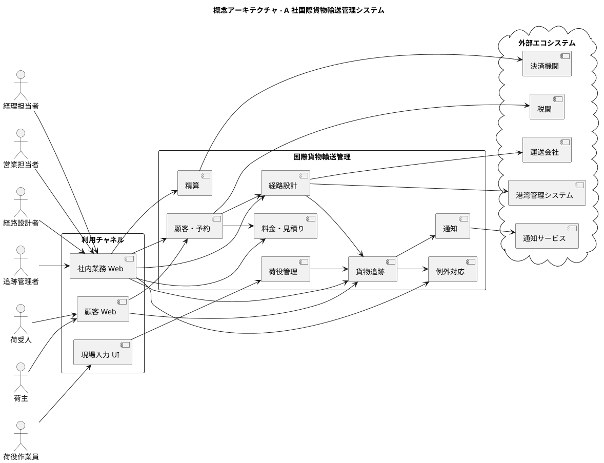
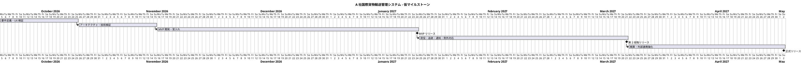

# インセプションデッキ - A 社国際貨物輸送管理システム

本書は、A 社の国際貨物輸送サービスを、専門性とデジタルを融合した安全・迅速・透明なサービスへ転換するプロジェクトの共通認識を示す。日程、人員、費用は要件定義前の仮定であり、後続の計画で更新する。

## 1. なぜやるのか？

### 解決すべき問題

A 社では、予約、経路設計、荷役、追跡の情報が部門ごとに管理され、顧客価値の流れが分断されている。ビジネスアーキテクチャの成熟度評価では、貨物追跡・通知、例外対応、ナレッジ管理が低成熟度、データガバナンスと統合 IT サービス管理が新規構築領域となっている。

- **予約回答に時間がかかる**：荷主の条件を営業・運用部門が個別に確認し、転記と照合を繰り返している。
- **経路設計が属人化している**：航海、寄港地、期限、貨物種別、港湾制約の判断が熟練者の経験に集中している。
- **貨物状態の反映が遅い**：荷役記録が手作業中心で、追跡状態への反映と例外対応の開始に時間差がある。
- **顧客からの問い合わせが増える**：荷主・荷受人が自ら状態を確認できず、営業・カスタマーサポートへ問い合わせが集中する。
- **競争優位を組織として再現できない**：A 社の強みである複雑貨物の取扱経験と経路設計ノウハウが、データや標準業務として活用されていない。

このままでは、デジタルサービスを拡充する競合に対し、A 社の専門性が顧客から見えず、継続契約と信頼を失うおそれがある。

### 成功の定義

プロジェクトは、単に情報システムを導入するのではなく、次の状態を実現したとき成功とする。

1. 荷主の条件が一度の登録で予約、経路、追跡、精算へ引き継がれる。
2. 経路候補と判断根拠が示され、熟練者が例外判断へ集中できる。
3. 荷役イベントから貨物状態が速やかに更新される。
4. 荷主・荷受人が状態を自ら確認し、重要な変化を通知で把握できる。
5. 部門横断チームが顧客価値とデータに基づき継続改善できる。

## 2. どんなビジョンなのか？

### プロダクトビジョン

> 複雑な国際貨物輸送を必要とする法人荷主のために、A 社国際貨物輸送管理システムは、出発地・目的地・期限・貨物仕様から根拠ある経路候補を提示し、予約から引渡しまでの状態を一貫して共有するサービスである。部門別の手作業と情報分断に依存する従来業務と異なり、A 社の熟練知と輸送実績を組織能力へ変え、安全性・期日遵守・透明性を同時に実現する。

### ガイディングプリンシプル

| カテゴリ | プリンシプル | 意味 |
| :--- | :--- | :--- |
| ビジネス | 顧客価値を端から端まで最適化する | 部門処理量ではなく、相談から配送完了までの価値と所要時間を見る |
| アプリケーション | ドメイン境界と責任を明確にする | 予約、経路、荷役、追跡、精算の責務を分け、明示的に連携する |
| データ | 事実を一度記録し追跡可能にする | 予約を起点に状態、履歴、出典、判断根拠を関連付ける |
| テクノロジー | 標準準拠で段階的に連携する | UN/LOCODE、API、イベントを用い、品質を確認しながら外部連携を増やす |
| デリバリー | 小さく導入し品質と定着を確認する | 顧客価値単位でリリースし、品質ゲートを満たしてから拡張する |

## 3. どんな価値をもたらすのか？

### ビジネス目標

| # | 目標 | 期待効果 | 指標候補 |
| :--- | :--- | :--- | :--- |
| 1 | 見積り・予約を迅速化する | 営業の確認・転記作業を減らし、顧客回答を早める | 経路提示リードタイム、予約確定率 |
| 2 | 経路設計品質を標準化する | 基本制約を自動照合し、熟練者を例外判断へ集中させる | 自動候補提示率、再設計率、制約違反件数 |
| 3 | 輸送状況を透明化する | 荷主・荷受人が現在状態と予定を自己確認できる | 状態反映時間、自己照会率、問い合わせ件数 |
| 4 | 例外対応を迅速化する | 遅延・破損・紛失を早く共有し、対応責任を明確にする | 検知時間、対応開始時間、解決時間 |
| 5 | 熟練知を組織能力へ変える | 判断ルールと根拠を蓄積し、担当者差を減らす | 標準ルール化率、非熟練者処理可能率 |
| 6 | 法人顧客との関係を強化する | 安全性・期日・透明性による集中差別化を実現する | 期日遵守率、継続率、顧客満足度 |

指標の基準値と目標値は、要件定義中に現状測定し、経営・業務改革委員会が承認する。

## 4. スコープの範囲はどこか？

### スコープ内

| 優先度 | 機能領域 | 主要フィーチャ | 導入段階 |
| :---: | :--- | :--- | :--- |
| 1 | 予約管理 | 荷主・荷受人、貨物仕様、期限、見積り、予約確定、追跡番号 | MVP |
| 2 | 経路設計 | 航海・港湾検索、基本制約照合、候補比較、例外判断、経路確定 | MVP |
| 3 | 基本追跡 | 確定経路と予定、主要状態、社内照会、荷主照会 | MVP |
| 4 | 荷役管理 | 積込み・荷降ろし・受領・引取りのイベント記録 | 第 2 段階 |
| 5 | リアルタイム追跡・通知 | 状態導出、異常検知、荷主・荷受人への通知 | 第 2 段階 |
| 6 | 例外対応 | 遅延・破損・紛失の案件化、責任者、対応履歴 | 第 2 段階 |
| 7 | 料金・精算 | 料金規則、法人条件、配送実績に基づく精算 | 第 3 段階 |
| 8 | 外部連携 | 運送会社、港湾、税関、通知、決済との API・イベント連携 | 段階的 |

### スコープ外

- 船舶、航路、運送会社の運航そのものの管理。
- 港湾施設の物理設備管理。
- 税関申告業務そのもの。ただし申告に必要な情報連携は対象とする。
- 一般会計、給与、人事管理システムの置換え。
- 高度な全世界最適化や需要予測。MVP は確定的な基本制約の照合を対象とする。
- 一般消費者向け配送サービス。法人荷主の国際貨物輸送に集中する。

### 要件定義で決める事項

- 荷役作業員向け UI を Web/PWA とするか、ネイティブモバイルアプリとするか。
- 港湾・運送会社ごとのリアルタイム連携可否と、ファイル連携等の代替手段。
- 危険物・冷凍貨物の規制ルールをどこまで自動判定するか。
- 顧客通知のチャネル、重要度、同意・停止方法。

## 5. 主なステークホルダーは？

| ステークホルダー | 役割・関心事 | プロジェクトへの関与 |
| :--- | :--- | :--- |
| 現社長・経営陣 | 投資効果、品質、事業承継、競争優位 | スポンサー、重要判断、品質ゲート承認 |
| 後継者候補 | 顧客価値、部門横断改革、継続改善 | プロダクト責任者 |
| 荷主 | 簡単な予約、根拠ある経路、状態確認、例外時の安心 | ユーザー調査、受入れ評価 |
| 荷受人 | 到着予定、状態、引渡し準備 | 通知・追跡機能の評価 |
| 営業担当者 | 見積り・予約の迅速化、顧客対応 | 業務責任者、受入れテスト |
| 経路設計者 | 候補算出、根拠、例外判断、知識保護 | ドメイン専門家、ルール・受入条件定義 |
| 荷役作業員 | 迅速で間違いにくい現場入力 | 現場検証、ユーザビリティ評価 |
| 追跡管理者 | 状態の正確性、異常検知、対応履歴 | 状態・例外モデルの責任者 |
| 経理担当者 | 料金根拠、精算の正確性、監査可能性 | 第 3 段階の業務責任者 |
| IT 部門 | 保守性、セキュリティ、データ品質、外部連携 | 技術責任者、運用責任者 |
| 管理・コンプライアンス部門 | 規制、安全、個人・取引情報の保護 | 品質・リスク責任者 |
| 運送会社・港湾管理者 | 正確なスケジュール・イベント連携 | 外部データ提供者、連携合意 |
| 税関・決済・通知事業者 | 標準的で安全な情報交換 | 外部サービス提供者 |

## 6. 基本的な解決策はどのようなものになるか？

### 概念アーキテクチャ

### 解決方針

- ドメイン境界に沿って責務を分離するが、物理的なサービス分割は後続のアーキテクチャ設計で判断する。
- 予約を起点として貨物、経路、荷役イベント、追跡状態、例外、料金を追跡可能にする。
- 定型制約は機械的に照合し、根拠を提示する。規制や不確実な条件は経路設計者が承認する。
- 荷役・航海等の事実をイベントとして記録し、状態はイベントから導出する。
- 外部連携は API またはイベントを優先し、相手が対応できない場合は管理された代替手段を用意する。
- MVP は予約、経路設計、基本追跡の縦の流れを通すウォーキングスケルトンとする。

## 7. 主なリスクは何か？

| # | リスク | 発生可能性 | 影響 | 対応方針 | 検証時期 |
| :--- | :--- | :---: | :---: | :--- | :--- |
| 1 | 経路制約が複雑で候補算出の品質が出ない | 高 | 高 | 基本制約から始め、熟練者の期待結果を受入テストにする | 要件定義・PoC |
| 2 | 外部システムの仕様・品質・更新頻度が不明 | 高 | 高 | 早期に責任分界を確認し、スタブと代替連携で分離する | 要件定義 |
| 3 | 誤予約・誤追跡が顧客と安全へ影響する | 中 | 高 | 状態遷移、監査履歴、承認、段階リリースを品質ゲートにする | 全段階 |
| 4 | 危険物・冷凍貨物の規制を見落とす | 中 | 高 | 専門家レビューと明示的な手動承認を残す | 要件定義・受入れ |
| 5 | 現場入力が定着せず状態更新が遅いままになる | 高 | 高 | 作業員参加の UX 検証、オフライン・再送要件の確認、段階教育を行う | 第 2 段階前 |
| 6 | 熟練者が知識標準化を置換えと受け取り協力しない | 中 | 高 | 熟練者を設計・品質責任者とし、例外判断の価値を明確化する | 立上げ時 |
| 7 | 部門別 KPI が横断最適を阻害する | 中 | 中 | 経路提示時間、期日遵守、状態鮮度等の共通 KPI を設ける | 立上げ時 |
| 8 | 新規 IT 運用能力が不足する | 高 | 中 | 運用担当を初期から参加させ、自動化・監視・手順を成果物に含める | MVP から |
| 9 | スコープ拡大で MVP が遅れる | 高 | 中 | MVP の非目標を明示し、追加要求は第 2 段階以降へ評価する | 各承認ゲート |

## 8. どのくらい作業があり、費用はいくらか？

### チーム構成（仮定）

| ロール | 人数 | 主な責任 |
| :--- | :---: | :--- |
| プロダクト責任者 | 1 | 価値、優先順位、受入れ判断。後継者候補を想定 |
| 業務アナリスト／ドメイン担当 | 1〜2 | 要件、業務ルール、熟練者・現場との調整 |
| ソフトウェアエンジニア | 3〜4 | フロントエンド、バックエンド、連携、テスト自動化 |
| QA／テスト担当 | 1 | テスト戦略、探索的テスト、品質ゲート |
| プラットフォーム／運用担当 | 1 | 環境、CI/CD、監視、セキュリティ、運用移管 |
| UX 担当 | 0.5 | 顧客・社内・現場 UI の調査と検証 |
| ドメイン専門家 | 兼務 | 営業、経路設計、追跡、荷役、精算の判断と受入れ |

平均 7〜8 FTE の部門横断チームを想定する。A 社側の業務担当者が継続参加できることを前提とする。

### 概算規模（仮定）

| 区分 | 期間 | 概算人月 | 対象 |
| :--- | :--- | :---: | :--- |
| 分析・設計 | 6 週 | 9〜12 | 要件、UX、アーキテクチャ、技術検証 |
| MVP | 10 週 | 18〜22 | 予約、経路設計、基本追跡、運用基盤 |
| 第 2 段階 | 8 週 | 14〜18 | 荷役、リアルタイム追跡、通知、例外対応 |
| 第 3 段階 | 6 週 | 10〜13 | 料金・精算、外部連携強化、運用改善 |
| 合計 | 約 30 週 | 51〜65 | 段階導入全体 |

### 概算費用（仮定）

外部委託を含む混成チームの平均人月単価を 150〜200 万円と仮定した場合、開発費の単純計算は **約 7,650 万〜1 億 3,000 万円**となる。クラウド利用料、外部サービス料、端末、教育、データ移行、規制専門家および A 社社員の内部工数は別途である。

この金額は投資判断のための初期レンジであり、要件、技術スタック、外部連携、調達方式、チーム内製比率を決めた後に再見積りする。

## 9. トレードオフにどう向き合うか？

### 優先順位

| 要素 | 優先度 | 方針 |
| :--- | :---: | :--- |
| 品質 | 1 | 安全性、正確性、追跡可能性を守る。誤予約・規制違反につながる妥協はしない |
| スコープ | 2 | 予約・経路設計・基本追跡の縦の流れを守り、周辺機能は後続へ送る |
| 時間 | 3 | 日付のために品質を落とさず、スコープを調整してリリース可能な状態を作る |
| 予算 | 4 | 投資上限は尊重するが、品質不足を隠すために運用負債へ転嫁しない |

### 判断ルール

| 対立 | 選択 |
| :--- | :--- |
| 自動化範囲 vs. 判断品質 | 基本制約を自動化し、不確実な例外は人が承認する |
| 全機能同時提供 vs. 早期学習 | MVP から段階的に提供する |
| 独自開発 vs. 外部サービス | 経路設計・追跡状態は差別化領域として設計し、通知・決済等は標準サービスを優先する |
| 即時整合性 vs. 可用性 | 安全・予約確定に必要な情報は強く整合させ、追跡・通知は遅延を監視できる非同期連携を許容する |
| 高機能 UI vs. 現場定着 | 操作数、誤入力防止、通信不安定時の継続を優先する |
| 納期 vs. 未検証の外部連携 | スタブ・手動代替で MVP を分離し、未検証連携は後続にする |

## 10. 初回リリースが可能になるのはいつか？

### マイルストーン（仮定）

### リリース見通し

| マイルストーン | 仮の日付 | 提供価値 | 進入条件 |
| :--- | :--- | :--- | :--- |
| 分析・設計完了 | 2026 年 11 月中旬 | MVP の価値、境界、品質、実現方式が合意される | 要件・アーキテクチャ・技術リスクの承認 |
| MVP リリース | 2027 年 1 月下旬 | 予約、根拠付き経路設計、基本追跡が一貫して利用できる | 重大欠陥ゼロ、業務受入れ、運用準備完了 |
| 第 2 段階リリース | 2027 年 3 月下旬 | 荷役イベント、リアルタイム追跡、通知、例外対応が利用できる | 現場定着、状態鮮度、通知品質の基準達成 |
| 正式リリース | 2027 年 5 月中旬 | 精算と主要外部連携を含む一貫サービスとなる | 精算・連携・監査・運用品質の基準達成 |

初回リリース日は固定納期ではなく、2027 年 1 月下旬を目標とする仮説である。要件定義終了時に、チーム編成、休業日、調達リードタイム、外部 API の利用可能性を反映して更新する。

## 未決事項と検証ゲート

| ゲート | 決めること | 主な承認者 |
| :--- | :--- | :--- |
| 戦略レビュー | 価値、MVP、優先順位、投資レンジ | 現社長、経営・業務改革委員会 |
| 要件レビュー | アクター、業務ルール、外部境界、測定可能な目標 | プロダクト責任者、各業務責任者 |
| アーキテクチャレビュー | 技術スタック、データ責任、連携方式、セキュリティ | IT 部門、業務責任者、品質責任者 |
| MVP リリース判定 | 品質、業務受入れ、教育、監視、復旧手順 | スポンサー、プロダクト責任者、運用責任者 |

## 参照ドキュメント

- [A 社の企業事例](business_case.md)
- [A 社の経営戦略](business_strategy.md)
- [A 社のビジネスアーキテクチャ](business_architecture.md)
- [A 社のビジネスモデルキャンバス](BMC.svg)
